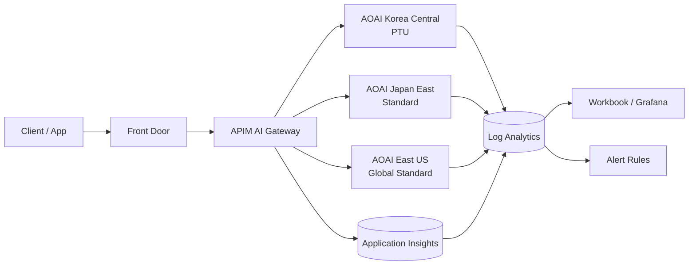

# Azure OpenAI(AOAI) 배포 & 운영 모니터링 가이드

> 대상: AOAI를 **Production**에서 운영하는 아키텍트, SRE, 플랫폼 팀
> 범위: 배포 설계 → 관측(Observability) 구성 → Metric/Log → Alert → 대시보드 → 장애 대응 Runbook
> 검증 기준: Azure Monitor `Microsoft.CognitiveServices/accounts` 지원 메트릭/로그 레퍼런스 (2026-07 기준)

---

## 0. TL;DR — 최소 구성 체크리스트

| # | 항목 | 필수 여부 | 비고 |
|---|------|-----------|------|
| 1 | Diagnostic Settings → Log Analytics (Audit / RequestResponse / Trace / AzureOpenAIRequestUsage / **AllMetrics**) | ✅ 필수 | 로그는 `AzureDiagnostics` 테이블로 적재 |
| 2 | **Metrics Explorer / 메트릭 알림**을 별도로 구성 | ✅ 필수 | PTU 사용률 등 일부 메트릭은 로그로 내보낼 수 없음(§2.3) |
| 3 | Application Insights를 **애플리케이션 측**에 연결 | ✅ 필수 | User/Session/Prompt 상관관계 추적 |
| 4 | AOAI 호출을 **Dependency**로 기록 | ✅ 필수 | 429 → 사용자 → 세션 추적의 핵심 |
| 5 | APIM AI Gateway 삽입 | ⭕ 강력 권장 | 토큰 메트릭·LLM 로깅·Failover·Rate limit |
| 6 | Alert Rule (429 / 5xx / PTU 80·90%) | ✅ 필수 | 아래 §8 |
| 7 | 대시보드 핵심 8종 | ✅ 필수 | 아래 §7 |
| 8 | Multi-region / Spillover Failover 설계 | ⭕ 권장 | 429·503 완화의 최종 수단 |

---

## 1. 배포 아키텍처 설계

### 1.1 권장 표준 아키텍처



- **Primary**: PTU 배포(예측 가능한 지연 시간, 기저 부하 담당)
- **Spillover**: PTU 포화 시 표준 배포로 자동 전환
- **Failover**: 리전 장애 시 타 리전 Global Standard로 우회

### 1.2 배포(Deployment) 유형 선택

| 유형 | 특징 | 적합 시나리오 | 429 특성 |
|------|------|---------------|----------|
| **Standard (PAYG)** | 리전 단위 공유 용량, TPM/RPM 쿼터 | POC, 가변 트래픽 | 쿼터 초과 시 429 |
| **Global Standard** | 글로벌 라우팅, 높은 가용 용량 | 데이터 상주 요건이 낮은 워크로드 | 429 상대적으로 적음 |
| **Data Zone Standard** | 지역(EU/US) 경계 내 라우팅 | 데이터 경계 요건 있음 | 중간 |
| **Provisioned (PTU)** | 전용 처리량, 예측 가능한 Latency | SLA가 필요한 Production | **사용률 100% 도달 시 429** |
| **PTU + Spillover** | PTU 포화 시 표준 배포로 넘김 | 피크 흡수 | 429 최소화 |
| **Batch** | 비동기 대량 처리, 저비용 | 야간 배치, 대량 임베딩 | 해당 없음 |

> 💡 **실무 팁**: PTU 단독 구성은 "용량 = 벽"입니다. 문서상으로도 **사용률이 100%에 도달하면 호출이 스로틀되고 429가 반환**됩니다. 반드시 Spillover 또는 표준 배포 백업을 함께 두세요.

### 1.3 PTU 사이징 기준

- Azure OpenAI **Capacity Calculator**로 (Peak RPM × 평균 입력 토큰 × 평균 출력 토큰) 기반 산정
- **출력 토큰의 가중치가 입력보다 훨씬 큼** → `max_tokens`를 반드시 제한
- 목표 활용률: **평상시 60~70%**, 피크 85% 이하 (100% 근접 시 429 폭증)
- 스트리밍 사용 시 첫 토큰까지의 지연(TTFT)이 체감 성능을 좌우

### 1.4 네이밍 & 태깅 규칙 (모니터링의 전제조건)

관측이 되려면 **이름 자체가 차원(Dimension)** 이어야 합니다. AOAI 메트릭의 주요 차원은 `ModelDeploymentName`, `ModelName`, `ModelVersion`, `Region` 이므로, **배포 이름에 환경·리전·티어를 인코딩**해야 대시보드에서 의미 있게 분리됩니다.

```
리소스:  aoai-<env>-<region>-<seq>              예) aoai-prod-krc-01
배포명:  <model>-<version>-<tier>               예) gpt-4o-2024-11-20-ptu
```

권장 태그: `env`, `owner`, `costcenter`, `workload`, `tier(ptu|paygo)`, `dataclass`

---

## 2. 진단 설정 (Diagnostic Settings)

**경로**: `Azure OpenAI Resource → Monitoring → Diagnostic settings → + Add diagnostic setting`

### 2.1 로그 카테고리

`Microsoft.CognitiveServices/accounts`가 지원하는 로그 카테고리와 적재 테이블은 다음과 같습니다. **모든 카테고리가 `AzureDiagnostics` 테이블로 들어갑니다**(전용 테이블 없음).

| 카테고리 (표시명) | 카테고리 명 | 적재 테이블 | 추가 내보내기 과금 | 권장 |
|---|---|---|---|---|
| Audit Logs | `Audit` | `AzureDiagnostics` | 없음 | ✅ |
| Request and Response Logs | `RequestResponse` | `AzureDiagnostics` | 없음 | ✅ |
| Trace Logs | `Trace` | `AzureDiagnostics` | 없음 | ✅ |
| Azure OpenAI Request Usage | `AzureOpenAIRequestUsage` | `AzureDiagnostics` | **있음** | ⭕ 토큰 단위 사용량 추적 시 |
| Managed Network Events | `ManagedNetworkEvents` | `AzureDiagnostics` | **있음** | ⭕ VNet/Private Endpoint 운영 시 |
| **All metrics** | `AllMetrics` | `AzureMetrics` | — | ✅ **필수** |

> ⚠️ **"추가 내보내기 과금 = 없음"은 무료라는 뜻이 아닙니다.**
> AOAI 로그 비용은 **두 겹**으로 발생합니다.
>
> | 비용 | 대상 | 과금 주체 |
> |---|---|---|
> | ① **수집·보존(ingestion / retention)** | **모든 카테고리** (Audit·Trace 포함) | Log Analytics (GB 단위) |
> | ② **플랫폼 로그 내보내기(export)** | 위 표에서 "있음"인 카테고리만 | Azure Monitor **Platform Logs** 미터 |
>
> 즉 `Audit` · `Trace` · `RequestResponse`는 **①은 발생하고 ②만 면제**됩니다.
> 위 표의 컬럼은 Azure Monitor 레퍼런스의 *Costs to export* 값으로, **①에 더해 추가로 붙는 과금이 있는지**만 나타냅니다.
> 특히 `RequestResponse`는 호출량에 비례해 수집량이 커지므로, 과금 표시가 "없음"이더라도 **비용에 가장 큰 영향을 주는 카테고리**인 경우가 많습니다. 트래픽이 많다면 수집 볼륨을 먼저 측정하세요(§2.4).

### 2.2 Bicep 예시

```bicep
resource aoai 'Microsoft.CognitiveServices/accounts@2024-10-01' existing = {
  name: aoaiName
}

resource diag 'Microsoft.Insights/diagnosticSettings@2021-05-01-preview' = {
  name: 'aoai-to-law'
  scope: aoai
  properties: {
    workspaceId: lawId
    logs: [
      { category: 'Audit',                   enabled: true }
      { category: 'RequestResponse',         enabled: true }
      { category: 'Trace',                   enabled: true }
      { category: 'AzureOpenAIRequestUsage', enabled: true }
    ]
    metrics: [
      { category: 'AllMetrics', enabled: true }
    ]
  }
}
```

```bash
az monitor diagnostic-settings create \
  --name aoai-to-law \
  --resource $AOAI_RESOURCE_ID \
  --workspace $LAW_RESOURCE_ID \
  --logs '[{"category":"Audit","enabled":true},
           {"category":"RequestResponse","enabled":true},
           {"category":"Trace","enabled":true},
           {"category":"AzureOpenAIRequestUsage","enabled":true}]' \
  --metrics '[{"category":"AllMetrics","enabled":true}]'
```

### 2.3 ⚠️ 반드시 알아야 할 두 가지 한계

이 두 가지를 모르면 **"KQL을 썼는데 데이터가 안 나온다"** 는 상황에 빠집니다.

**① `AllMetrics`를 켜도 Log Analytics로 넘어가지 않는 메트릭이 있습니다.**
메트릭 레퍼런스의 *DS Export* 컬럼이 `No`인 메트릭은 진단 설정으로 내보낼 수 없습니다.

| 내보내기 불가 (DS Export = No) | 대체 수단 |
|---|---|
| `AzureOpenAIProvisionedManagedUtilizationV2` (PTU 사용률) | Metrics Explorer, **메트릭 알림**, Grafana(Azure Monitor 데이터소스) |
| `AzureOpenAIContextTokensCacheMatchRate` (프롬프트 캐시 적중률) | 동일 |
| `AzureOpenAIAvailabilityRate` (가용성) | 동일 |

> 즉 **PTU 사용률은 KQL로 조회할 수 없습니다.** 알림은 로그 알림이 아니라 **메트릭 알림**으로 만들어야 하고, 대시보드에서는 Workbook의 *Metrics* 파트나 Grafana를 사용해야 합니다.

**② `AzureMetrics` 테이블에는 차원(Dimension) 컬럼이 없습니다.**
`AzureMetrics`는 리소스별로 집계된 값만 담기 때문에 `StatusCode`, `ModelDeploymentName` 같은 차원으로 쪼갤 수 없습니다.

- ❌ `AzureMetrics | where MetricName == "Requests" | where ResponseCode == "429"` → **동작하지 않음** (해당 컬럼 자체가 없음)
- ✅ 차원 분리가 필요하면 → **Metrics Explorer / 메트릭 알림의 Dimension 필터**, 또는 **`AzureDiagnostics`(RequestResponse) 로그**, 또는 **APIM/App Insights** 사용

### 2.4 보존 정책 및 비용 관리

| 데이터 | 보존 | 목적 |
|--------|------|------|
| Metrics(Analytics) | 30~90일 | 운영 대시보드 |
| Audit | 365일+ (Archive) | 컴플라이언스 |
| RequestResponse / RequestUsage | 30~90일 | 장애·사용량 분석 |
| LLM Message Log(APIM) | 30일 (민감정보 검토 후) | 품질/사고 분석 |

**수집 볼륨을 먼저 측정하세요.** 어떤 카테고리가 실제 비용을 만드는지는 트래픽 패턴에 따라 다릅니다.

```kusto
// 카테고리별 실제 청구 볼륨 (최근 7일)
AzureDiagnostics
| where ResourceProvider == "MICROSOFT.COGNITIVESERVICES"
| where TimeGenerated > ago(7d)
| summarize BillableGB = sum(_BilledSize) / 1024.0 / 1024.0 / 1024.0,
            Records = count()
        by Category
| order by BillableGB desc
```

```kusto
// 워크스페이스 전체에서 AOAI가 차지하는 비중
Usage
| where TimeGenerated > ago(30d)
| where IsBillable == true
| summarize GB = sum(Quantity) / 1024.0 by DataType
| order by GB desc
```

**비용 절감 수단**

| 수단 | 효과 |
|---|---|
| 수집 시 변환(ingestion-time transformation) | 불필요한 컬럼·레코드 제거 |
| 카테고리 선별 활성화 | `RequestResponse`는 트래픽 비례로 커짐 |
| 보존 기간 단축 + Archive 전환 | 장기 보관 단가 절감 |
| 커밋 티어(Commitment Tier) | 100GB/일 이상이면 최대 30% 절감 |

---

## 3. Azure Monitor에서 꼭 봐야 할 Metric

> 아래 *REST API 이름*이 알림 규칙·Grafana·CLI에서 실제로 쓰는 값입니다. 포털 표시명과 다르므로 반드시 확인하세요.

### 3.1 장애 / 성능

| 표시명 | REST API 이름 | 주요 차원 | 로그 내보내기 | 용도 |
|---|---|---|---|---|
| Azure OpenAI Requests | `AzureOpenAIRequests` | `StatusCode`, `ModelDeploymentName`, `ModelName`, `ModelVersion`, `Region`, `StreamType`, **`IsSpillover`**, `ServiceTierRequest/Response` | ✅ | **호출량 및 상태 코드 분석의 기준 메트릭** |
| Azure OpenAI AvailabilityRate | `AzureOpenAIAvailabilityRate` | `ModelDeploymentName`, `Region` 등 | ❌ | (Total − 5xx)/Total 가용률 |
| Time to Response | `AzureOpenAITimeToResponse` | `StatusCode`, `ModelDeploymentName`, `Region` 등 | ✅ | **권장 지연 지표**(첫 응답까지) |
| Time to Last Byte | `AzureOpenAITTLTInMS` | `ModelDeploymentName`, `Region` | ✅ | 전체 생성 완료 시간 |
| Normalized Time to First Byte | `AzureOpenAINormalizedTTFTInMS` | `ModelDeploymentName`, `Region` | ✅ | 토큰 정규화된 첫 바이트 지연 |
| Time Between Token | `AzureOpenAINormalizedTBTInMS` | `ModelDeploymentName`, `Region` | ✅ | 스트리밍 토큰 생성 간격 |
| Tokens Per Second | `AzureOpenAITokenPerSecond` | `ModelDeploymentName`, `Region` | ✅ | 생성 성능 |
| Active Tokens | `ActiveTokens` | `ModelDeploymentName`, `Region` | ✅ | 총 토큰 − 캐시 토큰. **PTU TPM 기준 부하** |
| Provisioned-managed Utilization V2 | `AzureOpenAIProvisionedManagedUtilizationV2` | `ModelDeploymentName`, `StreamType`, `Region` | ❌ | **PTU 사용률(%)** |

> ⚠️ **흔한 함정**: 포털에 함께 보이는 `TotalCalls`, `SuccessfulCalls`, `ClientErrors`, `ServerErrors`, `BlockedCalls`, `Latency`, `SuccessRate`는 Cognitive Services 공통 메트릭이며, 공식 문서에 **"Do not use for Azure OpenAI service"** 로 명시되어 있습니다. AOAI 모니터링에는 사용하지 마세요. AOAI는 `AzureOpenAI*` 계열 메트릭을 써야 합니다.

### 3.2 비용 / 사용량

| 표시명 | REST API 이름 | 의미 |
|---|---|---|
| Processed Prompt Tokens | `ProcessedPromptTokens` | 입력 토큰 |
| Generated Completion Tokens | `GeneratedTokens` | 출력 토큰 |
| Processed Inference Tokens | `TokenTransaction` | 입력 + 출력 총합 |
| Prompt Token Cache Match Rate | `AzureOpenAIContextTokensCacheMatchRate` | 프롬프트 캐시 적중률(%) — PTU/PTU-managed 한정, 로그 내보내기 ❌ |
| Audio Prompt / Completion Tokens | `AudioPromptTokens` / `AudioCompletionTokens` | 오디오 모델 사용 시 |
| Realtime API Seconds Used | `RealtimeUsageTime` | Realtime API 사용 시간 |

> 💡 캐시 적중률이 낮다면 **시스템 프롬프트·공통 컨텍스트를 프롬프트 앞쪽에 고정**하고 가변 부분을 뒤로 옮기세요. 접두사가 일치해야 캐시가 적중하므로, 순서만 바꿔도 비용과 TTFT가 동시에 개선됩니다.

### 3.3 Responsible AI / 콘텐츠 필터

| 표시명 | REST API 이름 | 용도 |
|---|---|---|
| Blocked Volume | `RAIRejectedRequests` | 콘텐츠 필터로 차단된 호출 수 |
| Harmful Volume Detected | `RAIHarmfulRequests` | 유해 콘텐츠 감지 수 (`Category`, `Severity` 차원) |
| Total Volume Sent For Safety Check | `RAITotalRequests` | 필터 통과 총량 |

> 400 오류가 늘었는데 원인을 모르겠다면 이 메트릭을 먼저 보세요. 콘텐츠 필터 차단이 원인인 경우가 많습니다.

### 3.4 PTU 3종 세트 (반드시 함께 볼 것)

```
AzureOpenAIProvisionedManagedUtilizationV2  > 80%
        +
AzureOpenAIRequests (StatusCode = 429)      증가
        +
AzureOpenAITimeToResponse                   증가
```

세 지표가 **동시에** 움직이면 진단은 하나입니다.

> 실제 고객 사례의 상당수는 **"AOAI 장애"가 아니라 "PTU 포화"** 입니다.
> 문서상으로도 사용률이 100%에 도달하면 호출이 스로틀되고 429가 반환되므로, 세 지표를 한 화면에 두면 오진과 불필요한 에스컬레이션이 크게 줄어듭니다.

### 3.5 Spillover 모니터링

`AzureOpenAIRequests`의 **`IsSpillover`** 차원으로 분리하면 "PTU에서 처리된 요청"과 "표준 배포로 넘어간 요청"을 구분할 수 있습니다.

- Spillover 비율이 지속적으로 높다 → **PTU 증설 검토 신호**
- Spillover 비율이 급증 + 지연 증가 → 피크 부하 또는 특정 테넌트 폭주

---

## 4. HTTP 상태 코드 해석 가이드

| 코드 | 의미 | 주요 원인 | 1차 조치 |
|------|------|-----------|----------|
| **429** | Throttle | TPM/RPM 쿼터 초과, PTU 사용률 100% 도달 | `retry-after` 준수 + 지수 백오프, Spillover, 용량 증설 |
| **499** | Client Abort | **클라이언트가 응답 완료 전에 연결을 끊음** | 클라이언트/게이트웨이 타임아웃 상향, 스트리밍(SSE) 전환, 타임아웃 정합성 확보 |
| **500 / 503** | 서비스 오류 | 백엔드 오류, 일시적 용량 부족 | 재시도 + 리전 Failover |
| **502 / 504** | Gateway 오류 | APIM·프록시·네트워크 경로 | APIM 백엔드 타임아웃 점검 |
| **400** | 요청 오류 | 컨텍스트 길이 초과, 콘텐츠 필터 차단 | `RAIRejectedRequests` 확인, 프롬프트 길이 점검 |
| **401 / 403** | 인증/권한 | 키 만료, Managed Identity 권한 누락 | RBAC(`Cognitive Services OpenAI User`) 확인 |

---

## 5. Application Insights — AOAI 단독으로는 부족한 이유

AOAI 플랫폼 메트릭은 다음을 **알지 못합니다**.

- 어떤 **User**가
- 어떤 **Session / Conversation**에서
- 어떤 **비즈니스 트랜잭션**을 수행하다가
- 어떤 **Prompt**로 실패했는지

따라서 **애플리케이션 계층에 Application Insights를 반드시 부착**해야 합니다.

### 5.1 수집 대상

- ✅ **Dependency** (AOAI 호출을 반드시 Dependency로 기록)
- ✅ Request
- ✅ Exception
- ✅ Custom Events
- ✅ Custom Metrics

### 5.2 권장 Custom Property (표준화 필수)

```json
{
  "UserId": "u-8391",
  "SessionId": "s-2f10",
  "ConversationId": "c-77a1",
  "Model": "gpt-4o",
  "Deployment": "prod-krc",
  "Region": "KoreaCentral",
  "Tier": "ptu",
  "PromptTokens": 1820,
  "CompletionTokens": 430,
  "StatusCode": 429,
  "RetryCount": 2,
  "AppName": "assistant-web"
}
```

> 🔒 개인정보 주의: `UserId`는 **가명화(pseudonymized) 식별자**를 사용하고, Prompt 원문 로깅은 데이터 거버넌스 승인 후에만 수행하세요.

### 5.3 추적 체인

```
429 발생
   ↓ 어떤 사용자 (UserId)
   ↓ 어떤 앱 (AppName)
   ↓ 어느 모델 (Model / Deployment)
   ↓ 어느 세션 (SessionId / ConversationId)
   ↓ 어느 프롬프트 패턴 (토큰 길이 / 템플릿 버전)
```

여기까지 연결되어야 **"장애 대응"이 아니라 "원인 제거"** 가 가능합니다.

### 5.4 구현 스니펫

**Python (OpenTelemetry + Azure Monitor)**

```python
from azure.monitor.opentelemetry import configure_azure_monitor
from opentelemetry import trace
from openai import AzureOpenAI

configure_azure_monitor(connection_string=APPINSIGHTS_CONNECTION_STRING)
tracer = trace.get_tracer(__name__)

client = AzureOpenAI(azure_endpoint=ENDPOINT, api_version="2024-10-21",
                     azure_ad_token_provider=token_provider)

with tracer.start_as_current_span("aoai.chat.completions") as span:
    span.set_attribute("UserId", user_id)
    span.set_attribute("SessionId", session_id)
    span.set_attribute("Deployment", "prod-krc")
    span.set_attribute("Model", "gpt-4o")
    span.set_attribute("Region", "KoreaCentral")
    try:
        resp = client.chat.completions.create(
            model="prod-krc", messages=messages, max_tokens=800)
        span.set_attribute("PromptTokens", resp.usage.prompt_tokens)
        span.set_attribute("CompletionTokens", resp.usage.completion_tokens)
        span.set_attribute("StatusCode", 200)
    except Exception as e:
        span.set_attribute("StatusCode", getattr(e, "status_code", 500))
        span.record_exception(e)
        raise
```

**C# (.NET)**

```csharp
using var activity = ActivitySource.StartActivity("aoai.chat.completions");
activity?.SetTag("UserId", userId);
activity?.SetTag("SessionId", sessionId);
activity?.SetTag("Deployment", "prod-krc");
activity?.SetTag("Model", "gpt-4o");

try
{
    var result = await chatClient.CompleteChatAsync(messages, options);
    activity?.SetTag("PromptTokens", result.Value.Usage.InputTokenCount);
    activity?.SetTag("CompletionTokens", result.Value.Usage.OutputTokenCount);
    activity?.SetTag("StatusCode", 200);
}
catch (ClientResultException ex)
{
    activity?.SetTag("StatusCode", ex.Status);
    activity?.SetStatus(ActivityStatusCode.Error, ex.Message);
    throw;
}
```

> AOAI 플랫폼 메트릭만으로는 Prompt/Response 수준의 상세 사용 추적이 불가능하므로, **Application Insights 또는 Gateway 계층(APIM)** 활용이 사실상 필수입니다.

---

## 6. APIM AI Gateway 활용

고객 환경에서는 거의 항상 다음 구조를 권장합니다.

```
User → APIM AI Gateway → AOAI (다중 배포 / 다중 리전)
```

### 6.1 APIM으로 얻는 것

| 기능 | 정책 / 설정 | 효과 |
|------|------|------|
| 토큰 메트릭 방출 | `llm-emit-token-metric` | 토큰 사용량을 Application Insights 커스텀 메트릭으로 전송 |
| 토큰 기반 쿼터 | `llm-token-limit` | 테넌트/사용자별 토큰 소비 제한 |
| 시맨틱 캐싱 | `llm-semantic-cache-lookup` / `llm-semantic-cache-store` | 유사 질의 캐시로 비용·지연 절감 |
| 백엔드 풀 & 서킷 브레이커 | Backend Pool + Circuit Breaker | 429/5xx 시 자동 Failover |
| LLM 메시지 로깅 | Diagnostic Settings → `ApiManagementGatewayLlmLog` | Prompt/Completion/Token을 KQL로 조회 |

### 6.2 정책 예시

```xml
<policies>
  <inbound>
    <base />
    <set-variable name="tenantId" value="@(context.Subscription?.Id ?? "anonymous")" />

    <llm-token-limit
        counter-key="@((string)context.Variables["tenantId"])"
        tokens-per-minute="60000"
        estimate-prompt-tokens="true"
        remaining-tokens-header-name="x-remaining-tokens"
        tokens-consumed-header-name="x-consumed-tokens" />

    <llm-emit-token-metric namespace="aoai-gateway">
      <dimension name="TenantId" value="@((string)context.Variables["tenantId"])" />
      <dimension name="Deployment" value="@(context.Request.MatchedParameters.GetValueOrDefault("deployment-id",""))" />
      <dimension name="ApiId" value="@(context.Api.Id)" />
      <dimension name="Region" value="@(context.Deployment.Region)" />
    </llm-emit-token-metric>
  </inbound>

  <backend>
    <retry condition="@(context.Response.StatusCode == 429 || context.Response.StatusCode >= 500)"
           count="2" interval="1" max-interval="5" delta="1" first-fast-retry="true">
      <forward-request buffer-request-body="true" timeout="120" />
    </retry>
  </backend>

  <on-error>
    <base />
  </on-error>
</policies>
```

> `timeout="120"` 값은 타임아웃 정합성 원칙(클라이언트 타임아웃 ≥ APIM 백엔드 타임아웃 ≥ 예상 최대 생성 시간)에 따라 클라이언트 타임아웃보다 **작거나 같게** 설정해야 합니다.

### 6.3 LLM 메시지 로깅 활성화

`APIM → Diagnostic settings → 카테고리 ApiManagementGatewayLlmLog → Log Analytics`

이후 KQL로 Prompt / Completion / Token Usage / 모델 호출 정보를 조회할 수 있습니다.

> ⚠️ 메시지 본문 로깅은 개인정보·기밀정보를 포함할 수 있습니다. 샘플링 비율 제한, 보존기간 단축, 접근 RBAC 제한을 반드시 병행하세요.

---

## 7. KQL 쿼리 모음

> **전제**: §2.3의 두 가지 한계를 먼저 확인하세요. PTU 사용률·캐시 적중률·가용률은 KQL이 아니라 **메트릭 알림/Metrics Explorer**로 다룹니다.
> `AzureDiagnostics`의 실제 컬럼명은 API 버전에 따라 접미사(`_s`, `_d`, `_g`)가 달라질 수 있으므로 **7.1 탐색 쿼리로 먼저 스키마를 확인**한 뒤 쿼리를 확정하세요.

### 7.1 먼저 실행 — 스키마 탐색

```kusto
AzureDiagnostics
| where ResourceProvider == "MICROSOFT.COGNITIVESERVICES"
| where TimeGenerated > ago(1h)
| take 5
| evaluate narrow()
```

```kusto
// 어떤 카테고리가 실제로 들어오고 있는지 확인
AzureDiagnostics
| where ResourceProvider == "MICROSOFT.COGNITIVESERVICES"
| summarize Rows = count() by Category, bin(TimeGenerated, 1h)
```

### 7.2 상태 코드 분포 (429 / 499 / 5xx)

```kusto
AzureDiagnostics
| where ResourceProvider == "MICROSOFT.COGNITIVESERVICES"
| where Category == "RequestResponse"
| extend Code = toint(coalesce(column_ifexists("resultSignature_d", real(null)),
                               todouble(column_ifexists("ResultSignature", ""))))
| extend Bucket = case(Code == 429, "429 Throttle",
                       Code == 499, "499 Client Abort",
                       Code >= 500, "5xx Server",
                       Code >= 400, "4xx Client",
                       "2xx Success")
| summarize Cnt = count() by Bucket, bin(TimeGenerated, 5m)
| render columnchart
```

### 7.3 429 상위 배포 (App Insights 또는 APIM 권장)

`AzureMetrics`에는 배포명 차원이 없으므로, 배포별 429는 **Metrics Explorer에서 `AzureOpenAIRequests`를 `StatusCode` + `ModelDeploymentName`으로 분리**하거나 아래처럼 App Insights를 사용합니다.

```kusto
dependencies
| where name has "chat.completions"
| extend Code = toint(customDimensions["StatusCode"]),
         Deployment = tostring(customDimensions["Deployment"])
| where Code == 429
| summarize Throttled = count() by Deployment, bin(timestamp, 5m)
| order by Throttled desc
```

### 7.4 AOAI 지연 추이 (리소스 단위)

```kusto
AzureMetrics
| where ResourceProvider == "MICROSOFT.COGNITIVESERVICES"
| where MetricName == "AzureOpenAITimeToResponse"
| summarize Avg = avg(Average), Max = max(Maximum)
        by bin(TimeGenerated, 5m), Resource
| render timechart
```

```kusto
// 전체 생성 완료 시간 — 클라이언트 타임아웃/499 진단에 사용
AzureMetrics
| where MetricName == "AzureOpenAITTLTInMS"
| summarize P95Approx = max(Maximum), Avg = avg(Average)
        by bin(TimeGenerated, 5m), Resource
| render timechart
```

### 7.5 토큰 사용량 및 비용 추정

```kusto
let promptRate   = 0.0000025;   // USD / token — 실제 단가로 교체
let completeRate = 0.00001;
AzureMetrics
| where ResourceProvider == "MICROSOFT.COGNITIVESERVICES"
| where MetricName in ("ProcessedPromptTokens", "GeneratedTokens")
| summarize Tokens = sum(Total) by MetricName, bin(TimeGenerated, 1h), Resource
| evaluate pivot(MetricName, sum(Tokens))
| extend EstCostUSD = round(coalesce(ProcessedPromptTokens, 0.0) * promptRate
                          + coalesce(GeneratedTokens, 0.0) * completeRate, 4)
| render timechart
```

```kusto
// 총 추론 토큰
AzureMetrics
| where MetricName == "TokenTransaction"
| summarize InferenceTokens = sum(Total) by bin(TimeGenerated, 1h), Resource
| render timechart
```

### 7.6 콘텐츠 필터 차단 추이

```kusto
AzureMetrics
| where MetricName in ("RAIRejectedRequests", "RAITotalRequests")
| summarize Cnt = sum(Total) by MetricName, bin(TimeGenerated, 15m)
| evaluate pivot(MetricName, sum(Cnt))
| extend BlockRate = round(coalesce(RAIRejectedRequests, 0.0) * 100.0
                         / iff(coalesce(RAITotalRequests, 0.0) == 0, 1.0, RAITotalRequests), 2)
| render timechart
```

### 7.7 App Insights — 429를 겪은 사용자 Top N

```kusto
dependencies
| where name has "chat.completions"
| extend Code = toint(customDimensions["StatusCode"]),
         UserId = tostring(customDimensions["UserId"]),
         Deployment = tostring(customDimensions["Deployment"])
| where Code == 429
| summarize Failures = count(),
            Sessions = dcount(tostring(customDimensions["SessionId"]))
        by UserId, Deployment
| top 20 by Failures desc
```

### 7.8 App Insights — 재시도 후 실효 성공률

429가 발생해도 재시도로 성공했다면 사용자 영향은 없습니다. **알림은 "429 발생 여부"가 아니라 이 지표로 거는 것이 노이즈가 적습니다.**

```kusto
dependencies
| where name has "chat.completions"
| extend Conv = tostring(customDimensions["ConversationId"]),
         Code = toint(customDimensions["StatusCode"])
| summarize AnySuccess = countif(Code == 200) > 0 by Conv, bin(timestamp, 5m)
| summarize EffectiveSuccessRate = round(countif(AnySuccess) * 100.0 / count(), 2)
        by bin(timestamp, 5m)
| render timechart
```

### 7.9 App Insights — 출력 토큰 분포 (`max_tokens` 튜닝 근거)

```kusto
dependencies
| where name has "chat.completions"
| extend CompletionTokens = toint(customDimensions["CompletionTokens"])
| where isnotnull(CompletionTokens)
| summarize P50 = percentile(CompletionTokens, 50),
            P95 = percentile(CompletionTokens, 95),
            P99 = percentile(CompletionTokens, 99),
            Max = max(CompletionTokens)
        by bin(timestamp, 1h)
| render timechart
```

> P99보다 약간 여유 있는 값을 `max_tokens`로 설정하면, 응답 잘림 없이 tail latency만 제어할 수 있습니다.

### 7.10 APIM — 배포별 토큰 소비

```kusto
ApiManagementGatewayLlmLog
| summarize PromptTokens = sum(PromptTokens),
            CompletionTokens = sum(CompletionTokens),
            Calls = count()
        by DeploymentName, bin(TimeGenerated, 1h)
| extend TotalTokens = PromptTokens + CompletionTokens
| order by TotalTokens desc
```

### 7.11 APIM — 백엔드별 오류 / Failover 발생

```kusto
ApiManagementGatewayLogs
| where BackendResponseCode in (429, 500, 502, 503, 504)
| summarize Failures = count()
        by BackendUrl, BackendResponseCode, bin(TimeGenerated, 15m)
| render columnchart
```

---

## 8. 대시보드 구성

Production이라면 **최소 아래 8개를 한 화면**에 둡니다.

| # | 패널 | 데이터 소스 |
|---|------|-------------|
| 1 | Request Count | `AzureOpenAIRequests` (메트릭) |
| 2 | 429 Count | `AzureOpenAIRequests` + `StatusCode` 차원 필터 |
| 3 | 5xx Count | `AzureOpenAIRequests` + `StatusCode` 차원 필터 |
| 4 | Time to Response (평균/최대) | `AzureOpenAITimeToResponse` |
| 5 | Prompt Tokens | `ProcessedPromptTokens` |
| 6 | Completion Tokens | `GeneratedTokens` |
| 7 | **PTU Utilization V2** | `AzureOpenAIProvisionedManagedUtilizationV2` — **메트릭 파트로만 가능** |
| 8 | Cost Trend | 토큰 메트릭 기반 추정 또는 Cost Management |

APIM 사용 시 추가:

9. Deployment별 호출량 (`ModelDeploymentName` 분리)
10. Region별 Failover 발생 횟수 (`ApiManagementGatewayLogs`)
11. Tenant별 토큰 소비 Top N (`llm-emit-token-metric` 차원)
12. Semantic Cache Hit Rate

Spillover 사용 시 추가:

13. Spillover 비율 (`AzureOpenAIRequests` + `IsSpillover` 차원)

### 8.1 화면 레이아웃 권장

```
┌────────────┬────────────┬────────────┬────────────┐
│ Requests   │ 429 Count  │ 5xx Count  │ TimeToResp │  ← KPI 타일
├────────────┴────────────┼────────────┴────────────┤
│ Status Code 분포(시계열)│ PTU Utilization V2      │  ← 메트릭 파트
├─────────────────────────┼─────────────────────────┤
│ Token 사용량(Prompt/Comp)│ Cost Trend             │
├─────────────────────────┴─────────────────────────┤
│ Deployment별 호출량 / Spillover / Failover(테이블) │
└───────────────────────────────────────────────────┘
```

> **Workbook 구성 팁**: PTU 사용률은 로그로 내보낼 수 없으므로 Workbook에서 *Query* 파트가 아니라 ***Metric* 파트**로 추가해야 합니다. 이것을 모르고 KQL 파트로 만들려다 실패하는 경우가 매우 흔합니다.

### 8.2 대안 도구

- **Azure Managed Grafana**: 다중 구독·리소스 통합 뷰, 온콜 팀 친화적. 메트릭 차원 분리가 Workbook보다 편함
- **Azure Monitor Dashboard(Portal)**: 경영진 요약용 간단 뷰
- **Power BI / Cost Management**: 월간 비용·사용량 리포팅

---

## 9. Alert Rule 설계

> **중요**: 아래 알림 중 **PTU 사용률·가용률은 반드시 "메트릭 알림(Metric alert)"** 으로 만들어야 합니다(로그 알림 불가, §2.3).
> 429·5xx는 메트릭 알림에서 `StatusCode` **차원 필터**로 구성합니다.

### 9.1 Critical

| 이름 | 신호 | 조건 | 평가 | 심각도 |
|---|---|---|---|---|
| **AOAI-429-Spike** | `AzureOpenAIRequests` (Dim: `StatusCode`) | Total > 임계치 | 1분 / 5분 창 | Sev1 |
| **AOAI-5xx** | `AzureOpenAIRequests` (Dim: `StatusCode`) | Total > 0 | 1분 / 5분 창 | Sev1 |
| **AOAI-PTU-Critical** | `AzureOpenAIProvisionedManagedUtilizationV2` | Avg > **90%** | 5분 / 15분 창 | Sev1 |
| **AOAI-Availability-Drop** | `AzureOpenAIAvailabilityRate` | Avg < 99% | 5분 / 15분 창 | Sev1 |

### 9.2 Warning

| 이름 | 신호 | 조건 | 심각도 |
|---|---|---|---|
| **AOAI-PTU-Warning** | `AzureOpenAIProvisionedManagedUtilizationV2` | Avg > **80%** | Sev2 |
| **AOAI-Latency-Degrade** | `AzureOpenAITimeToResponse` | 동적 임계값 또는 기준선 × 1.5 | Sev2 |
| **AOAI-TTLB-Near-Timeout** | `AzureOpenAITTLTInMS` | Max > 클라이언트 타임아웃 × 0.8 | Sev2 |
| **AOAI-499-Spike** | App Insights 로그 알림 | 499 비율 급증 | Sev3 |
| **AOAI-ContentFilter-Spike** | `RAIRejectedRequests` | 차단율 급증 | Sev3 |
| **AOAI-Spillover-High** | `AzureOpenAIRequests` (Dim: `IsSpillover`) | Spillover 비율 지속 상승 | Sev3 |
| **AOAI-CacheHit-Drop** | `AzureOpenAIContextTokensCacheMatchRate` | 급락 | Sev3 |

### 9.3 CLI 예시 — PTU 80% 경고

```bash
az monitor metrics alert create \
  --name "AOAI-PTU-Warning" \
  --resource-group $RG \
  --scopes $AOAI_RESOURCE_ID \
  --condition "avg AzureOpenAIProvisionedManagedUtilizationV2 > 80" \
  --window-size 5m \
  --evaluation-frequency 5m \
  --severity 2 \
  --action $ACTION_GROUP_ID \
  --description "PTU utilization exceeded 80% - capacity pressure"
```

### 9.4 CLI 예시 — 429 급증 (StatusCode 차원 필터)

```bash
az monitor metrics alert create \
  --name "AOAI-429-Spike" \
  --resource-group $RG \
  --scopes $AOAI_RESOURCE_ID \
  --condition "total AzureOpenAIRequests > 50 where StatusCode includes 429" \
  --window-size 5m \
  --evaluation-frequency 1m \
  --severity 1 \
  --action $ACTION_GROUP_ID
```

> `StatusCode` 차원 값은 환경에 따라 숫자(`429`) 또는 범주(`clienterrors`)로 나타날 수 있습니다.
> **Metrics Explorer에서 차원 값을 먼저 확인**한 뒤 알림 조건에 반영하세요.

### 9.5 Alert 설계 원칙

- **동적 임계값(Dynamic Threshold)** 을 Latency·Request Count에 적용 → 트래픽 계절성 대응
- **Action Group**: Teams Webhook + PagerDuty/ITSM + Logic App(자동 완화)
- **Alert Suppression**: 배포 창(deployment window) 동안 억제 규칙 적용
- **노이즈 방지**: 429 원시 카운트보다 **재시도 후 실효 성공률(§7.8)** 로 페이징하고, 429 카운트는 경고 수준으로 유지

---

## 10. 장애 대응 Runbook

### 10.1 429 급증

```
1. AzureOpenAIProvisionedManagedUtilizationV2 확인 (Metrics Explorer)
   ├─ >85% → 용량 문제 확정
   │    → Spillover 활성 / PTU 증설 / 표준 배포 라우팅
   └─ 낮음 → 특정 테넌트 폭주 또는 표준 배포 쿼터 초과 의심
        → App Insights에서 UserId/TenantId Top N 조회 (§7.7)
        → APIM llm-token-limit으로 격리
2. 클라이언트 재시도 로직 점검 — retry-after 헤더 준수 여부
   → 헤더를 무시한 즉시 재시도는 429를 증폭시킴
3. max_tokens 축소 / 스트리밍 전환으로 순간 부하 완화
```

### 10.2 499 급증

```
1. AzureOpenAITTLTInMS(전체 생성 시간) p95 확인
   ├─ 클라이언트 타임아웃에 근접 → A유형(타임아웃)
   │    → 스트리밍 도입, 타임아웃 상향, max_tokens 조정
   └─ 여유 있음 → B유형(사용자 취소) → UX/제품 이슈
2. 클라이언트 ↔ APIM ↔ AOAI 타임아웃 정합성 확인
3. 출력 토큰 분포(§7.9)로 max_tokens 근거 확보
```

### 10.3 5xx 급증

```
1. Azure Service Health / Resource Health 확인
2. 단일 리전 문제인지 → Region 차원으로 분리 비교
3. APIM Backend Pool 자동 Failover 동작 확인 (§7.11)
4. 지속 시 지원 티켓 (apim-request-id / x-ms-request-id 첨부)
```

### 10.4 지연(Latency) 저하

```
1. TimeToResponse vs TTLB 분리 분석
   ├─ TimeToResponse ↑ → 큐잉/용량 압박 (PTU 사용률 확인)
   └─ TTLB만 ↑        → 출력 토큰 증가 (프롬프트/max_tokens 점검)
2. Prompt Token Cache Match Rate 확인 → 캐시 미스 증가 여부
3. 입력 토큰 길이 분포 확인 (RAG 컨텍스트 팽창이 가장 흔한 원인)
4. AzureOpenAITokenPerSecond 하락 여부 확인
```

---

## 11. 비용 최적화 관점의 모니터링

| 레버 | 관측 지표 | 기대 효과 |
|------|-----------|-----------|
| 프롬프트 캐싱 | `AzureOpenAIContextTokensCacheMatchRate` | 입력 비용·TTFT 개선 |
| 모델 라우팅(경량 모델 우선) | `AzureOpenAIRequests` × `ModelName` | 단가 절감 |
| `max_tokens` 제한 | `GeneratedTokens` | 출력 비용 직접 절감 + tail latency 통제 |
| Semantic Cache(APIM) | Cache Hit Rate | 중복 질의 제거 |
| Batch API 전환 | Batch 처리량 | 비동기 워크로드 비용 절감 |
| RAG 컨텍스트 압축 | `ProcessedPromptTokens` | 입력 비용 절감 |
| PTU vs 표준 믹스 | PTU 사용률 + `IsSpillover` | 기저부하 PTU, 피크는 표준 |

**월간 리뷰 루틴**: 토큰 사용량 Top 5 앱 → 프롬프트 길이 분포 → 캐시 적중률 → 모델 다운그레이드 후보 식별

---

## 12. 보안 & 거버넌스 체크리스트

- [ ] API Key 대신 **Managed Identity + Entra ID RBAC** 사용 (`Cognitive Services OpenAI User`)
- [ ] **Private Endpoint** 구성 + 퍼블릭 네트워크 접근 차단
- [ ] APIM에서만 AOAI 접근 허용 (네트워크 ACL)
- [ ] Content Filter 정책 및 `RAIRejectedRequests` 모니터링
- [ ] Prompt/Completion 로깅 시 **PII 마스킹 + 보존기간 정책**
- [ ] Log Analytics 접근 RBAC 분리 (운영자 vs 감사자)
- [ ] Azure Policy로 진단 설정 강제 적용 (`DeployIfNotExists`)
- [ ] `AzureOpenAIRequestUsage` / `ManagedNetworkEvents`는 **플랫폼 로그 내보내기 과금이 추가**되므로 비용 검토 후 활성화
- [ ] 로그 **수집·보존 비용은 모든 카테고리에 발생**하므로, `_BilledSize` 기준으로 실제 볼륨을 주기적으로 점검 (§2.4)

---

## 부록 A. 자주 하는 실수 Top 10

1. `AllMetrics` 미활성화 → 이후 모든 관측이 무력화
2. **`AzureMetrics`에 차원 컬럼이 있다고 가정** → `ResponseCode` 필터가 조용히 0건 반환
3. **PTU 사용률을 KQL로 조회하려 시도** → 해당 메트릭은 로그로 내보낼 수 없음(메트릭 알림/Metrics Explorer 사용)
4. **`TotalCalls` / `ClientErrors` / `Latency` 사용** → 공식 문서상 AOAI에는 사용 금지 메트릭
5. AOAI 메트릭만 보고 App Insights 미연결 → 사용자·세션 단위 원인 추적 불가
6. 429를 "AOAI 장애"로 보고 → 실제로는 PTU 포화 또는 쿼터 초과
7. `retry-after`를 무시한 즉시 재시도 → 스로틀 증폭
8. `max_tokens` 미설정 → 비용·tail latency 동시 폭증, 499 유발
9. 499를 서버 오류로 오분류 → 엉뚱한 에스컬레이션 (실제는 클라이언트 측 단절)
10. 단일 리전·단일 배포 → Failover 경로 부재

## 부록 B. 참고 문서

- Supported metrics — Microsoft.CognitiveServices/accounts: https://learn.microsoft.com/azure/azure-monitor/reference/supported-metrics/microsoft-cognitiveservices-accounts-metrics
- Supported logs — Microsoft.CognitiveServices/accounts: https://learn.microsoft.com/azure/azure-monitor/reference/supported-logs/microsoft-cognitiveservices-accounts-logs
- Supported resource log categories (내보내기 비용 설명): https://learn.microsoft.com/azure/azure-monitor/reference/logs-index
- Azure Monitor Logs 비용 계산: https://learn.microsoft.com/azure/azure-monitor/logs/cost-logs
- Azure Monitor 가격 (Platform Logs 섹션): https://azure.microsoft.com/pricing/details/monitor/
- Monitor Azure OpenAI: https://learn.microsoft.com/azure/ai-services/openai/how-to/monitor-openai
- Provisioned Throughput (PTU): https://learn.microsoft.com/azure/ai-services/openai/concepts/provisioned-throughput
- Provisioned spillover: https://learn.microsoft.com/azure/ai-services/openai/how-to/spillover-traffic-management
- APIM GenAI gateway capabilities: https://learn.microsoft.com/azure/api-management/genai-gateway-capabilities
- Azure OpenAI gateway 아키텍처 가이드: https://learn.microsoft.com/azure/architecture/ai-ml/guide/azure-openai-gateway-guide
- Azure Monitor Workbooks: https://learn.microsoft.com/azure/azure-monitor/visualize/workbooks-overview
