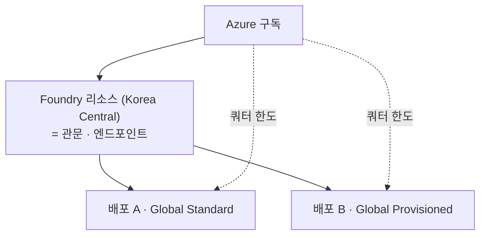
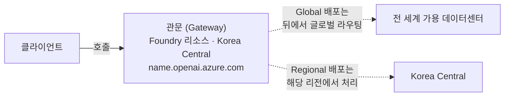

# Azure OpenAI 기본 개념 — 리소스 · 배포 · 쿼터 · PTU 신청과 예약

> 대상: AOAI/Foundry를 처음 도입하거나, **쿼터·용량·예약 개념이 헷갈리는** 아키텍트·플랫폼 담당자
> 범위: 리소스 계층 구조 → 배포 유형 → 쿼터 vs 용량 → PTU 신청 절차 → Azure 예약 구매

---

## 0. 한 장 요약

### 용어 관계도



### 🔑 먼저 짚을 것 — 리소스에는 반드시 "리전"이 있습니다

**Global 배포를 쓰더라도 리소스를 만들 때 리전을 골라야 합니다.** 여기서 대부분 혼란이 시작됩니다.



| 계층 | 리전 종속성 |
|---|---|
| **리소스(엔드포인트)** | **항상 특정 리전에 고정** — 클라이언트가 두드리는 주소 |
| **배포의 처리 위치** | 배포 유형에 따라 전 세계 / 데이터 존 / 단일 리전 |

즉 **리소스 리전은 "처리 장소"가 아니라 "들어가는 문"** 입니다. Global Standard든 Global Provisioned든 **일단 Korea Central의 관문으로 들어온 뒤**, 그 뒤에서 전 세계로 라우팅됩니다.

> ⚠️ 그래서 **"Global이니까 리전과 무관하다"는 말은 절반만 맞습니다.**
> 처리는 글로벌이지만 **관문은 리전 고정**이므로, 그 리전에 문제가 생기면 호출 자체가 들어가지 못합니다. 이것이 [가이드 04](../04-aoai-high-availability/)에서 다루는 가용성 설계의 출발점입니다.

| 용어 | 한 줄 정의 | 흔한 오해 |
|---|---|---|
| **리소스(Resource)** | Azure에 만드는 그릇. 엔드포인트·키·네트워크·RBAC의 경계 | "리소스 = 모델"이 아님 |
| **배포(Deployment)** | 리소스 안에 특정 모델을 특정 방식으로 올린 것 | 배포 이름이 곧 API의 `model` 값 |
| **배포 유형(Deployment type)** | 그 배포가 **어디서 처리되고 어떻게 과금되는지** | 모델 종류와 무관한 별개 축 |
| **쿼터(Quota)** | 배포할 수 있는 **상한선**. 비용 없음 | "쿼터 = 용량"이 아님 |
| **용량(Capacity)** | 실제로 배포 가능한 **실물 자원** | 쿼터가 있어도 없을 수 있음 |
| **PTU** | 전용 처리 능력의 단위 | 모델별로 같은 PTU가 다른 TPM을 냄 |
| **예약(Reservation)** | PTU 요금 **할인 약정** | 용량을 잡아주지 않음 |

### 가장 많이 하는 실수 5가지

1. **쿼터를 받았으니 배포된다고 생각** → 용량이 없으면 배포 실패 (§4.2)
2. **예약을 먼저 구매** → 배포 못 하면 돈만 나감. **배포 → 예약** 순서 (§6.2)
3. **배포 유형별로 쿼터가 나뉜 걸 모름** → Global 쿼터로 Regional 배포 불가 (§4.4)
4. **야간에 PTU 축소** → 아침에 용량을 못 되찾을 수 있음 (§4.3)
5. **예약을 배포 유형·리전과 안 맞춤** → 할인 미적용 (§6.4)

---

## 1. 리소스 — 무엇을 만드는가

### 1.1 ARM 리소스 타입은 하나입니다

Azure OpenAI든 Foundry든 **ARM 리소스 타입은 동일**합니다.

```
Microsoft.CognitiveServices/accounts
```

구분은 **`kind`** 로 이루어집니다.

| kind | 명칭 | 성격 |
|---|---|---|
| `OpenAI` | Azure OpenAI 리소스 | **레거시.** OpenAI 모델·API만 제공 |
| `AIServices` | **Foundry 리소스** | **현재 권장.** 에이전트·모델·도구·평가를 한 리소스에서 |

> *"Azure OpenAI – A specialized resource type that provides access to OpenAI models and APIs only. **For most use cases, use the Foundry resource**, which offers backward compatibility with all Azure OpenAI APIs."*

**기존 Azure OpenAI 리소스를 쓰고 있다면** 업그레이드 경로가 있습니다.

> *"Upgrade your Azure OpenAI resource to a Foundry resource **while preserving your endpoint, API keys, and existing state**."*

즉 **엔드포인트와 키를 유지한 채** 전환할 수 있어 애플리케이션 코드 변경이 최소화됩니다.

### 1.2 Hub · 프로젝트 — 어느 것을 쓰나

| 개념 | 상태 |
|---|---|
| **Azure AI Hub** | 레거시. 2025-06부터 기능이 Foundry 리소스로 이관 중 |
| **Hub 기반 프로젝트** | Foundry (classic) 포털에서만 접근. **신규 투자 대상 아님** |
| **Foundry 프로젝트** | **현재 권장.** 새 포털의 기본 |

> *"Hub-based projects are accessible in the Foundry (classic) portal. **New investments are focused on Foundry projects in the new portal.**"*

### 1.3 리소스 하나에 배포는 여러 개

**리소스 : 배포 = 1 : N** 관계입니다.

| 제한 | 값 |
|---|---|
| 리소스당 최대 Standard 배포 수 | **32** |
| 배포당 최대 PTU | **100,000** |

> 💡 **중요**: 같은 리소스 안의 배포들은 **엔드포인트를 공유**합니다. 즉 §0에서 본 "관문"이 하나뿐이라는 뜻입니다. 리소스가 속한 리전에 문제가 생기면 그 안의 **모든 배포가 함께 도달 불가**가 됩니다. 이 사실이 [가이드 04](../04-aoai-high-availability/)의 HA 설계에서 결정적인 의미를 갖습니다.

### 1.4 엔드포인트와 호출 방식

```python
from openai import OpenAI

client = OpenAI(
    api_key=os.getenv("AZURE_OPENAI_API_KEY"),
    base_url="https://<resource-name>.openai.azure.com/openai/v1/",
)

resp = client.chat.completions.create(
    model="prod-gpt5-ptu",     # ← 모델명이 아니라 "배포 이름"
    messages=[...]
)
```

> 🔑 **`model` 파라미터에는 모델명이 아니라 배포 이름이 들어갑니다.** OpenAI에서 넘어온 팀이 가장 먼저 부딪히는 차이입니다([가이드 01](../01-oai-to-aoai-onboarding/) 참고).

---

## 2. 배포(Deployment) — 무엇을 올리는가

배포를 만들 때 정하는 것은 **3가지**입니다.

```
① 어떤 모델을      (gpt-5.1)
② 어떤 버전으로    (2025-11-13)
③ 어떤 방식으로    (Global Standard / Global Provisioned / ...)
```

**③이 "배포 유형"이며, 모델 선택과는 완전히 독립된 축**입니다. 여기서 대부분의 혼란이 발생합니다.

### 2.1 배포 유형 전체 지도

배포 유형은 **"어디서 처리되나(행) × 어떻게 과금되나(열)"** 의 조합입니다.

| 처리 위치 ＼ 과금 | **토큰 과금 (Standard)** | **용량 예약 (Provisioned)** | 배치 |
|---|---|---|---|
| **전 세계** (Global) | `GlobalStandard` | `GlobalProvisionedManaged` | `GlobalBatch` |
| **데이터 존 내** (US/EU/APAC*) | `DataZoneStandard` | `DataZoneProvisionedManaged`* | `DataZoneBatch` |
| **단일 리전** | `Standard` | `ProvisionedManaged` | — |

\* **APAC은 Standard만 지원**합니다. Data Zone Provisioned는 US/EU만 가능합니다([가이드 04 §3.2](../04-aoai-high-availability/)).

### 2.2 어떻게 고르나

**1단계 — 데이터 처리 위치 요건이 있는가?**

| 요건 | 선택 |
|---|---|
| 없음 | **Global** (쿼터가 가장 크고 모델도 가장 빨리 들어옴) |
| 지리 권역 내(EU/US/APAC) | **Data Zone** |
| 특정 리전 내 | **Standard / Regional Provisioned** |

> ⚠️ **저장(at rest)은 모든 유형이 지정 지리 내**입니다. Global이 문제가 되는 건 **처리(processing)** 위치입니다. 규제가 처리 위치까지 제한하는지 먼저 확인하세요.

**2단계 — 트래픽이 예측 가능한가?**

| 상황 | 선택 |
|---|---|
| 개발·테스트·변동 큰 트래픽 | **Standard** (쓴 만큼 과금) |
| 예측 가능한 기저 부하 · 지연 SLA 필요 | **Provisioned (PTU)** |
| 야간 대량 처리, 지연 무관 | **Batch** (약 50% 저렴, 별도 쿼터) |

### 2.3 Standard vs Provisioned 핵심 차이

| | Standard | Provisioned (PTU) |
|---|---|---|
| 과금 | **토큰당** | **시간당** (PTU 수 × 시간) |
| 사용량 0일 때 | **0원** | **그대로 청구** |
| 용량 | 공유 | **전용** |
| 지연 SLA | 없음(best-effort) | **모델별 지연 목표 있음** |
| 한계 도달 시 | 429 | **사용률 100% → 429** |

> 💰 **PTU는 "쓰든 안 쓰든" 청구됩니다.** 배포를 만든 순간 미터가 시작되고 삭제해야 멈춥니다. 기저 부하가 확실할 때만 의미가 있습니다.

---

## 3. PTU — 전용 처리 능력의 단위

### 3.1 PTU의 성질

| 특성 | 내용 |
|---|---|
| **모델 독립적** | 같은 PTU 쿼터로 지원되는 아무 모델이나 배포 가능. "gpt-5용 PTU"를 따로 사지 않음 |
| **리전별** | 쿼터는 구독 × 리전 × 배포 유형 단위 |
| **모델마다 처리량이 다름** | 같은 100 PTU라도 모델에 따라 나오는 TPM이 다름 |
| **최소 배포 크기 존재** | 모델·유형별로 다름 |

### 3.2 최소 배포 크기와 증분

| 배포 유형 | 최소 PTU | 증분 |
|---|---|---|
| **Global / Data Zone Provisioned** | **15** | **5** |
| **Regional Provisioned** | **25~50** (모델별) | **25~50** |

예: gpt-4.1·gpt-5 계열의 Regional은 **50 PTU 최소 · 50 단위 증분** → 50, 100, 150...

> 💰 이 차이가 HA 비용에 직접 영향을 줍니다. Regional로 다중 리전을 구성하면 최소 비용이 몇 배가 됩니다.

### 3.3 PTU 규모 산정

계산에 필요한 3가지 입력입니다.

| 입력 | 설명 |
|---|---|
| **요청 형태** | 분당 요청 수(RPM), 평균 입력 토큰, 평균 출력 토큰 |
| **출력:입력 비율** | **출력 토큰이 입력보다 훨씬 무겁습니다.** 모델별 환산 비율 존재 |
| **캐시 적중률** | **캐시된 토큰은 PTU를 소모하지 않습니다.** 적중률이 높으면 필요 PTU 감소 |

이를 **정규화 TPM**으로 환산한 뒤, 모델의 **PTU당 입력 TPM** 값으로 나눠 필요 PTU를 구합니다.

🔗 **용량 계산기**: https://ai.azure.com/nextgen/goto/build/models/ptu-calculator

> 💡 **출력 토큰을 통제하면 PTU가 줄어듭니다.** `max_tokens` 제한과 프롬프트 캐싱은 성능뿐 아니라 **필요 PTU 자체를 낮추는** 수단입니다.

---

## 4. 쿼터(Quota) vs 용량(Capacity) — 가장 큰 혼란

### 4.1 둘은 완전히 다른 것입니다

| | **쿼터 (Quota)** | **용량 (Capacity)** |
|---|---|---|
| 정체 | Azure가 정한 **정책 한도** | 실제 존재하는 **물리 자원** |
| 비용 | **없음** | 배포 시 점유 |
| 비유 | 은행 **한도** | 금고 안의 **현금** |
| 확인 방법 | Foundry 포털 Quota 페이지 | 배포 시도 / Model capacities API |

### 4.2 🔴 쿼터가 있어도 배포가 실패합니다

> *"**Having PTU quota doesn't guarantee that capacity is available.** If capacity in the region is insufficient for the requested PTU count, **the deployment fails.** Always verify capacity availability before planning a deployment or purchasing a reservation."*

**"쿼터를 미리 받아뒀으니 장애 때 배포하면 된다"는 계획은 실패합니다.**

### 4.3 ⚠️ 반납한 용량은 돌아오지 않을 수 있습니다

> *"**Deleting or scaling down a deployment releases its capacity back to the region pool.** There's **no guarantee the same capacity is available** if you re-create or scale the deployment up later."*
>
> *"**Capacity availability changes throughout the day** based on customer demand across all regions and models."*

→ **비용 절감을 위해 야간에 PTU를 축소하는 운영은 위험합니다.**

### 4.4 쿼터가 나뉘는 기준

```
쿼터 = 구독  ×  리전  ×  배포 유형
```

| 잘못된 가정 | 실제 |
|---|---|
| "PTU 100개 있으니 아무 유형이나" | ❌ Global / Data Zone / Regional은 **완전히 별개 풀** |
| "East US 쿼터가 남으니 West Europe에서도" | ❌ *"quota in East US doesn't apply to West Europe"* |

> ⚠️ Failover 설계에서 **배포 유형을 바꾸려면**(예: Regional → Global) **그 유형의 쿼터를 따로 확보**해야 합니다.

### 4.5 Standard 쿼터 — TPM과 쿼터 티어

Standard 배포의 쿼터는 **TPM(분당 토큰)** 과 **RPM(분당 요청)** 으로 표현됩니다.

> ⚠️ **"1,000 TPM = 6 RPM" 같은 고정 비율은 현재 문서에 없습니다.** 모델별로 크게 다릅니다.
>
> | 모델 | RPM | TPM |
> |---|---|---|
> | gpt-4.1 (GlobalStandard) | 1,000 | 1,000,000 |
> | gpt-4o-mini (GlobalStandard) | 20,000 | 2,000,000 |
> | o3-mini (GlobalStandard) | 500 | 5,000,000 |
>
> 반드시 **모델별 쿼터 표**를 확인하세요.

#### 🆕 쿼터 티어 (자동 상향)

Foundry는 **Free Tier + Tier 1~6** 체계를 도입했습니다.

| 항목 | 내용 |
|---|---|
| 초기 티어 결정 | 현재 사용량 + Microsoft 관계(**EA / MCA-E**) |
| 자동 상향 | 사용량이 늘면 **자동으로 상위 티어로 이동** |
| 기존 승인분 | **유지되며 축소되지 않음** |
| 추가 요청 | 티어와 별개로 폼으로 요청 가능 |
| 옵트아웃 | `tierUpgradePolicy: NoAutoUpgrade` (preview) |

현재 티어 확인:

```bash
curl -X GET \
  "https://management.azure.com/subscriptions/$SUB/providers/Microsoft.CognitiveServices/quotaTiers?api-version=2025-10-01-preview" \
  -H "Authorization: Bearer $(az account get-access-token --resource https://management.azure.com --query accessToken -o tsv)"
```

#### 🆕 구독 단위 쿼터 통합

> *"**Subscription-level quota management in Microsoft Foundry started after May 7, 2026.**"*

- **Global Standard**: 같은 모델·버전이면 **구독 내 모든 리전이 한 풀을 공유**
- **Data Zone Standard**: **데이터 존별로 한 풀**

> 📌 이전에는 리소스·리전별로 쿼터를 나눠 관리했지만, 이제 **구독 단위로 통합**되는 방향입니다. 리전마다 쿼터를 쪼개 배정하던 기존 운영 방식은 재검토가 필요합니다.

---

## 5. 실전 절차 ① — 쿼터 신청과 용량 확인

### 5.1 전체 흐름


> 🔑 **④와 ⑤의 순서가 핵심입니다.** 뒤바꾸면 안 됩니다(§6.2).

### 5.2 쿼터 확인 및 신청

**포털 경로**
```
Foundry 포털 → Operate → Quota → Provisioned throughput unit
→ 구독·리전 선택 → 현재 사용량 확인
→ 부족하면 [Request Quota]
```

**신청 폼 (직접 링크)**
🔗 https://aka.ms/oai/stuquotarequest

> Standard TPM 쿼터와 PTU 쿼터 모두 현재 **같은 폼**을 사용합니다.

> ⏱️ *"**Approval might take several days** based on quota availability, and you receive an email notification when the request is approved."*
>
> **수일이 걸립니다.** 장애 상황에서 급히 신청하는 건 대책이 되지 못합니다. 반드시 **사전에** 확보하세요.

### 5.3 용량(Capacity) 확인 — 배포 전에

**Model capacities API**로 배포 가능한 실제 용량을 조회합니다.

```bash
curl -X GET \
  "https://management.azure.com/subscriptions/$SUB/providers/Microsoft.CognitiveServices/modelCapacities\
?api-version=2024-10-01&modelFormat=OpenAI&modelName=gpt-5.1&modelVersion=2025-11-13" \
  -H "Authorization: Bearer $TOKEN"
```

| 쿼리 파라미터 | 필수 | 예시 |
|---|---|---|
| `api-version` | ✅ | `2024-10-01` |
| `modelFormat` | ✅ | `OpenAI` |
| `modelName` | ✅ | `gpt-5.1` |
| `modelVersion` | ✅ | `2025-11-13` |

응답은 **리전 × 배포 유형(SKU)별**로 반환되며, **`availableCapacity`** 가 배포 가능한 최대치입니다.

```json
{
  "value": [
    {
      "location": "koreacentral",
      "properties": {
        "model": { "format": "OpenAI", "name": "gpt-5.1", "version": "2025-11-13" },
        "skuName": "GlobalProvisionedManaged",
        "availableCapacity": 300
      }
    }
  ]
}
```

> 💡 **HA를 운영한다면 이 API를 정기 점검에 넣으세요.** Failover 대상 리전의 용량이 실제로 있는지를 **장애 전에** 확인할 수 있는 방법입니다.

> 📌 `skuName`이 배포 유형입니다. 같은 리전·모델이라도 **`GlobalProvisionedManaged`와 `ProvisionedManaged`의 용량은 별개**이므로, 실제로 배포할 유형의 값을 확인해야 합니다.

### 5.4 용량이 없을 때

1. **PTU 수를 줄여** 배포 시도
2. **다른 리전** 시도 — API를 리전별로 조회해 여유가 있는 곳을 찾습니다
3. **시간을 두고 재시도** — 용량은 하루 중에도 변합니다
4. 쿼터 폼으로 **용량 요청**

---

## 6. 실전 절차 ② — Azure 예약(Reservation) 구매

### 6.1 예약이란

**PTU 시간당 요금에 적용되는 할인 약정**입니다. 1개월 또는 1년을 약정하고 낮은 단가를 받습니다.

| 특성 | 내용 |
|---|---|
| 약정 기간 | **1개월 또는 1년** (3년 옵션 **없음**) |
| 적용 대상 | 배포가 아니라 **PTU 미터(시간당 사용량)** |
| 결합도 | 배포와 예약은 **독립적으로 생성** |

### 6.2 🔑 반드시 "배포 → 예약" 순서

> *"Because capacity availability for model deployments is dynamic and changes frequently across regions and models, **always create deployments first, then purchase the Azure Reservation** to cover the PTUs you've deployed."*
>
> *"**Reservations don't guarantee capacity.** First create deployments to confirm that capacity is available, then purchase the reservation to lock in the discounted rate."*

**예약을 먼저 사면 이런 일이 생깁니다:**

```
예약 500 PTU 구매  →  배포하려니 용량 300 PTU만 있음
                  →  200 PTU 분량의 약정은 그대로 청구
                  →  사용하지 못한 예약은 소멸(이월 안 됨)
```

### 6.3 구매 절차

```
Azure 포털 → All services → Reservations
→ [Microsoft Foundry Provisioned Throughput] 선택
```

| 단계 | 선택 항목 | 주의 |
|---|---|---|
| 1 | **구독** | EA / MCA / 종량제 지원 |
| 2 | **범위(Scope)** | 리소스 그룹 / 단일 구독 / 공유 / 관리 그룹 |
| 3 | **리전** | Global은 아무 리전이나 무방(§6.4) |
| 4 | **제품(배포 유형)** | Global / Data Zone / Regional 중 **배포와 일치** |
| 5 | **수량** | 배포된 PTU 총합에 맞춤 |
| 6 | 검토 → **Buy now** | |

### 6.4 ⚠️ 배포 유형·리전 매칭 규칙

> *"**Reservations for Global, Data Zone, and Regional deployments aren't interchangeable.** You need to purchase a separate reservation for each deployment type."*

| 배포 유형 | 리전 일치 필요? |
|---|---|
| **Global Provisioned** | ❌ **불필요** — 한 예약이 여러 리전을 커버 |
| **Data Zone Provisioned** | ✅ **필요** |
| **Regional Provisioned** | ✅ **필요** |

**Global 예약의 강점 (문서 예시):**

> *"if you have 50 Global PTUs in East US, 100 in West Europe, and 200 in Australia East, you can purchase a **single Global reservation for 350 units in any region** to cover all deployments across all three regions."*

> 💰 **다중 리전 HA를 계획한다면 Global Provisioned가 예약 측면에서 압도적으로 유리합니다.** Regional은 리전마다 별도 예약이 필요합니다.

### 6.5 초과와 미달

| 상황 | 결과 |
|---|---|
| **배포 PTU > 예약 수량** | 초과분은 **정가 시간당 요금**으로 청구 |
| **예약 수량 > 배포 PTU** | 남는 예약은 **소멸. 이월되지 않음** |

문서 예시: 500 PTU 예약 + 기존 300 PTU 배포 상태에서 300 PTU를 추가하면 → 200은 커버, **100은 시간당 정가 청구**.

---

## 7. 운영 체크포인트

### 7.1 배포 후 확인할 것

| 항목 | 방법 |
|---|---|
| PTU 사용률 | Azure Monitor → `Provisioned-managed utilization V2` |
| 성능 검증 | `azure-openai-benchmark` 도구 |
| 429 발생 | 정상적인 흐름 제어 신호. 재시도 또는 Spillover로 대응 |

> 자세한 메트릭·알림·KQL은 [가이드 03](../03-aoai-deployment-monitoring/) 참고.

### 7.2 정리(삭제) 순서

```
① 배포 삭제
② 리소스 삭제
③ Purge (소프트 삭제 완전 제거)
④ 예약은 별도로 취소·교환   ← 잊기 쉬움
```

> 🔴 **배포를 지워도 예약은 자동으로 취소되지 않습니다.** Azure 포털의 Reservations에서 직접 처리해야 하며, 그대로 두면 쓰지도 않는 약정이 계속 청구됩니다.

### 7.3 정기 점검 루틴

| 주기 | 항목 |
|---|---|
| 주간 | PTU 사용률 · 429 발생 추이 |
| 월간 | 예약 활용률(사용하지 못한 예약 확인) · 토큰 소비 상위 앱 |
| 분기 | Failover 리전 **용량 실재 확인** · 모델 은퇴 일정 |

---

## 8. 자주 묻는 질문

**Q. 리소스를 여러 개 만들어야 하나요, 하나에 배포를 여러 개 만들어야 하나요?**
기능만 보면 하나로 충분합니다(배포 32개까지). 다만 **가용성 관점에서는 리소스가 곧 엔드포인트 경계**이므로, 프로덕션에서는 **리전이 다른 리소스 2개**를 권장합니다([가이드 04](../04-aoai-high-availability/)).

**Q. PTU를 샀는데 다른 모델로 바꿔도 되나요?**
됩니다. PTU 쿼터는 **모델 독립적**입니다. 지원되는 모델이면 같은 쿼터로 재배포할 수 있습니다. 단, **모델마다 최소 PTU와 PTU당 처리량이 다릅니다.**

**Q. 트래픽이 없는 밤에 PTU를 줄이면 비용이 절약되나요?**
계산상으로는 그렇지만 **권장하지 않습니다.** 반납한 용량을 다시 확보하지 못할 수 있고, 지속적인 시간당 과금이 예약 가격보다 비싼 경우가 많습니다(§4.3).

**Q. 예약을 사면 용량이 확보되나요?**
**아닙니다.** 예약은 순수한 **요금 할인**입니다. 반드시 배포로 용량을 확인한 뒤 구매하세요(§6.2).

**Q. Standard와 PTU를 같이 쓸 수 있나요?**
권장 구성입니다. **PTU로 기저 부하, Standard로 피크**를 처리합니다. Spillover를 설정하면 PTU 포화 시 자동으로 넘어갑니다([가이드 04 §5](../04-aoai-high-availability/)).

**Q. 쿼터 신청은 얼마나 걸리나요?**
**수일**이 소요됩니다. 프로젝트 일정에 반드시 선반영하세요.

---

## 부록. 참고 문서

### 개념
- Foundry란 무엇인가: https://learn.microsoft.com/azure/foundry/what-is-foundry
- 리소스 유형: https://learn.microsoft.com/azure/foundry-classic/concepts/resource-types
- Foundry 리소스 생성: https://learn.microsoft.com/azure/ai-services/multi-service-resource
- 배포 유형 비교: https://learn.microsoft.com/azure/foundry/foundry-models/concepts/deployment-types

### 쿼터 · 용량
- 쿼터 및 제한(쿼터 티어 포함): https://learn.microsoft.com/azure/foundry/openai/quotas-limits
- PTU 개념: https://learn.microsoft.com/azure/foundry/openai/concepts/provisioned-throughput
- PTU 사이징: https://learn.microsoft.com/azure/foundry/openai/how-to/provisioned-throughput-sizing
- Model capacities API: https://learn.microsoft.com/rest/api/aiservices/accountmanagement/model-capacities/list
- 🔑 모델 리전 가용성 표: https://learn.microsoft.com/azure/foundry/foundry-models/concepts/models-sold-directly-by-azure-region-availability?pivots=provisioned
- 쿼터 신청 폼: https://aka.ms/oai/stuquotarequest
- 용량 계산기: https://ai.azure.com/nextgen/goto/build/models/ptu-calculator

### 예약 · 청구
- PTU 청구 및 예약: https://learn.microsoft.com/azure/foundry/openai/concepts/provisioned-throughput-billing
- 예약 구매(Cost Management): https://learn.microsoft.com/azure/cost-management-billing/reservations/microsoft-foundry
- 예약 교환·환불: https://learn.microsoft.com/azure/cost-management-billing/reservations/exchange-and-refund-azure-reservations

### 운영
- 프로비저닝 배포 운영 시작: https://learn.microsoft.com/azure/foundry/openai/how-to/provisioned-get-started