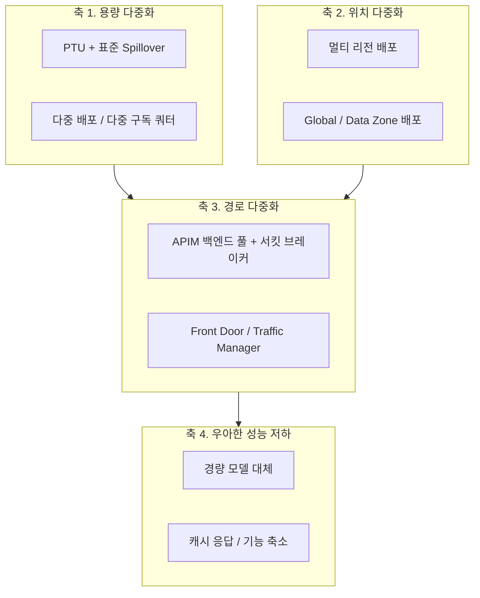
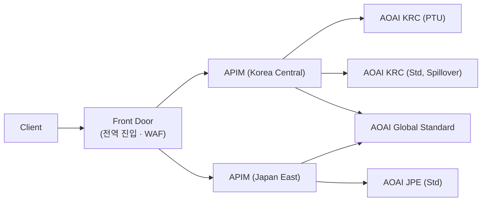

# Azure OpenAI 고가용성(HA) 아키텍처 가이드

> 대상: AOAI를 **미션 크리티컬 워크로드**에 사용하는 아키텍트, SRE, 플랫폼 팀
> 범위: 장애 유형 분류 → 계층별 HA 설계 → Spillover/APIM/멀티 리전 → 용량·모델 수명주기 → 검증
> 관련 가이드: [01 온보딩](../01-oai-to-aoai-onboarding/) · [02 배포 & 운영 모니터링](../02-aoai-deployment-monitoring/)
> 검증 기준: Azure OpenAI Spillover, API Management Backends(`2024-05-01`), Azure RBAC 기본 제공 역할 문서 (2026-08 확인)
>
> **⚠️ 초안(Draft)** — 리뷰용으로 공개된 문서입니다. 조직 표준 확정 전까지 그대로 적용하지 마세요. 미확정 항목은 문서 말미의 *리뷰가 필요한 항목* 참고.

---

## 0. TL;DR

### HA 성숙도 레벨

| Level | 구성 | 견딜 수 있는 장애 | 대상 |
|---|---|---|---|
| **L0** | 단일 리전 · 단일 배포 · 재시도 없음 | 없음 | PoC |
| **L1** | + 지수 백오프 재시도, `Retry-After` 준수, 타임아웃 정합성 | 순간적 429/5xx | 내부 도구 |
| **L2** | + **Spillover** (PTU → 표준, 동일 리소스) | **용량 포화(429)** | 일반 Production |
| **L3** | + **APIM 백엔드 풀** (다중 리전, 우선순위 + 서킷 브레이커) | 용량 + **리전 장애** | 중요 서비스 |
| **L4** | + Front Door 다중 APIM, 다중 구독/테넌트 쿼터 분산, 성능 저하 모드 | 게이트웨이·구독 단위 장애 | 미션 크리티컬 |

> 💡 **핵심 원칙**: Spillover는 **용량 장애**만 해결하고, APIM 백엔드 풀은 **리전 장애**까지 해결합니다. 둘은 대체 관계가 아니라 **보완 관계**입니다(§5.4).

### 최소 체크리스트

- [ ] 모든 클라이언트가 `Retry-After` 헤더를 **준수**한다 (§4.2)
- [ ] PTU 배포에 **Spillover 표준 배포**가 연결되어 있다 (§5)
- [ ] 최소 **2개 리전**에 동일 모델·버전 배포가 존재한다 (§7)
- [ ] APIM 백엔드 풀에 **서킷 브레이커 규칙**이 설정되어 있다 (§6.3)
- [ ] 리전별 **쿼터가 실제로 확보**되어 있다 (Failover 시점에 없으면 무의미, §8)
- [ ] 모델 **버전 은퇴(retirement) 일정**을 추적하고 있다 (§9)
- [ ] **성능 저하 모드(graceful degradation)** 가 정의되어 있다 (§10)
- [ ] Failover를 **정기적으로 테스트**한다 (§11)

---

## 1. AOAI에서 "장애"란 무엇인가

HA 설계의 출발점은 **무엇으로부터 보호할 것인가**를 정확히 나누는 것입니다. AOAI 장애는 성격이 전혀 다른 5가지로 나뉘며, **대응 수단이 각각 다릅니다.**

| # | 장애 유형 | 증상 | 근본 원인 | 유효한 대응 | 무효한 대응 |
|---|---|---|---|---|---|
| **F1** | **용량 포화** | 429 급증 | PTU 100% 도달, TPM/RPM 쿼터 초과 | Spillover, 용량 증설, 다른 배포로 라우팅 | 재시도만 반복(오히려 악화) |
| **F2** | **서비스 오류** | 500/503 | 백엔드 일시 오류 | 재시도 + 다른 배포/리전 | 용량 증설 |
| **F3** | **리전 장애** | 특정 리전 전체 실패 | 리전 인시던트 | **다른 리전 Failover** | Spillover(같은 리소스이므로 무력) |
| **F4** | **클라이언트 단절** | 499 | 타임아웃/사용자 취소 | 스트리밍, 타임아웃 정합성 | 리전 Failover |
| **F5** | **모델 수명주기** | 400/404, 품질 변화 | 모델 버전 은퇴·업그레이드 | 버전 고정 + 마이그레이션 계획 | 인프라 이중화 |

> **가장 흔한 오설계**: F1(용량)을 F3(리전 장애) 대응으로 막으려 하거나, 그 반대입니다.
> 예를 들어 Spillover만 구성해 두고 "우리는 HA가 되어 있다"고 보는 경우, **리전 인시던트에는 전혀 대비되어 있지 않습니다**(§5.4).

---

## 2. HA 설계의 4개 축



| 축 | 질문 | 대표 수단 |
|---|---|---|
| **1. 용량** | 토큰을 처리할 여유가 있는가? | PTU + Spillover, 다중 배포, 쿼터 확보 |
| **2. 위치** | 이 리전이 죽어도 되는가? | 멀티 리전, Global Standard |
| **3. 경로** | 요청을 다른 곳으로 보낼 수 있는가? | APIM 백엔드 풀, Front Door |
| **4. 저하** | 완전 실패 대신 덜 좋은 응답이 가능한가? | 경량 모델, 캐시, 기능 축소 |

**축 4를 빠뜨리는 경우가 매우 많습니다.** 모든 백엔드가 포화된 상황에서 "느린 실패"보다 "빠른 대체 응답"이 사용자 경험상 훨씬 낫습니다.

---

## 3. 배포 유형별 가용성 특성

| 배포 유형 | 용량 예측성 | 리전 종속 | 429 특성 | HA 역할 |
|---|---|---|---|---|
| **Provisioned (PTU)** | 높음(전용) | 리전 고정 | 사용률 100% 도달 시 즉시 429 | **기저 부하 담당(Primary)** |
| **Standard (PAYG)** | 낮음(공유) | 리전 고정 | 리전 쿼터 혼잡 시 429 | **Spillover 대상 / 보조** |
| **Global Standard** | 중간 | 글로벌 라우팅 | 상대적으로 여유 | **최종 Failover 후보** |
| **Data Zone Standard** | 중간 | 권역 내 | 중간 | 데이터 경계 요건 있는 Failover |
| **Batch** | — | 리전 고정 | 비동기 | 실시간 경로에서 분리(부하 감소) |

### 3.1 설계 권장 조합

```
[기저 부하]     PTU (Korea Central)
      ↓ 포화 시
[피크 흡수]     Standard (동일 리소스, Spillover)
      ↓ 리전 장애 시
[리전 Failover] Standard 또는 Global Standard (Japan East)
      ↓ 광역 장애 시
[최종 수단]     Global Standard (다른 지리)
```

> **데이터 상주(residency) 주의**: Global Standard는 **처리(processing)** 가 광역에서 일어날 수 있습니다. 규제 요건이 있는 워크로드는 Failover 후보를 **Data Zone** 또는 동일 지리 내 리전으로 제한해야 합니다. HA를 위해 컴플라이언스를 깨지 마세요.

---

## 4. Layer 1 — 클라이언트 복원력

**가장 저렴하고 가장 효과가 큰 계층입니다.** 인프라를 아무리 이중화해도 클라이언트가 잘못 재시도하면 장애를 스스로 만들어냅니다.

### 4.1 재시도 설계

| 상태 코드 | 재시도 | 방식 |
|---|---|---|
| 429 | ✅ | **`Retry-After` 우선**, 없으면 지수 백오프 + 지터 |
| 500 / 502 / 503 / 504 | ✅ | 지수 백오프 + 지터, 2~3회 |
| 408 | ✅ | 1~2회 |
| 400 / 401 / 403 / 404 | ❌ | 재시도 무의미 (요청·권한·모델 문제) |
| 499 | ❌ | 클라이언트 측 단절 — 타임아웃/스트리밍으로 해결 |

### 4.2 ⚠️ `Retry-After`를 반드시 확인해야 하는 이유

AOAI가 429와 함께 반환하는 `Retry-After` 값은 **매우 클 수 있습니다(예: 1일 단위)**. 이는 공식 문서에도 명시된 주의사항입니다.

- 이 값을 **무시하고 즉시 재시도**하면 → 스로틀이 증폭되고 백엔드가 회복되지 않습니다.
- 이 값을 **그대로 대기**하면 → 서비스가 사실상 멈춥니다.

**따라서 실무 처리는 다음과 같아야 합니다.**

```
if 429:
    ra = Retry-After
    if ra <= 상한(예: 30초):
        해당 시간만큼 대기 후 재시도
    else:
        재시도하지 않고 즉시 다음 백엔드로 전환(Failover)
        + 해당 백엔드를 일정 시간 라우팅 대상에서 제외
```

즉 **"긴 `Retry-After` = 이 백엔드는 지금 포기하라는 신호"** 로 해석하고, 대기가 아니라 **경로 전환**으로 대응합니다. APIM 서킷 브레이커도 동일한 사고방식으로 동작합니다(§6.3).

### 4.3 타임아웃 정합성

```
클라이언트 타임아웃  ≥  게이트웨이(APIM) 백엔드 타임아웃  ≥  예상 최대 생성 시간
```

- 역전되면 상위 계층이 먼저 끊어 **499**가 발생하고, 재시도가 중첩되어 부하가 배가됩니다.
- 스트리밍(SSE)을 사용하면 첫 토큰이 즉시 도착해 유휴 타임아웃 문제 대부분이 사라집니다.

### 4.4 클라이언트 측 서킷 브레이커 & 부하 차단

- 연속 실패한 엔드포인트는 일정 시간 **격리(open)** 후 half-open으로 복귀
- **Bulkhead**: 배포별 동시 요청 수 상한 → 한 배포의 지연이 전체 스레드를 잠식하지 않도록
- **큐잉/우선순위**: 대화형 요청 우선, 배치성 요청은 지연 허용 큐로 분리

---

## 5. Layer 2 — Spillover (PTU → 표준 배포)

PTU 배포가 포화되어 비(非)200 응답(예: PTU 소진 시 429)을 반환할 때, **오버플로 요청을 대응되는 표준 배포로 자동 라우팅**하는 기능입니다.

### 5.1 전제 조건

- **동일한 Foundry/AOAI 리소스 안에** 프로비저닝 배포와 표준 배포가 함께 존재해야 합니다.
- Spillover 대상 표준 배포는 **같은 모델·같은 버전**이어야 합니다.
- 구성에는 **Cognitive Services Contributor** 이상 권한이 필요합니다.

### 5.2 배포 단위로 켜기

배포 속성 `spilloverDeploymentName`에 표준 배포 이름을 지정합니다. 신규 생성 시 또는 기존 배포에 추가할 수 있습니다.

```bash
curl -X PUT "https://management.azure.com/subscriptions/$SUB/resourceGroups/$RG/providers/Microsoft.CognitiveServices/accounts/$ACCOUNT/deployments/ptu-gpt4o?api-version=2024-10-01" \
  -H "Content-Type: application/json" \
  -H "Authorization: Bearer $TOKEN" \
  -d '{
        "sku": { "name": "GlobalProvisionedManaged", "capacity": 100 },
        "properties": {
          "spilloverDeploymentName": "std-gpt4o",
          "model": { "format": "OpenAI", "name": "gpt-4o", "version": "2024-11-20" }
        }
      }'
```

### 5.3 요청 단위로 켜기

요청 헤더 `x-ms-spillover-deployment`에 표준 배포 이름을 지정하면 **해당 요청만** Spillover 대상이 됩니다.

```bash
curl "$AZURE_OPENAI_ENDPOINT/openai/deployments/ptu-gpt4o/chat/completions?api-version=2024-10-21" \
  -H "Content-Type: application/json" \
  -H "x-ms-spillover-deployment: std-gpt4o" \
  -H "Authorization: Bearer $TOKEN" \
  -d '{ "messages": [ { "role": "user", "content": "..." } ] }'
```

> **우선순위 규칙**: 배포 속성(`spilloverDeploymentName`)과 요청 헤더가 둘 다 설정되면 **배포 속성이 우선**합니다.
> 요청 단위로만 제어하고 싶다면 배포 속성을 설정하지 말고 헤더만 사용하세요.

**활용 예** — 워크로드별 차등 정책:

| 워크로드 | Spillover | 이유 |
|---|---|---|
| 대화형 UI | ✅ 켬 | 지연이 늘더라도 실패보다 낫다 |
| 실시간 저지연 API | ❌ 끔 | 표준 배포의 지연 변동을 허용할 수 없다 |
| 배치·백그라운드 | ✅ 켬 | 지연 허용 |

### 5.4 ⚠️ Spillover가 **막지 못하는** 것

Spillover는 **동일 리소스 내부**의 표준 배포로 넘기는 기능입니다. 따라서:

| 장애 | Spillover로 대응 가능? |
|---|---|
| PTU 용량 포화 (429) | ✅ |
| PTU 배포의 일시적 5xx | ✅ (비200 응답 시 라우팅) |
| **리전 전체 장애** | ❌ 표준 배포도 같은 리전에 있음 |
| **리소스/구독 단위 문제** | ❌ |
| 표준 배포 쿼터까지 소진 | ❌ 최종 실패 |

> 즉 **Spillover는 HA의 시작이지 완성이 아닙니다.** 리전 장애 대비는 §6~7의 다중 리전 경로가 필요합니다.

### 5.5 Spillover 관측

응답 헤더로 판별합니다.

| 헤더 | 의미 |
|---|---|
| `x-ms-spillover-from-deployment` | 값이 있으면 **이 요청은 Spillover된 요청** (PTU 배포명 포함) |
| `x-ms-deployment-name` | 실제로 요청을 처리한 배포 이름 |
| `x-ms-spillover-error` | Spillover를 유발한 프로비저닝 배포의 응답 코드(429/500/503 등). **성공 여부와 무관하게 존재** |

> Spillover된 요청을 표준 배포도 처리하지 못하면, **표준 배포의 응답(상태 코드·본문)이 그대로 반환**됩니다. 이때도 위 헤더가 남아 있으므로 "Spillover 실패"와 "표준 배포 직접 실패"를 구분할 수 있습니다.

메트릭 측면에서는 `AzureOpenAIRequests` 메트릭의 **`IsSpillover` 차원**으로 분리해 추이를 봅니다.

- Spillover 비율이 지속적으로 높다 → **PTU 증설 신호**
- Spillover 비율 급증 + 지연 증가 → 피크 부하 또는 특정 테넌트 폭주

> 자세한 메트릭·KQL은 [가이드 02](../02-aoai-deployment-monitoring/) 참고.

---

## 6. Layer 3 — APIM AI Gateway (다중 백엔드)

리전 장애까지 흡수하려면 **요청 경로를 바꿀 수 있는 계층**이 필요합니다. APIM 백엔드 풀이 그 역할을 합니다.

### 6.1 백엔드 엔터티 구성

- Runtime URL에 각 AOAI 엔드포인트 지정
- **Managed Identity로 인증** 권장 (키 관리·순환 부담 제거, 키 유출로 인한 가용성 사고 예방)
  - **Resource ID**: `https://cognitiveservices.azure.com` (후행 슬래시 없음, `/.default` 불필요)
  - APIM의 관리 ID에 **`Cognitive Services OpenAI User`** 역할 부여

> ⚠️ **역할 선택 주의 — 공식 문서 간 불일치가 있습니다.**
> APIM *Backends* 문서는 AOAI 백엔드에 **`Cognitive Services User`** 를 부여하라고 안내합니다. 기능적으로는 동작하지만, 이 역할은 `Microsoft.CognitiveServices/accounts/listkeys/action` 권한을 포함해 **관리 ID가 AOAI 계정 키를 조회할 수 있습니다.** 또한 DataActions가 `Microsoft.CognitiveServices/*` 와일드카드라 Speech·Vision 등 다른 서비스까지 열립니다.
>
> 반면 AOAI RBAC 문서가 추론 호출용으로 제시하는 역할은 **`Cognitive Services OpenAI User`**(`5e0bd9bd-7b93-4f28-af87-19fc36ad61bd`)이며, 키 조회 권한이 **없고** 데이터 액션이 `accounts/OpenAI/...` 범위로 한정됩니다.
>
> **최소 권한 원칙상 `Cognitive Services OpenAI User`를 사용하세요.**

```bash
az role assignment create \
  --assignee-object-id $APIM_PRINCIPAL_ID \
  --assignee-principal-type ServicePrincipal \
  --role "Cognitive Services OpenAI User" \
  --scope $AOAI_RESOURCE_ID
```

### 6.2 백엔드 풀 & 로드 밸런싱

| 옵션 | 동작 | HA 활용 |
|---|---|---|
| **Round-robin** | 균등 분배(기본) | 동급 리전 간 분산 |
| **Weighted** | 상대 가중치 기반 분배 | 리전별 용량 비율 반영, 블루-그린 |
| **Priority-based** | 우선순위 그룹 순으로 전송 | **Primary → Failover 구조에 최적** |

> **핵심 동작**: 낮은 우선순위 그룹은 **상위 그룹의 모든 백엔드가 서킷 브레이커로 차단되었을 때에만** 사용됩니다.
> 즉 **우선순위 기반 라우팅은 서킷 브레이커와 반드시 함께 구성해야 의미가 있습니다.**

제약 사항:
- 풀 하나에 **최대 30개 백엔드**
- APIM은 분산 아키텍처이므로 로드 밸런싱과 서킷 브레이커 판정은 **게이트웨이 인스턴스 간 동기화되지 않는 근사(approximate) 동작**

**세션 인식(session awareness)**: 쿠키 기반으로 동일 세션의 요청을 같은 백엔드로 보냅니다. 대화형 어시스턴트처럼 상태가 백엔드에 묶이는 시나리오에 사용하되, **HA 관점에서는 Failover 유연성을 떨어뜨리므로 꼭 필요한 경우에만** 사용합니다.

### 6.3 서킷 브레이커 (필수)

- 정의한 기간 동안 실패 조건(개수/비율, 상태 코드 범위)을 넘으면 회로가 **trip**
- Trip 되면 APIM은 해당 백엔드로의 전송을 멈추고 클라이언트에 **503**을 반환
- 지정한 trip 기간 후 회로가 리셋되어 트래픽 재개

제약 사항:
- **Consumption 티어 미지원**
- 백엔드당 **규칙 1개만** 구성 가능
- 게이트웨이 인스턴스 간 비동기 → 근사 동작

**AOAI 백엔드에 대한 공식 주의사항**: 요청이 과도하면 AOAI는 429와 함께 **매우 큰 `Retry-After` 값(예: 1일)** 을 반환할 수 있습니다. 따라서 **429를 처리하고 `Retry-After`를 수용하는 서킷 브레이커 규칙을 반드시 구성**해야 합니다.

```bicep
resource backend 'Microsoft.ApiManagement/service/backends@2024-05-01' = {
  name: '${apimName}/aoai-krc'
  properties: {
    url: 'https://aoai-prod-krc-01.openai.azure.com/openai'
    protocol: 'http'
    circuitBreaker: {
      rules: [
        {
          name: 'aoai-throttle-and-errors'
          failureCondition: {
            count: 3
            interval: 'PT1M'
            statusCodeRanges: [
              { min: 429, max: 429 }
              { min: 500, max: 599 }
            ]
          }
          tripDuration: 'PT1M'
          acceptRetryAfter: true   // Retry-After 헤더 값을 수용
        }
      ]
    }
  }
}
```

> - `acceptRetryAfter: true`로 두면 응답에 `Retry-After`가 있을 때 그 시간만큼 기다린 뒤 해당 백엔드로 다시 보냅니다. 이것이 §4.2에서 설명한 "긴 `Retry-After` = 경로 전환" 원칙의 게이트웨이 구현입니다. (포털에서는 **Check 'Retry-After' header in HTTP response → True (Accept)**)
> - 위 `count` / `interval` / `tripDuration` 값은 **예시**입니다. 문서 기본값은 실패 간격·차단 기간 모두 1시간이며, AOAI처럼 회복이 빠른 백엔드에는 분 단위가 더 적합한 경우가 많습니다. **반드시 부하 테스트로 튜닝**하세요(§11).

### 6.4 우선순위 기반 Failover 풀 예시

```bicep
resource pool 'Microsoft.ApiManagement/service/backends@2024-05-01' = {
  name: '${apimName}/aoai-pool'
  properties: {
    description: 'AOAI multi-region failover pool'
    type: 'Pool'
    pool: {
      services: [
        // 우선순위 1: 국내 PTU (기저 부하)
        { id: backendKrcId, priority: 1, weight: 1 }
        // 우선순위 2: 인접 리전 표준 (리전 장애 시)
        { id: backendJpeId, priority: 2, weight: 1 }
        // 우선순위 3: Global Standard (최종 수단)
        { id: backendGlobalId, priority: 3, weight: 1 }
      ]
    }
  }
}
```

> 풀 타입 백엔드는 `url` / `protocol`을 지정하지 않습니다(`type: 'Pool'`). 우선순위 그룹이 실제로 작동하려면 **풀에 속한 각 백엔드에 서킷 브레이커가 설정되어 있어야 합니다**(§6.3).

### 6.5 정책 조합 예시

```xml
<policies>
  <inbound>
    <base />
    <set-backend-service backend-id="aoai-pool" />

    <!-- 테넌트별 토큰 쿼터: 한 테넌트가 전체 용량을 잠식하지 못하게 -->
    <llm-token-limit
        counter-key="@(context.Subscription?.Id ?? "anonymous")"
        tokens-per-minute="60000"
        estimate-prompt-tokens="true"
        remaining-tokens-header-name="x-remaining-tokens" />

    <llm-emit-token-metric namespace="aoai-gateway">
      <dimension name="Backend"  value="@(context.Request.Url.Host)" />
      <dimension name="TenantId" value="@(context.Subscription?.Id ?? "anonymous")" />
    </llm-emit-token-metric>
  </inbound>

  <backend>
    <!-- 풀 내 전환은 서킷 브레이커가 담당. 여기서는 짧은 재시도만 -->
    <retry condition="@(context.Response.StatusCode == 429 || context.Response.StatusCode >= 500)"
           count="2" interval="1" max-interval="5" delta="1" first-fast-retry="true">
      <forward-request buffer-request-body="true" timeout="120" />
    </retry>
  </backend>

  <outbound>
    <base />
    <!-- 어느 백엔드가 응답했는지 노출: 장애 분석에 필수 -->
    <set-header name="x-served-by" exists-action="override">
      <value>@(context.Request.Url.Host)</value>
    </set-header>
  </outbound>

  <on-error>
    <base />
  </on-error>
</policies>
```

> ⚠️ **재시도와 서킷 브레이커의 역할 분리**: 게이트웨이에서 재시도 횟수를 크게 잡으면 서킷 브레이커가 열리기 전에 부하를 계속 밀어 넣게 됩니다. **짧은 재시도 + 명확한 서킷 브레이커** 조합이 원칙입니다.

### 6.6 시맨틱 캐싱 — 가용성 관점

`llm-semantic-cache-lookup` / `llm-semantic-cache-store`는 비용 절감 기능으로 알려져 있지만, **HA 관점에서는 "백엔드 부하를 줄여 429 자체를 예방"하는 수단**입니다. 반복 질의 비중이 높은 워크로드(FAQ, 사내 지식 검색)에서 효과가 큽니다.

---

## 7. Layer 4 — 멀티 리전 설계

### 7.1 리전 선택 기준

| 기준 | 확인 사항 |
|---|---|
| **모델 가용성** | 대상 모델·**버전**이 해당 리전에 존재하는가 |
| **쿼터** | Failover 시점에 실제로 쓸 수 있는 TPM이 확보되어 있는가 (§8) |
| **지연** | 사용자↔리전 RTT가 허용 범위인가 |
| **데이터 경계** | 규제상 허용되는 지리인가 |
| **기능 동등성** | 콘텐츠 필터 구성, Batch, 파인튜닝 등 필요한 기능이 동일하게 되는가 |

### 7.2 Active-Active vs Active-Passive

| 방식 | 장점 | 단점 | 권장 |
|---|---|---|---|
| **Active-Passive** (우선순위 라우팅) | 비용 효율, PTU 집중 | Failover 경로가 **평소에 검증되지 않음** | 정기 훈련 필수 |
| **Active-Active** (가중치 라우팅) | 경로가 상시 검증됨, 전환 즉시성 | 비용 증가, 용량 분산 | 미션 크리티컬 |

> 💡 **가장 위험한 구성은 "한 번도 트래픽이 흘러본 적 없는 Failover 경로"** 입니다.
> Active-Passive를 택하더라도 **소량의 상시 트래픽(예: 1~5%)을 백업 리전에 흘려** 경로를 살아 있게 유지하세요(카나리 트래픽).

### 7.3 리전 간 일관성 관리

Failover가 "동작은 하는데 결과가 다른" 상황을 막기 위해 다음을 IaC로 동기화합니다.

- [ ] 모델 **이름 + 버전** 동일
- [ ] **배포 이름 동일** (라우팅 로직 단순화)
- [ ] 콘텐츠 필터 구성 동일 (한쪽만 커스텀 필터면 결과가 달라짐)
- [ ] RBAC / 네트워크(Private Endpoint, DNS) 구성 동일
- [ ] 진단 설정 동일 (장애 시 로그가 없는 리전이 생기지 않도록)

### 7.4 글로벌 진입 계층

APIM 자체의 가용성까지 고려한다면:



- **Front Door**: 전역 애니캐스트 진입, 상태 프로브 기반 자동 우회, WAF
- **APIM Premium 다중 리전 배포**: 단일 APIM 인스턴스를 여러 리전 게이트웨이로 확장
- **Traffic Manager**: DNS 기반 — 전환이 TTL에 종속되므로 **빠른 Failover에는 Front Door 우선**

---

## 8. 용량 계획과 쿼터 관리 — HA의 숨은 실패 지점

> **Failover 대상 리전에 쿼터가 없으면, 아키텍처 다이어그램이 아무리 훌륭해도 장애 시 아무 일도 일어나지 않습니다.**

이것이 실제 장애 상황에서 가장 자주 드러나는 맹점입니다.

### 8.1 반드시 확인할 것

| 항목 | 확인 방법 |
|---|---|
| Failover 리전의 **실제 TPM 쿼터** | Foundry 포털 → Quotas / Azure Portal → Usage + quotas |
| 쿼터가 **다른 배포에 이미 소진**되지 않았는지 | 리전 쿼터는 배포들이 나눠 씀 |
| PTU **예약 단위**와 최소 배포 크기 | 모델별 최소 PTU 상이 |
| 구독 한도 | 필요 시 **구독 분리**로 쿼터 리스크 분산 |

### 8.2 용량 시나리오 계산

Failover 설계 시 최소한 다음 3가지를 계산해 둡니다.

| 시나리오 | 필요 용량 |
|---|---|
| 정상 | Primary가 100% 처리 |
| Primary 포화 | Spillover 표준 배포가 **피크 초과분** 흡수 가능한가 |
| **Primary 리전 상실** | Secondary가 **평상시 트래픽 100%** 를 받을 수 있는가 |

> ⚠️ 세 번째가 핵심입니다. "Secondary는 소규모로 두고 나중에 늘리면 된다"는 계획은 **쿼터 증설에 시간이 걸리므로 장애 시점에는 실행 불가능**한 경우가 많습니다.

---

## 9. 모델 수명주기 — 조용한 가용성 리스크

인프라 이중화로는 막을 수 없는 유형(F5)입니다.

| 리스크 | 영향 | 대응 |
|---|---|---|
| 모델 **버전 은퇴(retirement)** | 특정 시점 이후 호출 실패 | 은퇴 일정 추적, 마이그레이션 기한 설정 |
| **자동 업그레이드** 설정 | 예고 없이 모델 동작 변화 | 프로덕션은 **버전 고정** 권장 |
| 리전별 **버전 편차** | Failover 시 다른 버전이 응답 | 리전 간 버전 동기화(§7.3) |
| API 버전 변경 | 파라미터 호환성 문제 | `api-version` 고정 + 회귀 테스트 |

**권장 운영 루틴**

1. 분기별로 배포 중인 모델·버전의 은퇴 일정 점검
2. 신규 버전은 **카나리 배포**(가중치 5~10%)로 먼저 검증
3. 승격 전 **회귀 테스트**: 출력 포맷, tool calling, `response_format`, 토큰 사용량 변화

---

## 10. Layer 5 — 우아한 성능 저하 (Graceful Degradation)

모든 백엔드가 실패했을 때 **"에러 화면" 대신 무엇을 보여줄 것인가**를 미리 정의합니다.

| 단계 | 전략 | 사용자 경험 |
|---|---|---|
| 1 | 동급 모델의 다른 배포/리전 | 변화 없음 |
| 2 | **경량 모델로 다운그레이드** (예: mini 계열) | 품질 소폭 저하, 응답은 유지 |
| 3 | **시맨틱 캐시 응답** 재사용 | 최신성 저하 |
| 4 | **규칙 기반/템플릿 응답** 또는 검색 결과만 제공 | AI 기능 축소 |
| 5 | 명시적 안내 + 재시도 유도 | 실패하되 예측 가능 |

**구현 힌트**

- 요청에 `criticality`(critical/normal/low) 태그를 부여하고, 용량 압박 시 낮은 등급부터 2~4단계로 강등
- 스트리밍 중 백엔드가 끊긴 경우, 이미 전송된 부분을 살리고 "일시적 오류" 메시지를 이어 붙이는 UX 처리

---

## 11. 검증 — 설계보다 중요한 것

> **테스트하지 않은 Failover는 없는 것과 같습니다.**

### 11.1 정기 훈련 항목

| 훈련 | 방법 | 확인 지표 |
|---|---|---|
| PTU 포화 | 부하 도구로 PTU 사용률 100% 유도 | Spillover 발생(`IsSpillover`), 사용자 실패율 |
| Primary 리전 상실 | 백엔드 URL을 잘못된 값으로 변경 / NSG 차단 | 서킷 브레이커 trip 시간, Failover 소요 시간 |
| 긴 `Retry-After` | 429 + 큰 `Retry-After` 모의 응답 | 클라이언트가 대기하지 않고 전환하는지 |
| 게이트웨이 장애 | APIM 리전 하나 차단 | Front Door 우회 동작 |
| 모델 버전 부재 | 존재하지 않는 배포명 호출 | 오류 분류·알림 동작 |

### 11.2 측정할 값

| 지표 | 의미 |
|---|---|
| **MTTD** | 장애 감지까지 걸린 시간 (알림 설정 품질) |
| **Failover 소요 시간** | 첫 실패 → 정상 응답 복귀까지 |
| **실효 성공률** | 재시도·Failover 포함, 사용자가 실제로 성공한 비율 |
| 성능 저하 지속 시간 | 강등 모드로 운영된 시간 |

> 실효 성공률 산출 KQL은 [가이드 02 §7.8](../02-aoai-deployment-monitoring/) 참고.

---

## 12. 참조 아키텍처

### 12.1 Tier 2 — 일반 Production

```
Client → APIM (단일 리전)
           ├─ [P1] AOAI KRC : PTU  ──Spillover──▶ AOAI KRC : Standard
           └─ [P2] AOAI JPE : Standard
```
- 용량 장애: Spillover
- 리전 장애: 우선순위 2 백엔드
- 비용: 중

### 12.2 Tier 3 — 미션 크리티컬

```
Client → Front Door
           ├─ APIM (KRC) ─┬─ [P1] AOAI KRC : PTU ──Spillover──▶ KRC : Standard
           │              ├─ [P2] AOAI JPE : Standard
           │              └─ [P3] AOAI Global Standard
           └─ APIM (JPE) ─┴─ (동일 풀 구성)
```
- 게이트웨이 이중화 + 3단 백엔드 우선순위
- 상시 카나리 트래픽으로 Failover 경로 검증
- 성능 저하 모드 정의

### 12.3 구성 요소별 역할 요약

| 구성 요소 | 담당 장애 | 없으면 생기는 일 |
|---|---|---|
| 클라이언트 재시도/백오프 | 순간 429·5xx | 작은 장애가 큰 장애로 증폭 |
| Spillover | PTU 포화 | 피크마다 사용자 실패 |
| APIM 서킷 브레이커 | 지속 실패 백엔드 | 죽은 백엔드로 계속 전송 |
| APIM 우선순위 풀 | 리전 장애 | 리전 인시던트 = 서비스 중단 |
| Front Door | 게이트웨이 장애 | APIM이 SPOF |
| 쿼터 사전 확보 | Failover 시 용량 부족 | **Failover가 실패** |
| 성능 저하 모드 | 전면 포화 | 완전 실패 |

---

## 13. HA 체크리스트

### 설계
- [ ] 장애 유형(F1~F5)별로 대응 수단이 매핑되어 있다
- [ ] RTO/RPO에 준하는 목표(Failover 소요 시간 목표)가 문서화되어 있다
- [ ] Failover 후보 리전이 데이터 상주 요건을 만족한다

### 구현
- [ ] 클라이언트가 `Retry-After`를 해석하고, 과도한 값이면 경로를 전환한다
- [ ] 타임아웃이 계층 간 정합적이다
- [ ] PTU 배포에 Spillover 표준 배포가 연결되어 있다
- [ ] APIM 백엔드가 Managed Identity로 인증하며, 역할은 **`Cognitive Services OpenAI User`**(키 조회 권한 없음)이다
- [ ] 백엔드 풀이 우선순위 기반이고, **모든 백엔드에 서킷 브레이커**가 있다
- [ ] 서킷 브레이커가 **429와 `Retry-After`를 수용**하도록 설정되어 있다
- [ ] 응답에 처리 백엔드 식별 헤더가 포함된다

### 운영
- [ ] Failover 리전 쿼터가 **평상시 트래픽 100%** 를 감당한다
- [ ] 리전 간 모델 버전·필터·네트워크 구성이 동기화되어 있다
- [ ] 모델 은퇴 일정을 분기별로 점검한다
- [ ] `IsSpillover`, `AzureOpenAIAvailabilityRate`, 429/5xx 알림이 설정되어 있다
- [ ] 분기 1회 이상 Failover 훈련을 수행한다
- [ ] 성능 저하 모드가 구현되어 있고 테스트되었다

---

## 부록 A. 자주 하는 실수

1. **Spillover만 구성하고 "HA 완료"로 간주** — 리전 장애에는 무력
2. **긴 `Retry-After`를 그대로 대기** — 서비스가 사실상 정지
3. **`Retry-After`를 무시하고 즉시 재시도** — 스로틀 증폭
4. **서킷 브레이커 없이 우선순위 풀만 구성** — 하위 우선순위가 절대 사용되지 않음
5. **Failover 리전 쿼터 미확보** — 전환은 되지만 즉시 429
6. **한 번도 트래픽이 흐르지 않은 Failover 경로** — 장애 시 처음 실행되어 실패
7. **리전 간 모델 버전 불일치** — Failover 후 결과가 달라짐
8. **게이트웨이 재시도 과다** — 서킷 브레이커가 열리기 전에 부하 가중
9. **APIM 단일 리전** — 게이트웨이가 SPOF
10. **성능 저하 모드 부재** — 전면 포화 시 완전 실패
11. **APIM 관리 ID에 `Cognitive Services User` 부여** — 게이트웨이가 AOAI 계정 키를 조회할 수 있게 됨 (§6.1)

## 부록 B. 참고 문서

- Spillover for provisioned deployments: https://learn.microsoft.com/azure/foundry/openai/how-to/spillover-traffic-management
- API Management backends (풀·서킷 브레이커·로드 밸런싱): https://learn.microsoft.com/azure/api-management/backends
- Backend - Create Or Update (REST, `2024-05-01`): https://learn.microsoft.com/rest/api/apimanagement/backend/create-or-update
- APIM `authentication-managed-identity` 정책: https://learn.microsoft.com/azure/api-management/authentication-managed-identity-policy
- Azure OpenAI RBAC: https://learn.microsoft.com/azure/ai-services/openai/how-to/role-based-access-control
- Azure 기본 제공 역할 (AI + Machine Learning): https://learn.microsoft.com/azure/role-based-access-control/built-in-roles/ai-machine-learning
- APIM GenAI gateway capabilities: https://learn.microsoft.com/azure/api-management/genai-gateway-capabilities
- Azure OpenAI gateway 아키텍처 가이드: https://learn.microsoft.com/azure/architecture/ai-ml/guide/azure-openai-gateway-guide
- Provisioned throughput (PTU): https://learn.microsoft.com/azure/ai-services/openai/concepts/provisioned-throughput
- 모델 은퇴 및 버전 관리: https://learn.microsoft.com/azure/ai-services/openai/concepts/model-retirements
- Supported metrics (Microsoft.CognitiveServices/accounts): https://learn.microsoft.com/azure/azure-monitor/reference/supported-metrics/microsoft-cognitiveservices-accounts-metrics
- 회로 차단기 패턴: https://learn.microsoft.com/azure/architecture/patterns/circuit-breaker

---

## 리뷰가 필요한 항목 (초안 메모)

- [ ] 고객 환경 기준 **RTO 목표치** 확정 → §13에 반영
- [ ] Tier 2 / Tier 3 중 표준 권고안을 무엇으로 할지 결정
- [ ] Front Door vs APIM 다중 리전만으로 충분한지 비용 검토
- [ ] 성능 저하 모드의 구체적 대체 모델 지정 (조직 표준 필요)
- [ ] 사내 부하 테스트 도구 및 카오스 훈련 절차 연결
