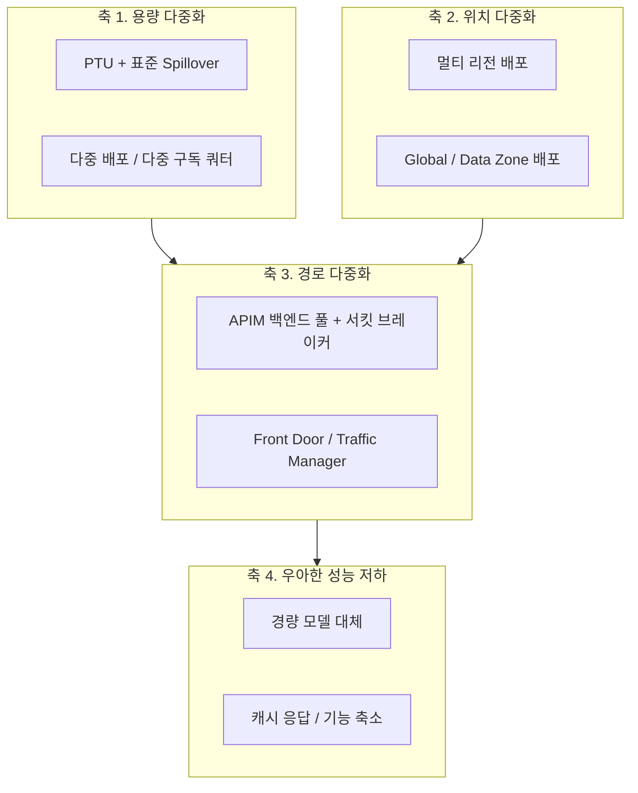
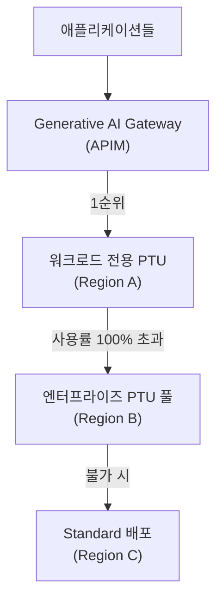
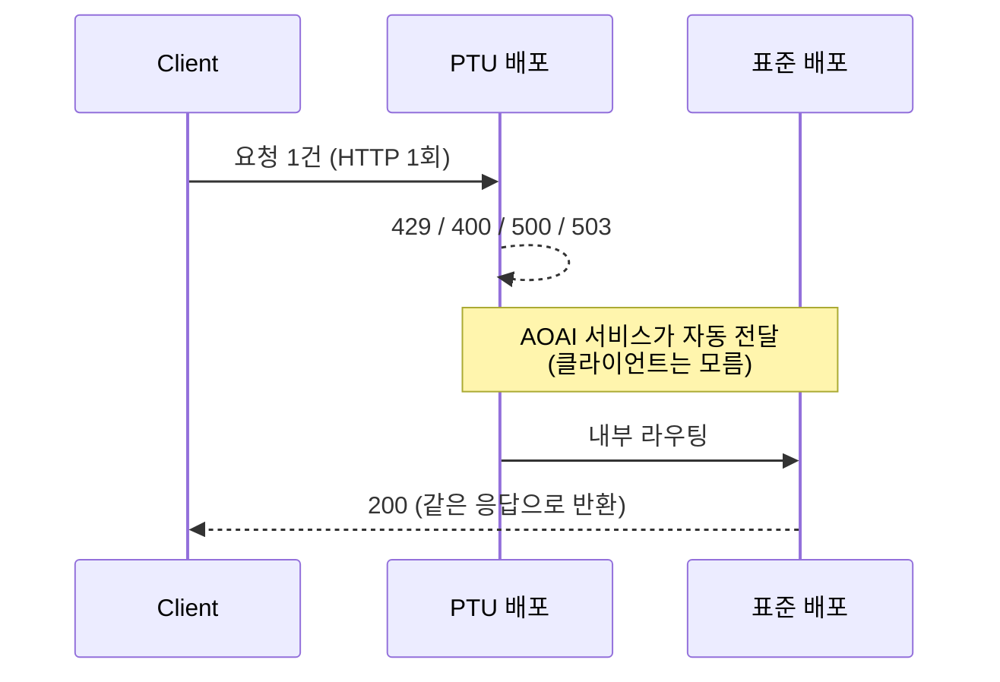
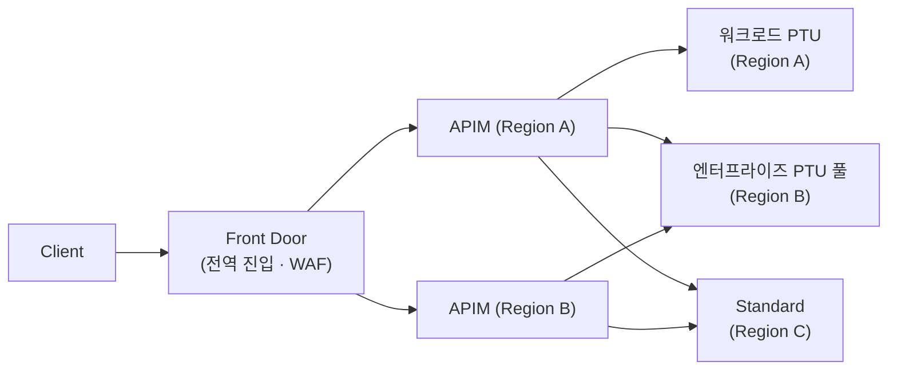

# Azure OpenAI 고가용성(HA) 아키텍처 가이드

> **대상** &nbsp;·&nbsp; AOAI를 **미션 크리티컬 워크로드**에 사용하는 아키텍트, SRE, 플랫폼 팀
>
> **범위** &nbsp;·&nbsp; 장애 유형 분류 → 계층별 HA 설계 → Spillover/APIM/멀티 리전 → 용량·모델 수명주기
>
> **관련 가이드** &nbsp;·&nbsp; [01 온보딩](../01-oai-to-aoai-onboarding/) · [02 기본 개념](../02-aoai-foundations/) · [03 배포 & 운영 모니터링](../03-aoai-deployment-monitoring/)

> 📌 **Spillover와 게이트웨이 Failover는 서로 다른 기능입니다.**
> 이 문서의 **엔터프라이즈 PTU 풀 3단 체인**(워크로드 PTU → 엔터프라이즈 풀 → Standard)은 **APIM 등 게이트웨이 라우팅으로 구현**합니다.
> **Spillover는 PTU 간 전환 기능이 아니며**, 지원되는 프로비저닝 배포에서 **동일 리소스 안의 PAYG 배포**로 넘기는 별개 기능입니다.

---

## 0. TL;DR

### HA 성숙도 레벨

| Level | 구성 | 견딜 수 있는 장애 | 대상 |
|---|---|---|---|
| **L0** | 단일 리전 · 단일 배포 · 재시도 없음 | 없음 | PoC |
| **L1** | + 지수 백오프 재시도, `Retry-After` 준수, 타임아웃 정합성 | 순간적 429/5xx | 내부 도구 |
| **L2** | + **Spillover** (PTU → 표준, 동일 리소스) | PTU 포화 및 Spillover가 처리하는 요청 오류(**429/400/500/503**) | 데이터 경계·비용·지연 변동을 허용하는 Production |
| **L3** | + **APIM 백엔드 풀** (다중 리전, 우선순위 + 서킷 브레이커) + **리전 반상관 배치** | 용량 + **리전 장애** | 중요 서비스 |
| **L4** | + Front Door 다중 APIM, **엔터프라이즈 PTU 풀 3단 체인**, 다중 구독 쿼터 분산, 성능 저하 모드 | 게이트웨이·구독 단위 장애 | 미션 크리티컬 |

> 💡 **핵심 원칙 3가지**
> 1. **Spillover는 동일 리소스 안에서** PTU 포화·일부 장문 컨텍스트 제한·일부 서버 오류를 표준 배포로 우회합니다. 다만 **리소스 엔드포인트 도달 불가에는 대응하지 못하므로**, 멀티 리소스 게이트웨이와 **보완 관계**입니다(§5.5).
> 2. **Global 배포라도 엔드포인트는 리전 고정**입니다. 글로벌 라우팅은 **용량 가용성**을 높일 뿐 **엔드포인트 가용성**을 높이지 않습니다(§3.1).
> 3. **PTU와 그 백업을 같은 리전에 두지 마세요.** 리전 장애 시 둘 다 사라집니다(§3.5 반상관 원칙).

### 최소 체크리스트

- [ ] 모든 클라이언트가 `Retry-After` 헤더를 **준수**한다 (§4.2)
- [ ] 배포 유형을 **Global / Data Zone / Regional 중 의식적으로 선택**했다 (§3.2)
- [ ] **PTU와 백업 배포가 서로 다른 리전**에 있다 (§3.5)
- [ ] PTU 배포에 **Spillover 표준 배포**가 연결되어 있다 (§5)
- [ ] Spillover 대상 유형이 **PTU 유형과 페어링**되어 있다 (Data Zone PTU → Data Zone Standard, §5.2)
- [ ] Spillover 응답 헤더(`x-ms-spillover-*`)를 **로깅**한다 (§5.7)
- [ ] PTU 포화를 **429가 아니라 `IsSpillover` / PTU 사용률**로 판단한다 (§5.7)
- [ ] 최소 **2개 리전**에 동일 모델·버전 배포가 존재한다 (§7)
- [ ] APIM 백엔드 풀에 **서킷 브레이커 규칙**이 설정되어 있다 (§6.3)
- [ ] **타임아웃 총 예산**(재시도 포함)이 클라이언트 타임아웃 이내다 (§6.6)
- [ ] Failover 리전에 **쿼터뿐 아니라 실제 용량(capacity)** 이 있는지 확인했다 (§8.1)
- [ ] **배포 유형별 쿼터 풀**이 분리되어 있음을 반영했다 (§8.2)
- [ ] 모델 **버전 은퇴(retirement) 일정**을 추적하고 있다 (§9)
- [ ] **성능 저하 모드(graceful degradation)** 가 정의되어 있다 (§10)

---

## 1. AOAI에서 "장애"란 무엇인가

HA 설계의 출발점은 **무엇으로부터 보호할 것인가**를 정확히 나누는 것입니다. AOAI 장애는 성격이 전혀 다른 6가지로 나뉘며, **대응 수단이 각각 다릅니다.**

| # | 장애 유형 | 증상 | 근본 원인 | 유효한 대응 | 무효한 대응 |
|---|---|---|---|---|---|
| **F1** | **용량 포화** | 429 급증 | PTU 100% 도달, TPM/RPM 쿼터 초과 | Spillover, 용량 증설, 다른 배포로 라우팅 | 재시도만 반복(오히려 악화) |
| **F2** | **서비스 오류** | 500/503 | 백엔드 일시 오류 | 재시도 + 다른 배포/리전 | 용량 증설 |
| **F3** | **리전 장애** | 특정 리전 전체 실패 | 리전 인시던트 | **다른 리전 Failover** | Spillover(같은 리소스이므로 무력) |
| **F4** | **클라이언트 단절** | 499 | 타임아웃/사용자 취소 | 스트리밍, 타임아웃 정합성 | 리전 Failover |
| **F5** | **모델 수명주기** | 400/404, 품질 변화 | 모델 버전 은퇴·업그레이드 | 버전 고정 + 마이그레이션 계획 | 인프라 이중화 |
| **F6** | **요청 한계 초과** | 400 | **PTU 컨텍스트 길이 상한 초과** | Spillover(표준 배포), 프롬프트 압축 | PTU 증설(무의미) |

> **가장 흔한 오설계**: F1(용량)을 F3(리전 장애) 대응으로 막으려 하거나, 그 반대입니다.
> 예를 들어 Spillover만 구성해 두고 "우리는 HA가 되어 있다"고 보는 경우, **리전 인시던트에는 전혀 대비되어 있지 않습니다**(§5.5).

---

## 2. HA 설계의 4개 축



| 축 | 질문 | 대표 수단 |
|---|---|---|
| **1. 용량** | 토큰을 처리할 여유가 있는가? | PTU + Spillover, 다중 배포, 쿼터 확보 |
| **2. 위치** | 이 리전이 죽어도 되는가? | 멀티 리전, Global Standard |
| **3. 경로** | 요청을 다른 곳으로 보낼 수 있는가? | APIM 백엔드 풀, Front Door |
| **4. 저하** | 완전 실패 대신 덜 좋은 응답이 가능한가? | 경량 모델, 캐시, 기능 축소 |

**축 4를 빠뜨리는 경우가 매우 많습니다.** 모든 백엔드가 포화된 상황에서 "느린 실패"보다 "빠른 대체 응답"이 사용자 경험상 훨씬 낫습니다.

---

## 3. 배포 유형별 가용성 특성

### 3.1 ⚠️ 가장 중요한 전제 — 처리는 글로벌이어도 **엔드포인트는 리전 고정**입니다

Global 계열 배포를 "리전 장애에 자동으로 안전하다"고 이해하면 **틀립니다.**

| 계층 | Global 배포에서의 동작 |
|---|---|
| **추론 처리(inference)** | Azure 글로벌 인프라가 **가용 데이터센터로 동적 라우팅** ✅ |
| **리소스 엔드포인트** | `https://<resource>.openai.azure.com` 은 **리소스가 만들어진 리전에 고정** ❌ |

즉 처리 용량은 글로벌에서 끌어오더라도, **리소스 엔드포인트가 지역 장애의 영향으로 도달 불가해질 경우 Global·Data Zone 배포가 다른 리소스 엔드포인트로 자동 Failover해 주지는 않습니다.**

**결론: Global 라우팅은 "용량 가용성"을 높이지 "엔드포인트 가용성"을 높이지 않습니다.** 리전 장애 대비는 여전히 **다중 리소스 + 게이트웨이**가 필요합니다(§6~7).

| 무엇을 이중화했는가 | Global 배포 | Spillover | 다중 리소스 + 게이트웨이 |
|---|---|---|---|
| **처리 용량** | ✅ 글로벌 분산 | ✅ PTU→표준 | ✅ |
| **배포(용량 풀)** | ❌ 단일 배포 | ✅ 2개 배포 | ✅ |
| **엔드포인트** | ❌ 단일 | ❌ **단일**(동일 리소스) | ✅ **2개 이상** |

> 세 가지는 **서로 다른 계층을 이중화**합니다. 하나로 나머지를 대체할 수 없습니다.

### 3.2 Provisioned(PTU)는 하나가 아니라 **세 가지**입니다

| 배포 유형 | SKU (`sku.name`) | 추론 처리 위치 | 최소 PTU | 증분 | HA 성격 |
|---|---|---|---|---|---|
| **Global Provisioned** | `GlobalProvisionedManaged` | **전 세계 리전으로 라우팅** | **15** | **5** | *"Highest availability"* — 라우팅 리전 제약이 없을 때 |
| **Data Zone Provisioned** | `DataZoneProvisionedManaged` | **데이터 존 내부** — **US / EU만** (⚠️ **APAC 미지원**) | **15** | **5** | 데이터 경계 충족 + Regional보다 높은 가용성 |
| **Regional Provisioned** | `ProvisionedManaged` | **단일 리전 고정** | **25~50**(모델별) | **25~50** | 엄격한 단일 리전 상주 요건용. HA 확보가 가장 어려움 |

### 3.3 Standard 계열

| 배포 유형 | SKU | 추론 처리 위치 | HA 역할 |
|---|---|---|---|
| **Global Standard** | `GlobalStandard` | 모든 Azure 리전 | 최고 쿼터 · 공식 가이드의 **1순위 권장**(상주 요건이 허용하면) |
| **Data Zone Standard** | `DataZoneStandard` | 데이터 존 내부 | **2순위 권장** — 지리 경계 필요 시 |
| **Standard** | `Standard` | 단일 리전 | 규제상 단일 리전만 가능할 때 |
| **Global / Data Zone Batch** | `GlobalBatch` / `DataZoneBatch` | 각각 | 실시간 경로에서 분리해 **부하 자체를 줄임** (별도 쿼터, 50% 저렴) |
| **Priority processing**(preview) | Global Standard 옵션 | 글로벌 | 장기 약정 없이 낮은 지연이 필요할 때 PTU의 대안 |

> 공식 가이드: *"If your data-residency requirements allow it, **prefer Global Standard** deployments. **Data Zone deployments (US/EU) are the next best option**..."*

### 3.4 SLA 관점

> *"Provisioned types provide **guaranteed throughput and lower latency variance**. Standard types offer **best-effort** service. Developer deployments **don't include an SLA**."*

즉 **일관된 지연이 필요한 워크로드는 Standard로 Failover하는 순간 지연 목표 적용 대상에서 벗어납니다.** 이 점을 성능 저하 모드(§10)에 명시적으로 반영해야 합니다.

---

### 3.5 권장 아키텍처 — 엔터프라이즈 PTU 풀

**개별 앱마다 PTU를 따로 사는 방식보다 우수한 구조**입니다.



#### 왜 "엔터프라이즈 PTU 풀"인가

조직 전체가 공유하는 **하나의 큰 PTU 풀**을 두고, 게이트웨이가 앱별로 분배하는 구조입니다. 일종의 **"우리 조직 전용 Standard 배포"** 로 생각하면 됩니다.

| 이점 | 설명 |
|---|---|
| **노이지 네이버 차단** | 공용 Standard가 혼잡해도 **조직 전용 용량**은 보장됨 |
| **우선순위 제어** | 용량 경합 시 **어느 앱이 먼저 느려질지** 조직이 결정 |
| **높은 활용률** | 개별 워크로드는 스파이크가 심하지만, **합치면 평탄해져** PTU 낭비가 줄어듦 |
| **지연 목표 유지** | 워크로드 PTU가 100%를 넘어도 **여전히 PTU 엔드포인트가 처리** → 모델별 latency target 적용 조건을 충족하는 한 Standard로 내려가는 것보다 일관된 지연 유지에 유리 |

#### 🔑 리전 반(反)상관 원칙

**PTU와 그 백업을 같은 리전에 두면 리전 장애 시 둘 다 사라집니다.**

- 워크로드 PTU와 엔터프라이즈 PTU 풀을 **서로 다른 리전**에
- 엔터프라이즈 PTU 풀과 주력 Standard 배포도 **서로 다른 리전**에

§5.5의 "Spillover는 엔드포인트 장애를 못 막는다"와 같은 원리이며, **리전 배치 단계에서 미리 분산**해야 합니다.

#### 권장 배치 예시

| 계층 | 배포 유형 | 리전 | 역할 |
|---|---|---|---|
| 1순위 | 워크로드 전용 PTU | Region A | 해당 앱 기저 부하 |
| 2순위 | **엔터프라이즈 PTU 풀** | **Region B** | 조직 공용 · 오버플로 흡수 |
| 3순위 | Standard (Global 또는 Data Zone) | **Region C** | 스파이크 흡수 · 최종 수단 |

**PTU는 기저 부하, Standard는 스파이크** — 이 역할 분담이 핵심입니다.

> ⚠️ **엔터프라이즈 PTU 풀의 배포 유형 선택**
> **공식 HA 가이드가 예시로 드는 기본 패턴은 Data Zone PTU 단일 배포**입니다. 데이터 처리 경계가 허용되고 더 넓은 글로벌 처리 범위가 필요하다면 **Global Provisioned를 별도 설계 선택지로 검토**할 수 있습니다(예약이 리전 무관, §8.3).
> 단 **APAC에서는 Data Zone Provisioned가 제공되지 않습니다**(§3.2). APAC 리전에서 데이터 상주가 필요하면 **Regional Provisioned**로 구성해야 하며, 이 경우 최소 PTU와 예약 비용이 올라갑니다.

#### 데이터 상주 주의

Global 계열은 **처리(processing)** 가 광역에서 일어날 수 있습니다. 저장(at rest)은 지정 지리 내이지만, 규제가 **처리 위치**까지 제한한다면 Failover 후보를 **Data Zone** 또는 동일 지리 내로 한정해야 합니다.

> **HA를 위해 컴플라이언스를 깨지 마세요.** 이 경우 Data Zone Provisioned + Data Zone Standard 조합이 현실적인 최적해입니다.

---

## 4. Layer 1 — 클라이언트 복원력

**가장 저렴하고 가장 효과가 큰 계층입니다.** 인프라를 아무리 이중화해도 클라이언트가 잘못 재시도하면 장애를 스스로 만들어냅니다.

### 4.1 재시도 설계

| 상태 코드 | 재시도 | 방식 |
|---|---|---|
| 429 | ✅ | **`Retry-After` 우선**, 없으면 지수 백오프 + 지터 |
| 500 / 502 / 503 / 504 | ✅ | 지수 백오프 + 지터, 2~3회 |
| 408 | ✅ | 1~2회 |
| 400 / 401 / 403 / 404 | ❌ | 재시도 무의미 (요청·권한·모델 문제) |
| 499 | ❌ | 클라이언트 측 단절 — 타임아웃/스트리밍으로 해결 |

### 4.2 ⚠️ `Retry-After`를 반드시 확인해야 하는 이유

AOAI가 429와 함께 반환하는 `Retry-After` 값은 **매우 클 수 있습니다(예: 1일 단위)**. 이는 공식 문서에도 명시된 주의사항입니다.

- 이 값을 **무시하고 즉시 재시도**하면 → 스로틀이 증폭되고 백엔드가 회복되지 않습니다.
- 이 값을 **그대로 대기**하면 → 서비스가 사실상 멈춥니다.

**따라서 실무 처리는 다음과 같아야 합니다.**

```
if 429:
    ra = Retry-After
    if ra <= 상한(예: 30초):
        해당 시간만큼 대기 후 재시도
    else:
        재시도하지 않고 즉시 다음 백엔드로 전환(Failover)
        + 해당 백엔드를 일정 시간 라우팅 대상에서 제외
```

즉 **"긴 `Retry-After` = 이 백엔드는 지금 포기하라는 신호"** 로 해석하고, 대기가 아니라 **경로 전환**으로 대응합니다. APIM 서킷 브레이커도 동일한 사고방식으로 동작합니다(§6.3).

### 4.3 타임아웃 정합성

```
클라이언트 타임아웃  ≥  게이트웨이(APIM) 총 소요 시간  ≥  예상 최대 생성 시간
                          └─ (시도 횟수 × 백엔드 timeout) + 재시도 간격 합
```

- **안쪽 계층이 먼저 실패해야** 바깥 계층이 그 실패를 처리할 수 있습니다. 역전되면 클라이언트가 먼저 끊어 **499**가 발생하고, 백엔드에는 아무도 읽지 않을 **고아 작업**이 남으며, 클라이언트 재시도가 겹쳐 부하가 배가됩니다.
- 게이트웨이의 타임아웃은 **시도 1회당** 적용되므로, 재시도 횟수를 곱해 총 예산을 계산해야 합니다. 계산법과 흔한 오류는 **§6.6** 참고.
- 스트리밍(SSE)을 사용하면 첫 토큰이 즉시 도착해 유휴 타임아웃 문제 대부분이 사라집니다. 다만 **게이트웨이의 `timeout`은 스트리밍에서 TTFT만 제한**하고 전체 생성 시간은 제한하지 않습니다(§6.6).

### 4.4 클라이언트 측 서킷 브레이커 & 부하 차단

- 연속 실패한 엔드포인트는 일정 시간 **격리(open)** 후 half-open으로 복귀
- **Bulkhead**: 배포별 동시 요청 수 상한 → 한 배포의 지연이 전체 스레드를 잠식하지 않도록
- **큐잉/우선순위**: 대화형 요청 우선, 배치성 요청은 지연 허용 큐로 분리

---

## 5. Layer 2 — Spillover (PTU → 표준 배포)

PTU 배포가 비(非)200 응답을 반환할 때, **오버플로 요청을 대응되는 표준 배포로 자동 라우팅**하는 기능입니다.

### 5.0 누가 재시도하는가 — 서버 측 자동 전환

가장 많이 오해하는 부분입니다. **재시도 주체는 Azure OpenAI 서비스 자신**입니다. 클라이언트도, APIM도 아닙니다.



- **HTTP 요청은 처음부터 끝까지 1건**입니다. 클라이언트는 한 번 호출하고 200을 받습니다.
- Spillover가 성공하면 **클라이언트는 429를 받지 않습니다.** 원래의 429는 `x-ms-spillover-error` 헤더에만 남습니다.
- 따라서 클라이언트 재시도 로직이 발동하지 않으며, 이 전환은 **재시도 횟수에 포함되지 않습니다.**

> 문서 원문: *"When a request results in one of these non-`200` response codes, **Azure OpenAI automatically sends the request** from your provisioned deployment to your standard deployment to be processed."*

### 5.1 Spillover를 유발하는 응답 코드 — 429만이 아닙니다

| 코드 | 상황 |
|---|---|
| **429** | PTU 완전 소진 |
| **400** | **긴 컨텍스트 요청** — 예: gpt-4.1 계열 PTU는 128K 미만 컨텍스트만 지원 |
| **500 / 503** | 처리 중 서버 오류 |

> 💡 **400이 포함된다는 점이 중요합니다.** PTU는 모델별로 지원 컨텍스트 길이 상한이 있어, 긴 프롬프트가 용량과 무관하게 400으로 실패한 뒤 표준 배포로 넘어갑니다. 이 경우 근본 원인은 "용량"이 아니라 "컨텍스트 길이"이므로 PTU를 증설해도 해결되지 않습니다.

### 5.2 전제 조건과 제약

| 항목 | 요건 |
|---|---|
| **위치** | 프로비저닝 배포와 표준 배포가 **동일한 Foundry/AOAI 리소스** 안에 있어야 함 |
| **대상 유형** | Spillover 대상은 **표준(PAYG) 배포**여야 함 — 다른 PTU 배포는 불가 |
| **모델 일치** | **같은 모델·같은 버전**이어야 함 |
| **권한** | **Cognitive Services Contributor** 이상 |
| **모델 지원** | AOAI 모델은 전부 지원. **Azure DeepSeek · Meta Llama 등 타 공급자 모델은 미지원** |

#### Spillover 대상 유형 선택 — 페어링이 중요합니다

Spillover 대상은 **동일 리소스 안의 호환되는 PAYG 배포**이며 **모델과 버전이 일치**해야 합니다. 데이터 처리 경계를 유지하려면 아래 페어링을 따르세요.

| PTU 유형 | 권장 Spillover 대상 | 이유 |
|---|---|---|
| **Global Provisioned** | **Global Standard** | 오버플로도 글로벌 라우팅 → 리전 용량 편중 흡수. 규모가 큰 쿼터 |
| **Data Zone Provisioned** | **Data Zone Standard**(동일 존) | ⚠️ **데이터 경계 유지** — 다른 존으로 넘기면 오버플로가 경계 밖에서 처리될 수 있음 |
| **Regional Provisioned** | **`Standard`(동일 리전)** | 상주 요건을 유지하면서 피크 흡수 <!-- 리뷰 필요: 지원 범위 재확인 --> |

### 5.3 배포 단위로 켜기

배포 속성 `spilloverDeploymentName`에 표준 배포 이름을 지정합니다. 신규 생성 시 또는 기존 배포에 추가할 수 있습니다.

```bash
curl -X PUT "https://management.azure.com/subscriptions/$SUB/resourceGroups/$RG/providers/Microsoft.CognitiveServices/accounts/$ACCOUNT/deployments/ptu-gpt4o?api-version=2024-10-01" \
  -H "Content-Type: application/json" \
  -H "Authorization: Bearer $TOKEN" \
  -d '{
        "sku": { "name": "GlobalProvisionedManaged", "capacity": 100 },
        "properties": {
          "spilloverDeploymentName": "std-gpt4o",
          "model": { "format": "OpenAI", "name": "gpt-4o", "version": "2024-11-20" }
        }
      }'
```

### 5.4 요청 단위로 켜기

요청 헤더 `x-ms-spillover-deployment`에 표준 배포 이름을 지정하면 **해당 요청만** Spillover 대상이 됩니다.

```bash
curl "$AZURE_OPENAI_ENDPOINT/openai/deployments/ptu-gpt4o/chat/completions?api-version=2024-10-21" \
  -H "Content-Type: application/json" \
  -H "x-ms-spillover-deployment: std-gpt4o" \
  -H "Authorization: Bearer $TOKEN" \
  -d '{ "messages": [ { "role": "user", "content": "..." } ] }'
```

> **우선순위 규칙**: 배포 속성(`spilloverDeploymentName`)과 요청 헤더가 둘 다 설정되면 **배포 속성이 우선**합니다.
> 요청 단위로만 제어하고 싶다면 배포 속성을 설정하지 말고 헤더만 사용하세요.

**활용 예** — 워크로드별 차등 정책:

| 워크로드 | Spillover | 이유 |
|---|---|---|
| 대화형 UI | ✅ 켬 | 지연이 늘더라도 실패보다 낫다 |
| 실시간 저지연 API | ❌ 끔 | 표준 배포의 지연 변동을 허용할 수 없다 |
| 배치·백그라운드 | ✅ 켬 | 지연 허용 |

### 5.5 ⚠️ Spillover가 **막지 못하는** 것

Spillover는 **동일 리소스 내부**의 표준 배포로 넘기는 기능입니다. 따라서:

| 장애 | Spillover로 대응 가능? |
|---|---|
| PTU 용량 포화 (429) | ✅ |
| PTU 컨텍스트 길이 초과 (400) | ✅ |
| PTU 배포의 일시적 5xx | ✅ |
| **특정 리전 용량 편중** | ⭕ **Global↔Global 페어링이면 상당 부분 흡수** (둘 다 글로벌 라우팅) |
| **리소스 엔드포인트 리전 장애** | ❌ **두 배포가 같은 엔드포인트를 공유** → 동시 도달 불가 |
| **리소스/구독 단위 문제** | ❌ |
| 표준 배포 쿼터까지 소진 | ❌ **최종 실패 → 클라이언트가 오류 수신**(§5.6) |

> 즉 **Spillover는 HA의 시작이지 완성이 아닙니다.** 엔드포인트 장애 대비는 §6~7의 **다중 리소스 + 게이트웨이** 경로가 필요합니다.

### 5.6 표준 배포도 실패하면 클라이언트는 무엇을 받는가

**규칙: 클라이언트는 "마지막으로 시도한 백엔드"의 응답을 그대로 받습니다.**

> 문서 원문: *"if the standard deployment also fails to serve it, **the standard deployment's response (including status code and body) is returned to the caller.** The `x-ms-spillover-from-deployment` and `x-ms-spillover-error` headers are still present, so the caller can distinguish a spillover failure from a direct standard-deployment failure."*

| PTU 결과 | 표준 배포 결과 | **클라이언트 수신** | `x-ms-spillover-error` |
|---|---|---|---|
| 429 | 200 | **200** ✅ | `429` |
| 429 | **429** | **429** | `429` |
| 429 | 500 | **500** | `429` |
| **400** (긴 컨텍스트) | 429 | **429** | **`400`** |
| 500 | 503 | **503** | `500` |

> ⚠️ **4번째 행에 주의하세요.** 클라이언트가 본 코드(429)와 실제 근본 원인(400, 컨텍스트 길이)이 **다를 수 있습니다.** 429만 보고 "용량 부족"으로 진단해 PTU를 증설하면 문제가 해결되지 않습니다.

**429를 받았을 때 세 가지 경우를 구분하는 법**

| 케이스 | `x-ms-spillover-from-deployment` | `x-ms-spillover-error` | 의미 |
|---|---|---|---|
| **A** | 없음 | — | Spillover 미적용 → 호출한 배포가 직접 429 |
| **B** | 있음 | `429` | PTU 포화 + **표준 배포까지 포화** — 가장 심각 |
| **C** | 있음 | `400` | PTU 컨텍스트 초과 + 표준 포화 |

> **케이스 B는 두 겹의 용량이 동시에 소진된 상태**입니다. 재시도로는 해결되지 않으므로 **다른 리전으로 경로 전환(§6~7) 또는 부하 차단**이 필요합니다.

**따라서 Spillover가 있어도 클라이언트 재시도 로직은 반드시 유지해야 합니다.** 이때 받는 `Retry-After`는 **표준 배포가 준 값**이므로, §4.2의 "과도한 값이면 대기 대신 경로 전환" 원칙을 그대로 적용합니다.

### 5.7 Spillover 관측

응답 헤더로 판별합니다.

| 헤더 | 의미 |
|---|---|
| `x-ms-spillover-from-deployment` | 값이 있으면 **이 요청은 Spillover된 요청** (PTU 배포명 포함) |
| `x-ms-deployment-name` | 실제로 요청을 처리한 배포 이름 |
| `x-ms-spillover-error` | Spillover를 유발한 프로비저닝 배포의 응답 코드(429/400/500/503). **성공 여부와 무관하게 존재** |

**애플리케이션 계측에 반드시 포함하세요.** 이 헤더들이 없으면 §5.6의 A/B/C를 사후에 구분할 수 없습니다.

```python
span.set_attribute("StatusCode", resp.status_code)
span.set_attribute("SpilloverFrom",  headers.get("x-ms-spillover-from-deployment"))
span.set_attribute("SpilloverError", headers.get("x-ms-spillover-error"))
span.set_attribute("ServedBy",       headers.get("x-ms-deployment-name"))
```

#### 🔴 메트릭 해석의 함정 — PTU에 429가 찍히지 않습니다

> 문서 원문: *"spilled-over requests are **not counted as `429`s on the provisioned deployment**"*

Spillover된 요청은 **표준 배포 쪽에 `IsSpillover=True` + 최종 상태 코드(보통 200)** 로 기록됩니다. PTU 배포에는 자신이 직접 처리한 요청만 남습니다.

문서의 실제 예시:

| 배포 | 기록 |
|---|---|
| `gpt-4.1-ptum` (PTU) | 200 = **46** |
| `gpt-4.1` (표준, `IsSpillover=True`) | 200 = **954** |

> ⚠️ **429 카운트만 모니터링하면 954건이나 넘쳤는데도 "포화 없음"으로 오판합니다.**
> PTU 포화 여부는 반드시 **`IsSpillover` 차원** 또는 **`Provisioned Utilization V2`** 로 판단하세요.

**알림 설계**: 사용자에게 실제로 전달되는 실패는 **표준 배포의 429**입니다.
→ `AzureOpenAIRequests` + `StatusCode=429` + `ModelDeploymentName=<표준 배포>` 조합이 **실사용자 영향 지표**입니다.

- Spillover 비율이 지속적으로 높다 → **PTU 증설 신호**
- Spillover 비율 급증 + 지연 증가 → 피크 부하 또는 특정 테넌트 폭주

### 5.8 지연과 비용 — Spillover의 대가

**① 지연 증가**

> 문서 원문: *"the service prioritizes sending requests to the provisioned deployment before sending any overage requests to the standard deployment. **This prioritization might incur additional latency.**"*

실패한 PTU 시도 + 표준 배포 처리가 **한 요청 안에 누적**됩니다. 클라이언트 타임아웃을 이 누적 지연 기준으로 잡아야 합니다.

**② 과금 방식 전환**

| 처리 배포 | 과금 |
|---|---|
| PTU 배포 | **시간당 프로비저닝 비용만** (요청당 추가 비용 없음) |
| 표준 배포(Spillover) | **입력·캐시·출력 토큰 단가**로 과금 |

> 즉 **Spillover 비율 급증 = 비용 급증**이기도 합니다. 용량 알림과 별개로 **비용 알림**도 함께 두세요.

> 자세한 메트릭·KQL은 [가이드 03](../03-aoai-deployment-monitoring/) 참고.

---

## 6. Layer 3 — APIM AI Gateway (다중 백엔드)

리전 장애까지 흡수하려면 **요청 경로를 바꿀 수 있는 계층**이 필요합니다. APIM 백엔드 풀이 그 역할을 합니다.

### 6.1 백엔드 엔터티 구성

- Runtime URL에 각 AOAI 엔드포인트 지정
- **Managed Identity로 인증** 권장 (키 관리·순환 부담 제거, 키 유출로 인한 가용성 사고 예방)
  - **Resource ID**: `https://cognitiveservices.azure.com` (후행 슬래시 없음, `/.default` 불필요)
  - APIM의 관리 ID에 **`Cognitive Services OpenAI User`** 역할 부여

```bash
az role assignment create \
  --assignee-object-id $APIM_PRINCIPAL_ID \
  --assignee-principal-type ServicePrincipal \
  --role "Cognitive Services OpenAI User" \
  --scope $AOAI_RESOURCE_ID
```

### 6.2 백엔드 풀 & 로드 밸런싱

| 옵션 | 동작 | HA 활용 |
|---|---|---|
| **Round-robin** | 균등 분배(기본) | 동급 리전 간 분산 |
| **Weighted** | 상대 가중치 기반 분배 | 리전별 용량 비율 반영, 블루-그린 |
| **Priority-based** | 우선순위 그룹 순으로 전송 | **Primary → Failover 구조에 최적** |

> **핵심 동작**: 낮은 우선순위 그룹은 **상위 그룹의 모든 백엔드가 서킷 브레이커로 차단되었을 때에만** 사용됩니다.
> 즉 **우선순위 기반 라우팅은 서킷 브레이커와 반드시 함께 구성해야 의미가 있습니다.**

### 6.3 서킷 브레이커 (필수)

- 정의한 기간 동안 실패 조건(개수/비율, 상태 코드 범위)을 넘으면 회로가 **trip**
- Trip 되면 APIM은 해당 백엔드로의 전송을 멈추고 클라이언트에 **503**을 반환
- 지정한 trip 기간 후 회로가 리셋되어 트래픽 재개

**AOAI 백엔드에 대한 공식 주의사항**: 요청이 과도하면 AOAI는 429와 함께 **매우 큰 `Retry-After` 값(예: 1일)** 을 반환할 수 있습니다. 따라서 **429를 처리하고 `Retry-After`를 수용하는 서킷 브레이커 규칙을 반드시 구성**해야 합니다.

```bicep
resource backend 'Microsoft.ApiManagement/service/backends@2024-05-01' = {
  name: '${apimName}/aoai-krc'
  properties: {
    url: 'https://aoai-prod-krc-01.openai.azure.com/openai'
    protocol: 'http'
    circuitBreaker: {
      rules: [
        {
          name: 'aoai-throttle-and-errors'
          failureCondition: {
            count: 3
            interval: 'PT1M'
            statusCodeRanges: [
              { min: 429, max: 429 }
              { min: 500, max: 599 }
            ]
          }
          tripDuration: 'PT1M'
          acceptRetryAfter: true   // Retry-After 헤더 값을 수용
        }
      ]
    }
  }
}
```

> - `acceptRetryAfter: true`는 AOAI가 반환한 `Retry-After` 값을 **서킷 브레이커의 차단 기간 결정에 반영**하도록 허용합니다. **현재 요청을 그 시간만큼 대기시켰다가 재전송하는 옵션이 아닙니다.** 회로가 열린 동안 해당 백엔드는 라우팅 대상에서 제외되고, 클라이언트에는 **503**이 반환됩니다. (포털에서는 **Check 'Retry-After' header in HTTP response → True (Accept)**)
> - 위 `count` / `interval` / `tripDuration` 값은 **예시**입니다. 문서 기본값은 실패 간격·차단 기간 모두 1시간이며, AOAI처럼 회복이 빠른 백엔드에는 분 단위가 더 적합한 경우가 많습니다. **반드시 부하 테스트로 튜닝**하세요.

### 6.4 우선순위 기반 Failover 풀 예시

```bicep
resource pool 'Microsoft.ApiManagement/service/backends@2024-05-01' = {
  name: '${apimName}/aoai-pool'
  properties: {
    description: 'AOAI multi-region failover pool'
    type: 'Pool'
    pool: {
      services: [
        // 우선순위 1: 국내 PTU (기저 부하)
        { id: backendKrcId, priority: 1, weight: 1 }
        // 우선순위 2: 인접 리전 표준 (리전 장애 시)
        { id: backendJpeId, priority: 2, weight: 1 }
        // 우선순위 3: Global Standard (최종 수단)
        { id: backendGlobalId, priority: 3, weight: 1 }
      ]
    }
  }
}
```

> 풀 타입 백엔드는 `url` / `protocol`을 지정하지 않습니다(`type: 'Pool'`). 우선순위 그룹이 실제로 작동하려면 **풀에 속한 각 백엔드에 서킷 브레이커가 설정되어 있어야 합니다**(§6.3).

### 6.5 정책 조합 예시

```xml
<policies>
  <inbound>
    <base />
    <set-backend-service backend-id="aoai-pool" />

    <!-- 테넌트별 토큰 쿼터: 한 테넌트가 전체 용량을 잠식하지 못하게 -->
    <llm-token-limit
        counter-key="@(context.Subscription?.Id ?? "anonymous")"
        tokens-per-minute="60000"
        estimate-prompt-tokens="true"
        remaining-tokens-header-name="x-remaining-tokens" />

    <llm-emit-token-metric namespace="aoai-gateway">
      <dimension name="Backend"  value="@(context.Request.Url.Host)" />
      <dimension name="TenantId" value="@(context.Subscription?.Id ?? "anonymous")" />
    </llm-emit-token-metric>
  </inbound>

  <backend>
    <!-- 풀 내 전환은 서킷 브레이커가 담당. 여기서는 짧은 재시도만 -->
    <retry condition="@(context.Response.StatusCode == 429 || context.Response.StatusCode >= 500)"
           count="2" interval="1" max-interval="5" delta="1" first-fast-retry="true">
      <forward-request
          timeout="60"                  <!-- 시도 1회당 · 응답 헤더까지의 시간 -->
          buffer-request-body="true"    <!-- 재시도 시 본문 재사용에 필수 -->
          buffer-response="false" />    <!-- SSE 스트리밍에 필수 -->
    </retry>
  </backend>

  <outbound>
    <base />
    <!-- 어느 백엔드가 응답했는지 노출: 장애 분석에 필수 -->
    <set-header name="x-served-by" exists-action="override">
      <value>@(context.Request.Url.Host)</value>
    </set-header>
  </outbound>

  <on-error>
    <base />
  </on-error>
</policies>
```

> ⚠️ **재시도와 서킷 브레이커의 역할 분리**: 게이트웨이에서 재시도 횟수를 크게 잡으면 서킷 브레이커가 열리기 전에 부하를 계속 밀어 넣게 됩니다. **짧은 재시도 + 명확한 서킷 브레이커** 조합이 원칙입니다.

> 🔴 **`<retry>`는 우선순위 Failover가 아닙니다 — 가장 흔한 오해**
> `<retry>`는 **정책 블록을 다시 실행**할 뿐입니다. 하위 우선순위 그룹이 사용되는 조건은 오직 **상위 그룹의 모든 백엔드 회로가 열린 상태**입니다.
> 게다가 서킷 브레이커 상태는 **게이트웨이 인스턴스별 근사값이며 인스턴스 간 동기화되지 않습니다.**
>
> 따라서 **"429를 한 번 받으면 즉시 다음 리전으로 넘어간다"는 보장은 없습니다.** 실제 차단·전환 시점은 반드시 **부하 테스트로 측정**해 임계값을 조정하세요.

### 6.6 타임아웃 예산 설계 — 가장 많이 틀리는 부분

#### ① 왜 안쪽(APIM)이 바깥(클라이언트)보다 먼저 실패해야 하는가

**바깥이 먼저 포기하면 안 됩니다.** 클라이언트 타임아웃 60초 · APIM 120초인 경우를 보면:

```
0s ──────── 60s ──────────── 120s
클라이언트  │ 포기(연결 끊음)
APIM        │ 계속 대기 ──────│ 그제서야 응답
AOAI        │ 계속 생성 ──────│ (아무도 읽지 않을 결과)
```

동시에 네 가지 문제가 발생합니다.

| 문제 | 내용 |
|---|---|
| **고아 작업** | 아무도 읽지 않을 응답을 위해 **PTU/TPM을 60초 더 소모** |
| **부하 증폭** | 클라이언트가 60초에 재시도 → 1번 요청이 살아있는데 **2번째 요청 추가** |
| **진단 불가** | 클라이언트는 HTTP 응답 없이 소켓 타임아웃만 받음 → correlation ID 없음 |
| **서킷 브레이커 무력화** | APIM이 실패를 인지하기 전에 클라이언트가 사라짐 → **깨끗한 실패 신호 미수집** |

반대로 안쪽이 짧으면 APIM이 먼저 실패를 감지해 **정상 HTTP 오류(504)** 를 반환하고, 서킷 브레이커가 작동하며, 클라이언트는 추적 가능한 오류를 받습니다.

> **원칙: 안쪽이 먼저 실패해야 바깥이 그 실패를 처리할 수 있습니다.**

#### ② `timeout`은 "전체 시간"이 아니라 **응답 헤더까지의 시간**입니다

> 문서 원문: *"The amount of time in seconds to wait for **the HTTP response headers** to be returned by the backend service before a timeout error is raised."*

| 모드 | `timeout`이 실제로 제한하는 것 |
|---|---|
| **비스트리밍** | 응답 완성까지 = 사실상 전체 시간 ✅ |
| **스트리밍(SSE)** | **첫 바이트(TTFT)까지만** — 이후 생성이 10분 걸려도 걸리지 않음 ⚠️ |

스트리밍을 쓰면서 "timeout으로 전체 시간을 통제했다"고 믿으면 **틀립니다.** 전체 생성 시간은 `max_tokens`와 클라이언트 측 총 시간 제한으로 통제해야 합니다.

#### ③ `timeout`은 **시도 1회당** 적용됩니다 — 총 예산 계산

`<retry>`는 자식 정책을 재실행하므로 타임아웃은 매 시도마다 새로 적용됩니다.

```
총 소요 시간 ≈ (시도 횟수 × timeout) + 재시도 간격 합
```

위 예시(`count="2"` = 총 3회 시도, `timeout="60"`, `first-fast-retry="true"`):

```
60s + 0s(즉시) + 60s + 2s + 60s ≈ 182초
```

> ⚠️ 만약 `timeout="120"`으로 두면 최악 **약 362초(6분)** 가 됩니다. 클라이언트 타임아웃이 120초라면 APIM이 2번째 시도 중일 때 이미 클라이언트가 포기해 ①의 문제가 그대로 발생합니다.

**따라서 올바른 정합성 공식은 다음과 같습니다.**

```
클라이언트 타임아웃  ≥  (시도 횟수 × APIM timeout) + 재시도 간격 합
```

위 설정 기준 **클라이언트 타임아웃은 200초 이상**으로 잡아야 합니다.

### 6.7 시맨틱 캐싱 — 가용성 관점

`llm-semantic-cache-lookup` / `llm-semantic-cache-store`는 비용 절감 기능으로 알려져 있지만, **HA 관점에서는 "백엔드 부하를 줄여 429 자체를 예방"하는 수단**입니다. 반복 질의 비중이 높은 워크로드(FAQ, 사내 지식 검색)에서 효과가 큽니다.

---

## 7. Layer 4 — 멀티 리전 설계

### 7.1 리전 선택 기준

| 기준 | 확인 사항 |
|---|---|
| **모델 가용성** | 대상 모델·**버전**이 해당 리전에 존재하는가 |
| **쿼터** | Failover 시점에 실제로 쓸 수 있는 TPM이 확보되어 있는가 (§8) |
| **지연** | 사용자↔리전 RTT가 허용 범위인가 |
| **데이터 경계** | 규제상 허용되는 지리인가 |
| **기능 동등성** | 콘텐츠 필터 구성, Batch, 파인튜닝 등 필요한 기능이 동일하게 되는가 |

### 7.2 리소스 배치 방식

> *"Deploy **two Azure OpenAI resources in the same Azure subscription.** Place one resource in your preferred region and the other in your secondary (failover) region. Azure OpenAI allocates quota at the **subscription-plus-region level**, so both resources can share a subscription without affecting quota."*

| 지침 | 이유 |
|---|---|
| **동일 구독에 2개 리소스**(주 리전 + 보조 리전) | 쿼터는 **구독+리전** 단위라 같은 구독을 써도 서로 잠식하지 않음 |
| 각 리전에 **동일한 모델 배포를 복제** | Failover 시 라우팅 로직 단순화 |
| **가용 쿼터를 전부 한 배포에 할당** | *"Full allocation provides **higher throughput** compared to splitting quota across multiple deployments."* |
| 구독 쿼터가 소진되면 **새 구독을 추가**해 게이트웨이 뒤에 배치 | 구독 단위 한계 우회 |

#### 📌 Private Endpoint에 대한 주의

Private Endpoint는 **AOAI 리소스에 대한 사설 네트워크 접근 경로**를 제공하는 보안 기능입니다.

**Private Endpoint를 다른 리전에 두더라도 리소스 리전, 모델 용량, 쿼터, 데이터 처리 위치는 바뀌지 않습니다.** 리전 장애의 자동 Failover 수단도 아닙니다.

멀티 리전 HA에서는 **각 리소스마다 Private Endpoint · Private DNS · 라우팅 · 게이트웨이 경로를 독립적으로 구성하고 테스트**해야 합니다.

### 7.3 Active-Active vs Active-Passive

| 방식 | 전환 특성 | 장점 | 단점 |
|---|---|---|---|
| **Hot/Hot** | 양쪽 경로가 상시 활성 → **가장 낮은 전환 지연을 목표로 설계 가능** | 경로가 상시 검증됨 | 비용 증가, 용량 분산 |
| **Hot/Warm** | 백업 경로와 용량 일부만 준비 → **확대 또는 운영 절차 필요** | 비용 균형 | 전환에 조작 필요 |
| **Hot/Cold** | 장애 후 배포 또는 용량 확보부터 시작 | 최저 비용 | **미션 크리티컬 추론 경로에는 부적합** |

**Azure 페어링 리전**도 고려하세요. 페어링된 리전은 플랫폼 업데이트가 조율되고 복구 우선순위가 부여됩니다. 다만 모든 리전이 페어링되어 있지는 않습니다.

### 7.4 리전 간 일관성 관리

Failover가 "동작은 하는데 결과가 다른" 상황을 막기 위해 다음을 IaC로 동기화합니다.

- [ ] 모델 **이름 + 버전** 동일
- [ ] **배포 이름 동일** (라우팅 로직 단순화)
- [ ] 콘텐츠 필터 구성 동일 (한쪽만 커스텀 필터면 결과가 달라짐)
- [ ] RBAC / 네트워크(Private Endpoint, DNS) 구성 동일
- [ ] 진단 설정 동일 (장애 시 로그가 없는 리전이 생기지 않도록)

### 7.5 글로벌 진입 계층

APIM 자체의 가용성까지 고려한다면:



- **Front Door**: 전역 애니캐스트 진입, 상태 프로브 기반 자동 우회, WAF
- **APIM Premium 다중 리전 배포**: 단일 APIM 인스턴스를 여러 리전 게이트웨이로 확장
- **Traffic Manager**: DNS 기반 — 전환이 TTL에 종속되므로 **빠른 Failover에는 Front Door 우선**

> **Generative AI Gateway**(게이트웨이 계층)의 역할: 다중 엔드포인트 **로드 밸런싱**, **서킷 브레이커**, **레이트 리밋**, **중앙 로깅**, 그리고 **우선순위 라우팅**(*"mission-critical applications get capacity first during contention"*).

---

## 8. 용량 계획과 쿼터 관리 — HA의 숨은 실패 지점

> **Failover 대상 리전에 쿼터가 없으면, 아키텍처 다이어그램이 아무리 훌륭해도 장애 시 아무 일도 일어나지 않습니다.**

이것이 실제 장애 상황에서 가장 자주 드러나는 맹점입니다.

### 8.1 🔴 쿼터(Quota) ≠ 용량(Capacity) — 가장 위험한 오해

> *"**Having PTU quota doesn't guarantee that capacity is available.** If capacity in the region is insufficient for the requested PTU count, **the deployment fails.** Always verify capacity availability before planning a deployment or purchasing a reservation."*

| 개념 | 정의 | 성격 |
|---|---|---|
| **Quota** | 배포할 수 있는 PTU **상한** | Azure가 강제하는 **정책 한도** · **비용 없음** |
| **Capacity** | 실제로 배포 가능한 PTU **실물** | 유한 자원 · 배포 시점에 할당되어 배포 수명 동안 유지 |

**"쿼터를 받아뒀으니 Failover 때 배포하면 된다"는 계획은 실패합니다.** 쿼터가 있어도 그 순간 리전에 용량이 없으면 배포 자체가 실패합니다.

#### 더 위험한 사실 — 반납한 용량은 돌아오지 않을 수 있습니다

> *"**Deleting or scaling down a deployment releases its capacity back to the region pool.** There's **no guarantee the same capacity is available** if you re-create or scale the deployment up later."*
>
> *"**Capacity availability changes throughout the day** based on customer demand across all regions and models."*

**Model capacities API**로 특정 모델·리전의 최대 배포 가능 PTU를 조회할 수 있습니다.

```bash
# 배포 전/정기 점검 스크립트에 편입 권장
az rest --method get \
  --url "https://management.azure.com/subscriptions/$SUB/providers/Microsoft.CognitiveServices/modelCapacities?api-version=2024-10-01&modelFormat=OpenAI&modelName=gpt-4.1&modelVersion=2025-04-14"
```

### 8.2 쿼터는 **배포 유형별로 분리된 풀**입니다

> *"Quota is scoped at the **offering level** (Global Provisioned, Data Zone Provisioned, and Regional Provisioned are **separate quota pools**) and at the **region level**."*

즉 쿼터는 **(구독 × 리전 × 배포 유형)** 단위입니다.

| 잘못된 가정 | 실제 |
|---|---|
| "PTU 쿼터 100개 있으니 아무 유형이나 배포 가능" | ❌ Global / Data Zone / Regional 쿼터는 **서로 별개** |
| "East US 쿼터가 남으니 West Europe에서도 쓸 수 있다" | ❌ *"Quota in East US doesn't carry over to West Europe."* |

**HA 설계 시사점**: Failover 경로에서 배포 **유형을 바꾸려면**(예: Regional PTU → Global PTU) **해당 유형의 쿼터를 따로 확보**해 두어야 합니다.

### 8.3 예약(Reservation)이 Failover 설계를 제약합니다

| 특성 | 내용 | HA 영향 |
|---|---|---|
| **유형별 구매** | Global / Data Zone / Regional 예약은 **별개 구매**. Global 예약은 Regional 배포를 **커버하지 않음** | Failover로 유형이 바뀌면 **할인 미적용 → 비용 급증** |
| **Global 예약은 리전 무관** | 단일 Global 예약으로 **여러 리전의 Global PTU 배포를 한꺼번에 커버** | ✅ **다중 리전 HA에 가장 유리** |
| **Data Zone / Regional은 리전 일치 필요** | 배포 리전과 예약 리전이 **일치해야 함** | 리전마다 별도 예약 → 비용·관리 부담 증가 |
| **예약은 용량을 보장하지 않음** | *"Purchasing a reservation doesn't reserve capacity."* **먼저 배포로 용량을 확인한 뒤 예약 구매** | 순서를 반대로 하면 예약만 사고 배포 실패 |

> 💰 **다중 리전 HA를 계획한다면 Global Provisioned가 예약 측면에서 압도적으로 유리합니다.**
> 예: East US 50 + West Europe 100 + Australia East 200 PTU → **어느 리전에서든 350 단위 Global 예약 1건으로 전부 커버**됩니다.
> 반면 Regional Provisioned는 리전마다 별도 예약이 필요하고 최소 PTU도 커서(§3.2), 다중 리전 구성 비용이 크게 늘어납니다.

### 8.4 반드시 확인할 것

| 항목 | 확인 방법 |
|---|---|
| Failover 리전의 **실제 TPM/PTU 쿼터** | Foundry 포털 → Quotas / Azure Portal → Usage + quotas |
| **해당 배포 유형의** 쿼터인지 | Global/Data Zone/Regional 각각 별도 확인 |
| **용량(capacity) 실재 여부** | Model capacities API (§8.1) |
| 쿼터가 **다른 배포에 이미 소진**되지 않았는지 | 리전 쿼터는 배포들이 나눠 씀 |
| PTU **최소 배포 크기와 증분** | Global/DZ는 15/5, Regional은 25~50 단위(§3.2) |
| 구독 한도 | 소진 시 **새 구독 추가** 후 게이트웨이 뒤에 배치 |

### 8.5 용량 시나리오 계산

Failover 설계 시 최소한 다음 3가지를 계산해 둡니다.

| 시나리오 | 필요 용량 |
|---|---|
| 정상 | Primary가 100% 처리 |
| Primary 포화 | Spillover 표준 배포가 **피크 초과분** 흡수 가능한가 |
| **Primary 리전 상실** | Secondary가 **평상시 트래픽 100%** 를 받을 수 있는가 |

> ⚠️ 세 번째가 핵심입니다. "Secondary는 소규모로 두고 나중에 늘리면 된다"는 계획은 **쿼터 증설에 시간이 걸리므로 장애 시점에는 실행 불가능**한 경우가 많습니다.

---

## 9. 모델 수명주기 — 조용한 가용성 리스크

인프라 이중화로는 막을 수 없는 유형(F5)입니다.

| 리스크 | 영향 | 대응 |
|---|---|---|
| 모델 **버전 은퇴(retirement)** | 특정 시점 이후 호출 실패 | 은퇴 일정 추적, 마이그레이션 기한 설정 |
| **자동 업그레이드** 설정 | 예고 없이 모델 동작 변화 | 프로덕션은 **버전 고정** 권장 |
| 리전별 **버전 편차** | Failover 시 다른 버전이 응답 | 리전 간 버전 동기화(§7.3) |
| API 버전 변경 | 파라미터 호환성 문제 | `api-version` 고정 + 회귀 테스트 |

**권장 운영 루틴**

1. 분기별로 배포 중인 모델·버전의 은퇴 일정 점검
2. 신규 버전은 **카나리 배포**(가중치 5~10%)로 먼저 검증
3. 승격 전 **회귀 테스트**: 출력 포맷, tool calling, `response_format`, 토큰 사용량 변화

---

## 10. Layer 5 — 우아한 성능 저하 (Graceful Degradation)

모든 백엔드가 실패했을 때 **"에러 화면" 대신 무엇을 보여줄 것인가**를 미리 정의합니다.

| 단계 | 전략 | 사용자 경험 |
|---|---|---|
| 1 | 동급 모델의 다른 배포/리전 | 변화 없음 |
| 2 | **경량 모델로 다운그레이드** (예: mini 계열) | 품질 소폭 저하, 응답은 유지 |
| 3 | **시맨틱 캐시 응답** 재사용 | 최신성 저하 |
| 4 | **규칙 기반/템플릿 응답** 또는 검색 결과만 제공 | AI 기능 축소 |
| 5 | 명시적 안내 + 재시도 유도 | 실패하되 예측 가능 |

**구현 힌트**

- 요청에 `criticality`(critical/normal/low) 태그를 부여하고, 용량 압박 시 낮은 등급부터 2~4단계로 강등
- 스트리밍 중 백엔드가 끊긴 경우, 이미 전송된 부분을 살리고 "일시적 오류" 메시지를 이어 붙이는 UX 처리

---

## 11. 참조 아키텍처

> 아래 구성은 §3.5의 **엔터프라이즈 PTU 풀 패턴**과 **리전 반상관 원칙**을 반영한 것입니다.

### 11.1 Tier 1 — 표준 워크로드 (PTU 불필요)

```
Client → APIM
           ├─ [P1] AOAI Region A : Global Standard (전체 쿼터 할당)
           └─ [P2] AOAI Region B : Global Standard (전체 쿼터 할당)
```
- 동일 구독, 2개 리소스(주/보조). 쿼터는 구독+리전 단위라 상호 잠식 없음
- 상주 요건이 있으면 Global Standard → **Data Zone Standard**로 대체
- 비용: 낮음 · 리전 장애 대응 가능

### 11.2 Tier 2 — 일반 Production (PTU 도입)

```
Client → APIM
           ├─ [P1] 엔터프라이즈 PTU 풀            (Region A)
           │         └─ Spillover ─▶ 동일 리소스 Standard
           └─ [P2] Standard (Global/Data Zone)          (Region B)  ← 다른 리전
```
- **PTU와 Standard 백업을 서로 다른 리전에** 배치(반상관 원칙)
- 용량 장애: Spillover(같은 리전 내) · 리전 장애: 우선순위 2 백엔드
- 비용: 중

### 11.3 Tier 3 — 미션 크리티컬 (3단 Failover 체인)

```
Client → Front Door
   ├─ APIM (Region A) ─┬─ [P1] 워크로드 전용 PTU      (Region A)
   │                   ├─ [P2] 엔터프라이즈 PTU 풀     (Region B)
   │                   └─ [P3] Standard               (Region C)
   └─ APIM (Region B) ─┴─ (동일 풀 구성)
```

3단 Failover 체인을 구현한 형태입니다.

> *"Configure the failover chain so the workload-dedicated deployment **fails over first to the enterprise PTU pool** and **then to the Standard deployment**."*

- **P1→P2 단계에서도 PTU 엔드포인트가 처리** → 모델별 latency target 적용 조건을 충족하는 한 일관된 지연 유지에 유리
- P3(Standard) 도달 시에는 지연 목표 없이 best-effort → 성능 저하 모드(§10) 발동 지점
- 비용: 높음

### 11.4 구성 요소별 역할 요약

| 구성 요소 | 담당 장애 | 없으면 생기는 일 |
|---|---|---|
| 클라이언트 재시도/백오프 | 순간 429·5xx | 작은 장애가 큰 장애로 증폭 |
| Spillover | PTU 포화(동일 리전) | 피크마다 사용자 실패 |
| **엔터프라이즈 PTU 풀** | 워크로드 PTU 포화 | 지연 목표를 잃고 곧장 Standard로 추락 |
| **리전 반상관 배치** | 리전 장애 | PTU와 백업이 **동시에** 소실 |
| APIM 서킷 브레이커 | 지속 실패 백엔드 | 죽은 백엔드로 계속 전송 |
| APIM 우선순위 풀 | 리전 장애 | 리전 인시던트 = 서비스 중단 |
| Front Door | 게이트웨이 장애 | APIM이 SPOF |
| **쿼터 + 용량 사전 확보** | Failover 시 배포 불가 | **Failover가 실패** |
| 성능 저하 모드 | 전면 포화 | 완전 실패 |

---

## 12. HA 체크리스트

### 설계
- [ ] 장애 유형(F1~F6)별로 대응 수단이 매핑되어 있다
- [ ] Failover 후보 리전이 데이터 상주 요건을 만족한다
- [ ] **Global / Data Zone / Regional 중 어느 유형인지 의식적으로 결정**하고 근거가 문서화되어 있다
- [ ] 선택한 배포 유형이 **대상 리전에서 실제로 제공되는지 모델 리전 가용성 표로 확인**했다 (예: APAC에는 Data Zone Provisioned 없음)
- [ ] **PTU · 엔터프라이즈 풀 · Standard가 서로 다른 리전**에 배치되어 있다(반상관)
- [ ] "Global이니까 리전 장애에 안전하다"는 가정을 하지 않았다(엔드포인트는 리전 고정)

### 구현
- [ ] 클라이언트가 `Retry-After`를 해석하고, 과도한 값이면 경로를 전환한다
- [ ] **Spillover가 있어도 클라이언트 재시도 로직을 유지**한다 (표준 배포도 실패하면 오류가 그대로 전달됨, §5.6)
- [ ] 타임아웃 총 예산 = **(시도 횟수 × 백엔드 timeout) + 재시도 간격 합** 이 클라이언트 타임아웃 이내다 (§6.6)
- [ ] 스트리밍을 쓴다면 APIM에 **`buffer-response="false"`** 가 설정되어 있다
- [ ] 재시도를 쓴다면 **`buffer-request-body="true"`** 가 설정되어 있다
- [ ] PTU 배포에 Spillover 표준 배포가 연결되어 있다
- [ ] APIM 백엔드가 Managed Identity로 인증하며, 역할은 **`Cognitive Services OpenAI User`** 다(추론 전용 최소 권한)
- [ ] 백엔드 풀이 우선순위 기반이고, **모든 백엔드에 서킷 브레이커**가 있다
- [ ] 서킷 브레이커가 **429와 `Retry-After`를 수용**하도록 설정되어 있다
- [ ] 응답에 처리 백엔드 식별 헤더가 포함된다
- [ ] 애플리케이션이 `x-ms-spillover-from-deployment` / `x-ms-spillover-error` / `x-ms-deployment-name`을 기록한다

### 운영
- [ ] Failover 리전 쿼터가 **평상시 트래픽 100%** 를 감당한다
- [ ] **쿼터가 아니라 실제 용량(capacity)** 을 정기적으로 확인한다 (Model capacities API)
- [ ] **배포 유형별로 쿼터를 각각** 확보했다 (Global/DZ/Regional 별개 풀)
- [ ] 예약(Reservation)이 **Failover 대상 배포 유형·리전을 커버**하는지 확인했다
- [ ] 비용 절감 목적의 **PTU 축소·재확대 운영을 하지 않는다**(용량 회수 보장 없음)
- [ ] 리전 간 모델 버전·필터·네트워크 구성이 동기화되어 있다
- [ ] 모델 은퇴 일정을 분기별로 점검한다
- [ ] `IsSpillover`, `AzureOpenAIAvailabilityRate`, 429/5xx 알림이 설정되어 있다
- [ ] **표준 배포의 429**에 알림이 걸려 있다 (실사용자 영향 지표, §5.7)
- [ ] Spillover 비율에 **비용 알림**도 함께 걸려 있다 (과금 방식 전환, §5.8)
- [ ] 성능 저하 모드가 구현되어 있고 테스트되었다

---

## 부록 A. 자주 하는 실수

1. **Spillover만 구성하고 "HA 완료"로 간주** — 리전 장애에는 무력
2. **긴 `Retry-After`를 그대로 대기** — 서비스가 사실상 정지
3. **`Retry-After`를 무시하고 즉시 재시도** — 스로틀 증폭
4. **서킷 브레이커 없이 우선순위 풀만 구성** — 하위 우선순위가 절대 사용되지 않음
5. **Failover 리전 쿼터 미확보** — 전환은 되지만 즉시 429
6. **리전 간 모델 버전 불일치** — Failover 후 결과가 달라짐
7. **게이트웨이 재시도 과다** — 서킷 브레이커가 열리기 전에 부하 가중
8. **APIM 단일 리전** — 게이트웨이가 SPOF
9. **성능 저하 모드 부재** — 전면 포화 시 완전 실패
10. **APIM 관리 ID에 광범위한 `Cognitive Services User` 부여** — 계정 키 조회를 포함한 불필요한 권한이 추가됨. AOAI 추론만 필요하면 **`Cognitive Services OpenAI User`를 우선 검토** (§6.1)
11. **PTU 포화를 429 카운트로 판단** — Spillover된 요청은 PTU에 429로 기록되지 않아 **포화를 놓침** (§5.7)
12. **Spillover가 있으니 클라이언트 재시도는 불필요하다고 판단** — 표준 배포도 실패하면 오류가 그대로 전달됨 (§5.6)
13. **게이트웨이 `timeout`을 총 예산으로 오해** — 시도 1회당 값이므로 재시도 횟수만큼 곱해야 함 (§6.6)
14. **스트리밍인데 `buffer-response="false"` 미설정** — 응답이 버퍼링되어 스트리밍 이점 소멸
15. **"Global 배포니까 리전 장애에 안전하다"** — 처리는 글로벌이어도 **엔드포인트는 리전 고정** (§3.1)
16. **PTU를 하나의 유형으로 취급** — Global/Data Zone/Regional은 최소 PTU·쿼터 풀·예약·리전 가용성이 모두 다름 (§3.2)
17. **PTU와 백업 Standard를 같은 리전에 배치** — 리전 장애 시 동시 소실 (§3.5 반상관 원칙)
18. **쿼터만 확보하고 용량은 확인하지 않음** — 쿼터가 있어도 용량이 없으면 **배포 자체가 실패** (§8.1)
19. **비용 절감을 위해 PTU를 야간 축소** — 반납한 용량을 다시 확보하지 못할 수 있음 (§8.1)
20. **Failover 시 배포 유형이 바뀌는데 해당 유형 쿼터·예약 미확보** — 전환은 되지만 할인 미적용 또는 배포 실패 (§8.2~8.3)
21. **Regional Provisioned로 다중 리전 HA 시도** — 최소 PTU가 크고 리전마다 별도 예약 필요 → 비용 급증 (§3.2, §8.3)
22. 🚨 **Data Zone PTU를 Global Standard로 Spillover** — 피크 때 오버플로가 **데이터 존 밖에서 처리**되어 상주 요건 위반. 오류가 나지 않아 감사 때 발견됨 (§5.2)
23. **Global PTU를 리전 `Standard`로 Spillover** — 오버플로가 단일 리전 공유 쿼터에 묶여 Global의 이점 상실 (§5.2)
24. **APAC에서 Data Zone Provisioned를 계획** — 제공되지 않음. 개념 문서가 아니라 **모델 리전 가용성 표**로 확인해야 함
25. **Spillover를 "리전 이중화"로 오해** — 두 배포가 **같은 엔드포인트**를 공유하므로 엔드포인트 장애에는 무력 (§5.2, §5.5)

## 부록 B. 참고 문서

### 공식 HA / 아키텍처
- **High availability and resiliency (BCDR 가이드)**: https://learn.microsoft.com/azure/foundry/how-to/high-availability-resiliency
- Azure OpenAI gateway 아키텍처 가이드: https://learn.microsoft.com/azure/architecture/ai-ml/guide/azure-openai-gateway-guide
- 회로 차단기 패턴: https://learn.microsoft.com/azure/architecture/patterns/circuit-breaker
- Azure 페어링 리전: https://learn.microsoft.com/azure/reliability/cross-region-replication-azure

### 배포 유형 · 용량
- **Provisioned throughput 개념(3가지 유형)**: https://learn.microsoft.com/azure/foundry/openai/concepts/provisioned-throughput
- **Deployment types (전체 SKU 비교)**: https://learn.microsoft.com/azure/foundry/foundry-models/concepts/deployment-types
- 🔑 **모델 리전 가용성 표(배포 유형 × 리전 정본)**: https://learn.microsoft.com/azure/foundry/foundry-models/concepts/models-sold-directly-by-azure-region-availability?pivots=provisioned
- 모델별 컨텍스트 한도(배포 유형별): https://learn.microsoft.com/azure/foundry/foundry-models/concepts/models-sold-directly-by-azure
- PTU 사이징(모델별 최소·증분): https://learn.microsoft.com/azure/foundry/openai/how-to/provisioned-throughput-sizing
- **PTU 청구 및 Azure 예약**: https://learn.microsoft.com/azure/foundry/openai/concepts/provisioned-throughput-billing
- Spillover 트래픽 관리: https://learn.microsoft.com/azure/foundry/openai/how-to/spillover-traffic-management
- Model capacities API: https://learn.microsoft.com/rest/api/aiservices/accountmanagement/model-capacities/list
- 모델 은퇴 및 버전 관리: https://learn.microsoft.com/azure/ai-services/openai/concepts/model-retirements

### API Management
- API Management backends (풀·서킷 브레이커·로드 밸런싱): https://learn.microsoft.com/azure/api-management/backends
- Backend - Create Or Update (REST, `2024-05-01`): https://learn.microsoft.com/rest/api/apimanagement/backend/create-or-update
- APIM `forward-request` 정책 (timeout·buffer-response 의미): https://learn.microsoft.com/azure/api-management/forward-request-policy
- APIM `retry` 정책: https://learn.microsoft.com/azure/api-management/retry-policy
- APIM Server-sent events(SSE) 처리: https://learn.microsoft.com/azure/api-management/how-to-server-sent-events
- APIM `authentication-managed-identity` 정책: https://learn.microsoft.com/azure/api-management/authentication-managed-identity-policy
- APIM GenAI gateway capabilities: https://learn.microsoft.com/azure/api-management/genai-gateway-capabilities

### 보안 · 관측
- Azure OpenAI RBAC: https://learn.microsoft.com/azure/ai-services/openai/how-to/role-based-access-control
- Azure 기본 제공 역할 (AI + Machine Learning): https://learn.microsoft.com/azure/role-based-access-control/built-in-roles/ai-machine-learning
- Supported metrics (Microsoft.CognitiveServices/accounts): https://learn.microsoft.com/azure/azure-monitor/reference/supported-metrics/microsoft-cognitiveservices-accounts-metrics

