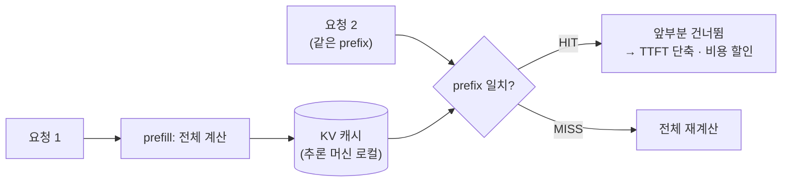
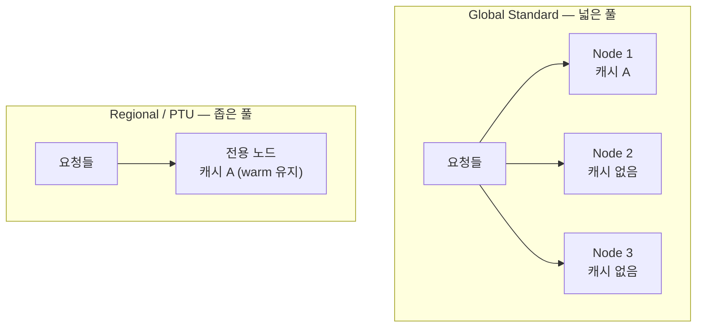
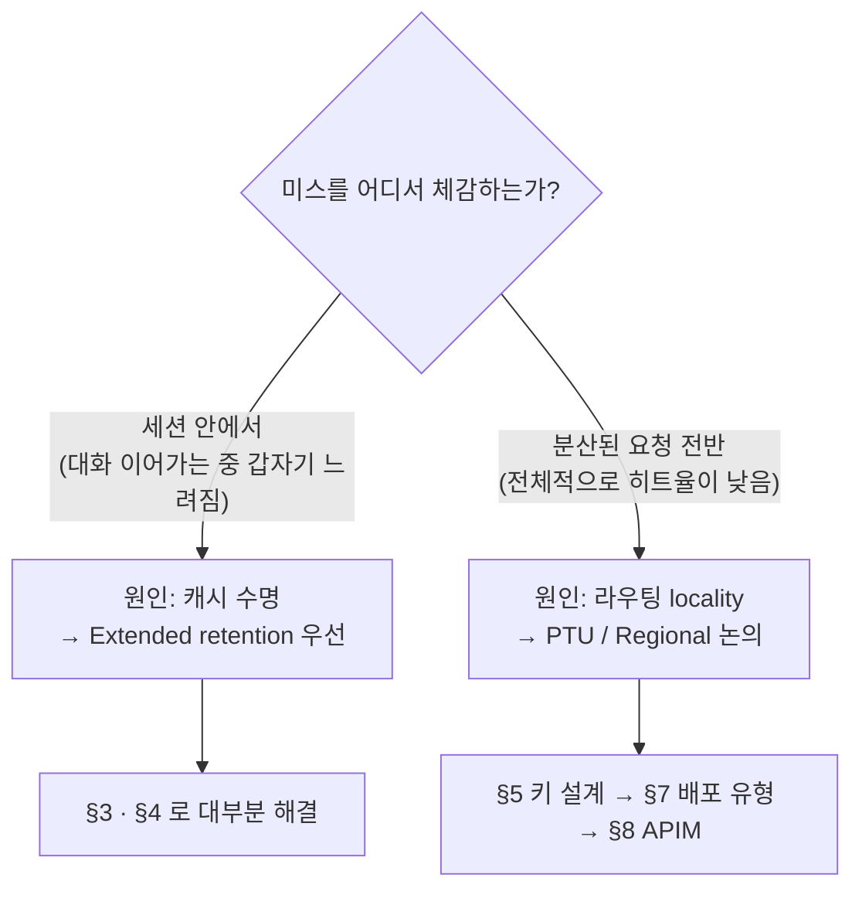
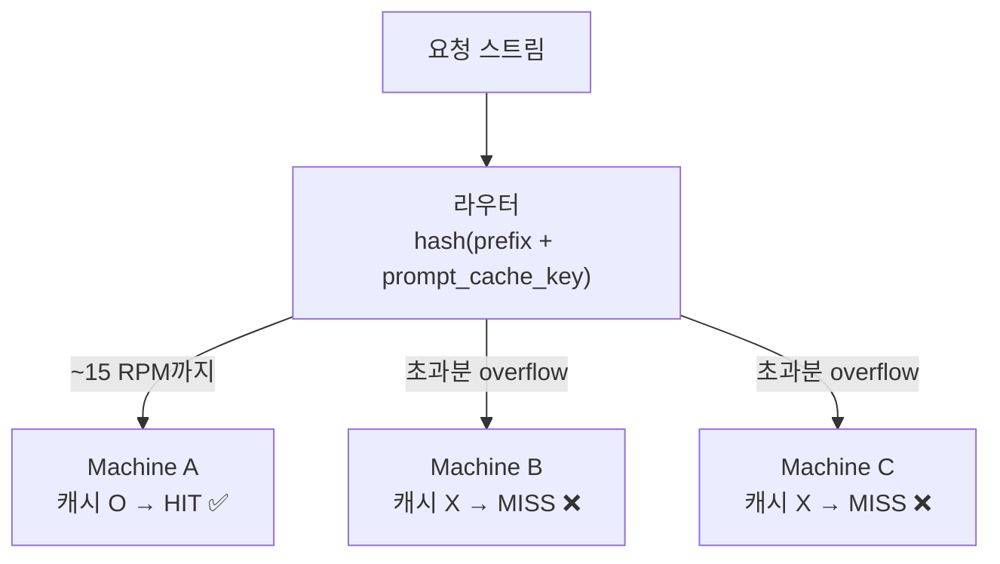
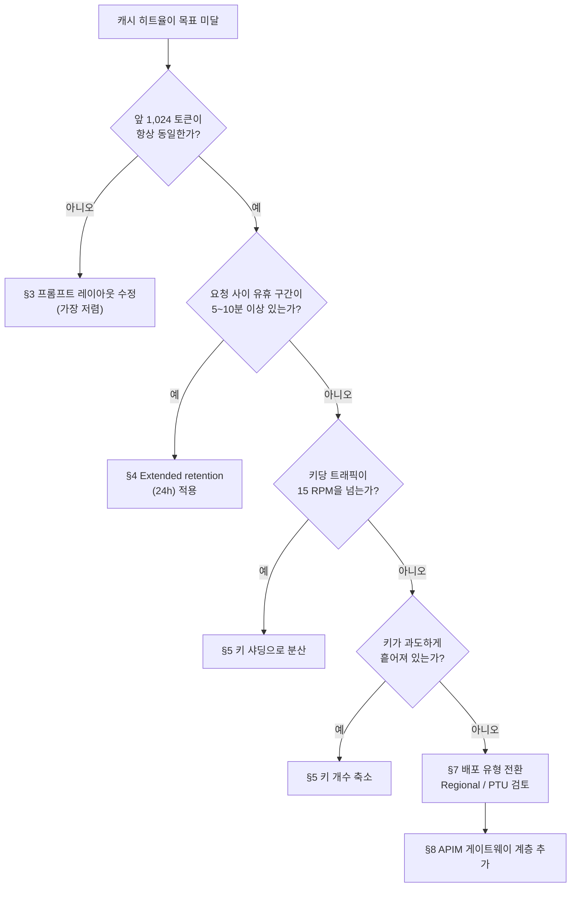
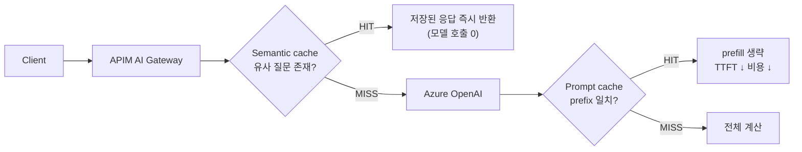

# Azure OpenAI 캐시 성능 최적화 가이드 — 프롬프트 캐싱으로 TTFT와 비용 줄이기

> 🚧 **WIP / Draft** &nbsp;·&nbsp; 현장 사례를 반영해 계속 갱신 중인 문서입니다. 수치와 파라미터는 배포 전 공식 문서로 재확인하세요.
>
> **대상** &nbsp;·&nbsp; AOAI에서 **TTFT(첫 토큰 지연)** 또는 **입력 토큰 비용**을 줄여야 하는 애플리케이션 팀, 플랫폼 팀
>
> **범위** &nbsp;·&nbsp; 프롬프트 캐싱 원리 → 히트율 진단 → 3단계 개선 → 배포 유형·게이트웨이 계층 선택 → 관측과 SLO
>
> **관련 가이드** &nbsp;·&nbsp; [01 온보딩](../01-oai-to-aoai-onboarding/) · [02 기본 개념](../02-aoai-foundations/) · [03 배포 & 운영 모니터링](../03-aoai-deployment-monitoring/) · [04 고가용성(HA)](../04-aoai-high-availability/)

---

## 0. TL;DR

### 한 문단 요약

프롬프트 캐싱은 **동일한 프롬프트 앞부분(prefix)의 KV 연산 결과를 재사용**해 TTFT와 입력 토큰 비용을 줄이는 기능입니다. 지원 모델에서 **기본 활성화**되어 있으므로 "켜는" 작업은 없고, 실무의 과제는 전부 **히트율을 어떻게 올리느냐**입니다. 캐시는 특정 추론 머신에 **로컬로** 존재하므로, 히트율은 ① 프롬프트가 얼마나 안정적인가 ② 캐시가 얼마나 오래 살아있는가 ③ 요청이 같은 머신으로 얼마나 잘 모이는가 — 이 세 가지가 결정합니다.

### 캐시 히트율 개선 3단계

실제 고객 사례에서 OpenAI 직결 대비 히트율 갭을 좁힌 순서입니다.

| 단계 | 조치 | 해결하는 문제 | 난이도 |
|---|---|---|---|
| **1** | **앞 1,024 토큰을 문자 단위로 동일하게 유지** | 프롬프트 불안정으로 인한 구조적 miss | 낮음 (코드 수정) |
| **2** | **캐시 보존 기간 연장** (`prompt_cache_retention`, 최대 24시간) | 유휴 구간에서 캐시가 만료되는 문제 | 낮음 (파라미터 1줄) |
| **3** | **`prefix` + `prompt_cache_key` 조합의 농도 조절** (~15 RPM 임계) | 라우팅 분산/과밀로 인한 miss | 중간 (샤딩 설계) |

> 💡 **3단계의 핵심 문장**
> 재사용될 만큼은 **뭉치되**, 한 머신이 넘칠 만큼 뭉치지는 **마세요**.
> *"concentrated enough for reuse, but not overloaded."*

### 최소 체크리스트

- [ ] 시스템 프롬프트 **앞 1,024 토큰에 가변 값**(타임스탬프, 사용자 ID, 랜덤 UUID)이 **없다** (§3.2)
- [ ] 대화 컨텍스트를 **append-only**로 유지한다 (중간 메시지 요약·삭제 금지) (§3.3)
- [ ] 도구(tool) 정의와 구조화 출력 스키마의 **직렬화 순서가 고정**되어 있다 (§3.2)
- [ ] 모델에 맞는 **보존 정책**을 명시적으로 설정했다 (`24h` 또는 `prompt_cache_options.ttl`) (§4)
- [ ] `prompt_cache_key`가 **안정적 해시**로 샤딩되어 있다 (요청마다 랜덤 아님) (§5.3)
- [ ] 키당 트래픽이 **~15 RPM 이하**가 되도록 키 개수를 산정했다 (§5.2)
- [ ] 응답의 **`cached_tokens`를 로깅**하고 키별로 집계한다 (§10.1)
- [ ] GPT-5.6+ 사용 시 **`cache_write_tokens`(쓰기 과금)** 를 함께 본다 (§9.2)
- [ ] 배포 유형(Global / Data Zone / Regional / PTU)이 **locality 관점에서** 선택되었다 (§7)
- [ ] TTFT **p95/p99를 캐시 히트율과 함께** 대시보드에 올렸다 (§10.3)

---

## 1. 프롬프트 캐싱이란

### 1.1 동작 원리

LLM은 입력 토큰마다 Key/Value 텐서를 계산합니다(prefill). 프롬프트의 앞부분이 이전 요청과 **완전히 같다면** 그 계산을 다시 할 이유가 없습니다. 프롬프트 캐싱은 이 KV 연산 결과를 임시 보관했다가 재사용합니다.



**중요한 성질 3가지**

1. **출력은 바뀌지 않습니다.** 캐싱은 지연시간과 비용에만 영향을 주고, 모델이 만드는 응답 내용에는 영향이 없습니다.
2. **prefix 기반입니다.** 프롬프트 "어딘가"가 같은 게 아니라 **맨 앞부터** 같아야 합니다.
3. **캐시는 로컬입니다.** 전역 공유 저장소가 아니라 요청을 처리하는 추론 머신에 붙어 있습니다. 이 성질이 §5의 라우팅 문제를 만듭니다.

### 1.2 적용 조건

| 항목 | 조건 |
|---|---|
| **최소 길이** | 프롬프트 **1,024 토큰 이상** |
| **일치 요건** | 앞 **1,024 토큰이 문자 단위로 동일** |
| **증분 단위** | GPT-5.5 이하 — 1,024 이후 **128 토큰 단위**로 히트 / GPT-5.6+ — 이 반올림 없음 |
| **활성화** | 지원 모델에서 **기본 활성화** (별도 설정 불필요) |
| **격리** | **Azure 구독 간 캐시 공유 없음** |

> ⚠️ 앞 1,024 토큰에서 **한 글자만 달라도** 전체가 miss입니다(`cached_tokens = 0`). "거의 같은" 프롬프트는 캐시 관점에서 "완전히 다른" 프롬프트입니다.

### 1.3 무엇이 캐싱되는가

| 대상 | 설명 |
|---|---|
| **Messages** | system · developer · user · assistant 전체 메시지 배열 |
| **Images** | user 메시지에 포함된 이미지 (링크 / base64 모두). `detail` 파라미터가 요청 간 동일해야 함 |
| **Tool use** | 메시지 배열 + **도구 정의(tool definitions)** |
| **Structured outputs** | 구조화 출력 스키마는 **system 메시지 앞에 prefix로 덧붙여짐** |

> 💡 도구 정의와 출력 스키마도 캐싱 대상이라는 점이 중요합니다. 에이전트처럼 도구가 많은 워크로드는 **도구 정의만으로 1,024 토큰을 넘기기 쉬워** 캐싱 이득이 큽니다. 반대로 도구 목록이 요청마다 동적으로 바뀌면 **캐시가 통째로 깨집니다.**

### 1.4 히트 확인 방법

응답 본문의 `usage`에서 확인합니다.

```json
{
  "usage": {
    "prompt_tokens": 1566,
    "completion_tokens": 1518,
    "total_tokens": 3084,
    "prompt_tokens_details": {
      "audio_tokens": null,
      "cached_tokens": 1408,
      "cache_write_tokens": 0
    },
    "completion_tokens_details": {
      "audio_tokens": null,
      "reasoning_tokens": 576
    }
  }
}
```

| 필드 | 의미 | 노출 조건 |
|---|---|---|
| `cached_tokens` | **캐시 읽기** — 재사용된 입력 토큰 수 | 지원 모델 전체 |
| `cache_write_tokens` | **캐시 쓰기** — 새로 캐시에 기록된 토큰 수 | GPT-5.6+ **Standard 종량제**만 |

**캐시 히트율 정의**

```
캐시 히트율 = cached_tokens / prompt_tokens
```

> ⚠️ 히트율은 **요청 단위 boolean이 아니라 토큰 비율**입니다. "히트/미스"로 세지 말고 토큰 가중 평균으로 집계하세요. 짧은 요청 다수가 지표를 왜곡합니다.

---

## 2. "OpenAI 직결보다 히트율이 낮다" — 왜 그렇게 느껴지는가

같은 애플리케이션을 OpenAI 직결에서 AOAI로 옮겼을 때 캐시 히트율이 떨어져 보이는 사례가 있습니다. 아래 두 가지가 유력한 설명입니다.

> ⚠️ **아래 §2.1·§2.2는 가설입니다.** 공식 문서로 확정된 인과관계가 아니라, 문서화된 동작에서 추론한 내용입니다. 실제 원인은 §2.3의 진단으로 가릅니다.

### 2.1 가설 1 — 기본 in-memory 캐시의 수명이 짧다

AOAI의 기본 보존 정책은 **in-memory**이고, 문서상 동작은 다음과 같습니다.

- 유휴 상태에서 보통 **5~10분 내** 캐시 제거
- 마지막 사용 시점으로부터 **최대 1시간 내** 반드시 제거

즉 **요청 사이에 공백이 있는 워크로드**는 그 공백 동안 캐시를 잃습니다. 사용자가 문서를 읽거나 생각하는 동안 10분이 지나면, 다음 질문은 cold miss로 시작합니다. 트래픽이 촘촘한 벤치마크에서는 안 보이고 **실사용에서만 보이는** 종류의 문제입니다.

→ **처방: §4 보존 기간 연장 (최대 24시간)**

### 2.2 가설 2 — 캐시는 GPU-local, Global Standard는 fan-out 한다

캐시는 GPU에 로컬입니다. 실제로 확장 캐싱의 동작 설명에도 이 성질이 드러납니다.

> "Extended prompt caching works by **offloading the key/value tensors to GPU-local storage** when memory is full…"

여기에 **Global Standard** 배포는 용량 가용성을 위해 요청을 넓은 풀로 분산시킵니다. 캐시 locality 관점에서는 이 분산이 불리하게 작용할 수 있습니다 — 요청이 퍼질수록 "내 캐시가 있는 그 머신"에 도착할 확률이 떨어집니다.



→ **처방: §7 Regional 엔드포인트 또는 PTU로 트래픽 집중**

### 2.3 두 가설을 가르는 진단 질문

**고객이 캐시 미스를 어느 층위에서 체감하는가**를 물으면 처방이 갈립니다.



**세션 레벨에서 체감하는 경우 (A)**

Foundry를 포함한 대부분의 모델 제공자는 **prefix-hash 기반 라우팅**을 씁니다. 같은 세션의 요청은 같은 GPU 노드로 떨어져 배치로 처리되는 것이 정상 동작입니다. 그런데도 세션 도중 미스를 느낀다면, 라우팅이 아니라 **캐시가 살아있는 시간**이 문제일 가능성이 큽니다. 이 경우 **확장 캐싱만으로도 체감이 크게 개선**될 가능성이 높습니다.

**분산 요청에서 캐시가 드롭아웃되는 경우 (B)**

세션 경계를 넘어 광범위하게 히트율이 낮다면 논의는 **배포 유형**으로 넘어갑니다. Regional 엔드포인트나 PTU로 트래픽을 집중시켜 locality를 확보하는 방향이고, 그 다음이 **APIM 계층**(semantic caching + prompt caching 조합)입니다.

---

## 3. 개선 1단계 — 앞 1,024 토큰을 고정하라

가장 싸고 가장 효과가 큰 단계입니다. 코드 몇 줄로 히트율이 0%에서 70%대로 뛰는 경우가 흔합니다.

### 3.1 프롬프트 레이아웃 원칙

**고정 콘텐츠는 앞, 가변 콘텐츠는 뒤.**

```
┌─────────────────────────────────────┐
│ ① 도구 정의 / 출력 스키마            │  ← 고정
│ ② 시스템 프롬프트 (지침, 정책)       │  ← 고정      캐시 대상 prefix
│ ③ 참조 문서 / few-shot 예시          │  ← 준고정
├─────────────────────────────────────┤  ← 여기까지 1,024 토큰 이상
│ ④ 대화 이력                          │  ← append-only
│ ⑤ 이번 사용자 입력                   │  ← 가변
└─────────────────────────────────────┘
```

> 💡 prefix가 1,024 토큰에 못 미치면 캐싱 자체가 동작하지 않습니다. 지침이 짧다면 **few-shot 예시나 용어집을 앞쪽에 배치**해 임계를 넘기는 것이 오히려 이득일 수 있습니다.

### 3.2 캐시를 깨는 흔한 패턴

| 안티패턴 | 왜 깨지는가 | 수정 |
|---|---|---|
| 시스템 프롬프트에 **현재 시각** 삽입 | 매 요청 문자열이 달라짐 | 뒤쪽(user 메시지)으로 이동, 또는 시간 단위로 절삭 |
| 앞부분에 **사용자 이름 / 세션 ID** | 사용자마다 prefix가 달라짐 | 뒤쪽으로 이동 |
| **도구 목록을 동적 생성** | 순서가 매번 달라짐 | 정렬 고정, 가능하면 전체 목록 항상 전달 |
| JSON 스키마를 **dict 순서 그대로 직렬화** | 런타임마다 키 순서 변동 | `sort_keys=True` 등으로 직렬화 안정화 |
| 프롬프트를 **A/B 테스트로 매번 변형** | variant마다 별도 캐시 | variant를 소수로 고정하고 각각 캐시 |
| 대화 이력을 **중간부터 요약·삭제** | prefix 자체가 변경됨 | §3.3 참조 |

```python
# ❌ 캐시가 절대 안 걸림
system = f"당신은 상담원입니다. 현재 시각: {datetime.now()}. 사용자: {user_name}\n" + POLICY

# ✅ 고정 prefix + 가변 정보는 뒤로
system = POLICY                       # 1,024 토큰 이상, 항상 동일
user   = f"[시각 {now_hour}] [사용자 {user_name}]\n{question}"
```

### 3.3 대화 컨텍스트는 append-only

멀티턴에서 캐시가 유지되려면 **앞선 턴들이 그대로 남아 있어야** 합니다.

```
턴 1:  [S][U1]                    → prefix [S] 캐시
턴 2:  [S][U1][A1][U2]            → prefix [S][U1][A1] 히트 ✅
턴 3:  [S][요약(U1,A1)][U3]       → prefix 변경 → 전체 miss ❌
```

컨텍스트가 길어져 압축이 필요하다면 **매 턴 요약하지 말고**, 임계에 도달했을 때 **한 번에 잘라내고 새 prefix를 확립**하세요. 압축 빈도를 낮추는 것이 히트율에 유리합니다.

> 💡 GPT-5.6+ Responses API에는 서버 측 압축(`context_management` + `compact_threshold`) 옵션이 있습니다. 압축 시점이 캐시 경계와 맞물리므로, 직접 구현한 요약 로직보다 캐시 친화적으로 동작할 가능성이 높습니다.

---

## 4. 개선 2단계 — 캐시 보존 기간을 늘려라

§2.1 가설에 대한 직접 처방입니다. **파라미터 한 줄**이라 시도 비용이 거의 없습니다.

### 4.1 in-memory vs extended

| | **In-memory** (기본) | **Extended** |
|---|---|---|
| 최대 보존 | 마지막 사용 후 **1시간** | **최대 24시간** |
| 유휴 제거 | 보통 **5~10분** | 더 길게 유지 시도 |
| 저장 방식 | GPU 메모리 | 메모리 부족 시 **GPU-local 스토리지로 KV 텐서 오프로드** |
| 지원 범위 | GPT-4o 이상 전 모델 | 아래 목록 한정 |
| 가격 | **두 정책 동일** | **두 정책 동일** |

> 💡 **보존 기간을 늘려도 추가 비용이 없습니다.** 프롬프트 캐시 가격은 두 보존 정책이 동일합니다. 지원 모델이라면 켜지 않을 이유가 거의 없습니다.

**확장 캐싱 지원 모델**

`gpt-5.5` · `gpt-5.4` · `gpt-5.3-codex` · `gpt-5.2` · `gpt-5.1-codex-max` · `gpt-5.1` · `gpt-5.1-codex` · `gpt-5.1-codex-mini` · `gpt-5.1-chat` · `gpt-5` · `gpt-5-codex` · `gpt-4.1`

### 4.2 모델별 설정 방법

| 모델 | 설정 | 기본값 |
|---|---|---|
| `gpt-5.4` 및 이전 | `"prompt_cache_retention": "24h"` | `in_memory` |
| `gpt-5.5` | (설정 불필요) | **확장 캐싱 기본 활성화** |
| `gpt-5.6` 이상 | `prompt_cache_retention` **폐기(deprecated)** → `prompt_cache_options.ttl` | §4.3 |

```json
{
  "model": "<your-gpt-5.4-deployment-name>",
  "input": "Your prompt goes here...",
  "prompt_cache_retention": "24h"
}
```

> ⚠️ 허용값은 `in_memory` 와 `24h` 두 가지뿐입니다. 임의의 기간은 설정할 수 없습니다.

### 4.3 GPT-5.6 이상의 `ttl` — 의미가 다릅니다

두 파라미터는 **이름은 비슷하지만 의미가 반대**입니다.

| 파라미터 | 의미 | 값 |
|---|---|---|
| `prompt_cache_retention` (~5.5) | **최대 보존 정책 선택** | `in_memory` / `24h` |
| `prompt_cache_options.ttl` (5.6+) | **최소 수명 보장** | `30m` (유일한 값, 기본값) |

`ttl: "30m"`은 "30분만 유지"가 아니라 **"최소 30분은 보장하고, 서비스 판단에 따라 더 길게 유지할 수도 있다"** 는 뜻입니다. 저장 정책이나 최대 보존 기간을 선택하는 값이 **아닙니다.**

> ⚠️ GPT-5.6 이전 모델에 `prompt_cache_options` / `prompt_cache_breakpoint`를 보내면 **`400` 오류**입니다. 모델 계열별로 요청 스키마를 분기하세요.

### 4.4 데이터 레지던시 영향

| 정책 | 데이터 경계 |
|---|---|
| **In-memory** | 모든 데이터 레지던시 리전과 호환 |
| **Extended** | GPU 머신에 **임시 저장**됨. Data Zone Standard/Provisioned는 **데이터 존 경계 내**, Regional Standard/Provisioned는 **리전 경계 내** 유지 |

> 💡 규제 산업 고객에게 확장 캐싱을 제안할 때 반드시 짚어야 할 지점입니다. 데이터가 경계를 벗어나지는 않지만 **"임시 저장이 발생한다"** 는 사실 자체가 검토 대상이 되는 경우가 있습니다.

---

## 5. 개선 3단계 — `prefix` + `prompt_cache_key` 농도 조절

여기서부터는 설계가 필요합니다. §1.1에서 본 **"캐시는 머신 로컬"** 성질이 정면으로 드러나는 영역입니다.

### 5.1 `prompt_cache_key`는 저장이 아니라 라우팅입니다

`prompt_cache_key`는 **"같은 키의 요청을 같은 머신으로 보내라"는 힌트**입니다. 캐시를 저장하는 주체가 아니라 **어디로 보낼지**를 결정합니다.

문서에 명시된 임계는 다음과 같습니다.

> 동일 **prefix + `prompt_cache_key`** 조합의 요청이 **분당 약 15건**을 넘으면 일부 요청이 **넘쳐서(overflow) 추가 머신으로 라우팅**되고, 그 요청들은 캐시를 놓칠 수 있습니다.



### 5.2 양쪽 극단이 모두 나쁩니다

| | 키가 **너무 적음** (전부 1개 키) | 키가 **너무 많음** (요청마다 다른 키) |
|---|---|---|
| 라우팅 | 한 머신에 집중 | 여러 머신으로 분산 |
| 실패 모드 | **15 RPM 초과 → overflow → miss** | 재사용 전에 캐시 만료 → **cold miss** |
| 비유 | 창구 하나에 줄이 넘쳐 옆 창구로 밀림 | 매번 다른 창구 — 아무도 나를 기억 못 함 |

**목표 키 개수 산정**

```
필요한 키 개수 ≈ (해당 prefix의 총 RPM) ÷ 15
```

예) 동일 시스템 프롬프트로 **150 RPM**이 들어온다면 → **약 10개 키**. 버스트를 감안해 **12~15개** 정도의 여유를 두는 것이 안전합니다.

### 5.3 샤딩 구현

**원칙: 키 ↔ prefix 매핑을 안정적으로 고정하세요.**

```python
# ❌ 매 요청 랜덤 → 머신도 랜덤 → cold miss
key = f"prompt-v2:{random.randint(0, 10)}"

# ❌ 요청마다 고유 → 캐시 공유 자체가 불가능
key = f"prompt-v2:{uuid4()}"

# ✅ 안정적 해시로 샤딩 — 같은 사용자는 항상 같은 샤드
shard = zlib.crc32(user_id.encode()) % 10
key   = f"prompt-v2:shard-{shard}"
```

**샤딩 기준 후보**

| 기준 | 장점 | 주의 |
|---|---|---|
| `session_id` | 세션 내 연속 요청이 같은 머신 → 히트율 최상 | 세션 수가 적으면 편중 |
| `user_id` | 안정적이고 자연스러운 분산 | 헤비 유저가 한 샤드를 과점할 수 있음 |
| `tenant_id` | 멀티테넌트에서 격리와 정합 | 테넌트별 트래픽 편차 큼 |
| 순환 카운터 `% N` | 균등 분산 보장 | 세션 연속성 없음 |

> 💡 **prefix 버전을 키에 넣으세요.** 시스템 프롬프트를 수정하면 `prompt-v2` → `prompt-v3`으로 올려 옛 캐시와 섞이지 않게 하는 편이 디버깅과 롤백에 유리합니다.

### 5.4 반드시 기억할 두 가지

> ⚠️ **키가 같아도 prefix가 다르면 소용없습니다.** `prompt_cache_key`는 라우팅 힌트일 뿐이고, 앞 1,024 토큰이 문자 단위로 동일해야 실제 히트가 납니다. 두 조건은 **AND**입니다.

> 💡 **overflow가 영구적 손실은 아닙니다.** 넘쳐 간 머신도 곧 자기 캐시를 만들기 때문에, 지속적인 트래픽에서는 여러 머신이 각각 warm 상태가 됩니다. 다만 그 과정에서 **cache write 비용**(GPT-5.6+, §9.2)과 초기 TTFT 저하가 발생합니다.

---

## 6. GPT-5.6+ — 명시적 캐시 breakpoint

GPT-5.6 이상에서는 재사용 가능한 prefix의 끝을 **직접 표시**할 수 있습니다. Responses API와 Chat Completions API 모두 지원합니다.

> ⚠️ **Standard 종량제 배포만 지원합니다.** **PTU-M(Provisioned Throughput managed)은 프롬프트 캐싱은 되지만 breakpoint를 지원하지 않고 `cache_write_tokens`도 노출하지 않습니다.**

### 6.1 모드

`prompt_cache_options.mode`로 요청 전체의 캐시 정책을 정합니다.

| 모드 | 동작 |
|---|---|
| `implicit` (기본) | **최신 메시지에 자동 breakpoint** + 사용자가 지정한 명시적 breakpoint도 함께 사용 |
| `explicit` | **명시한 breakpoint만** 읽기/쓰기에 사용. 하나도 없으면 캐싱을 쓰지 않고 **쓰기 과금도 발생하지 않음** |

`prompt_cache_breakpoint: { "mode": "explicit" }`를 콘텐츠 블록에 붙이면, **해당 블록과 그 앞의 모든 콘텐츠**가 재사용 prefix가 됩니다.

- **Responses API** — `input_text`, `input_image`, `input_file` 블록
- **Chat Completions API** — `text`, `image_url`, `input_audio`, `file` 블록

### 6.2 제한

- 요청당 **신규 캐시 쓰기 최대 4개**
- `implicit` 모드는 최신 메시지 breakpoint가 **쓰기 슬롯 1개를 소모** → 명시적 breakpoint는 **최근 3개**까지 기록
- `explicit` 모드는 **최근 4개**까지 기록
- 이전 턴의 breakpoint는 **읽기 전용** (매칭은 되지만 다시 기록되지 않음)
- 캐시 읽기는 대화 내 **최근 50개 breakpoint**까지 고려
- breakpoint까지 렌더된 prefix가 **1,024 토큰 이상**이어야 캐시 가능

### 6.3 예제

**Responses API — 기본 `implicit` 모드 + 고정 참조 파일 뒤 breakpoint**

```json
{
  "model": "<your-gpt-5.6-deployment-name>",
  "prompt_cache_key": "tenant:contoso:product-manual-v2",
  "input": [
    {
      "type": "message",
      "role": "user",
      "content": [
        {
          "type": "input_file",
          "file_id": "<product-manual-file-id>",
          "prompt_cache_breakpoint": { "mode": "explicit" }
        },
        {
          "type": "input_text",
          "text": "Summarize the troubleshooting procedures."
        }
      ]
    }
  ]
}
```

**Chat Completions API — `explicit` 모드 + 재사용 system 메시지 종료 표시**

```json
{
  "model": "<your-gpt-5.6-deployment-name>",
  "prompt_cache_key": "tenant:contoso:support-policy-v2",
  "prompt_cache_options": { "mode": "explicit", "ttl": "30m" },
  "messages": [
    {
      "role": "system",
      "content": [{
        "type": "text",
        "text": "<at least 1,024 tokens of reusable instructions>",
        "prompt_cache_breakpoint": { "mode": "explicit" }
      }]
    },
    {
      "role": "user",
      "content": "<variable user input>"
    }
  ]
}
```

### 6.4 캐싱을 끄고 싶다면

GPT-5.6+ Standard 종량제에서 `mode`를 `explicit`으로 두고 **breakpoint를 하나도 넣지 않으면** 캐싱을 쓰지 않고 쓰기 과금도 발생하지 않습니다. 이전 모델과 PTU-M은 이 옵션이 없으며 캐싱이 기본 활성 상태로 유지됩니다.

---

## 7. 그래도 부족하면 — 배포 유형으로 locality를 확보하라

§3~§6을 다 했는데도 히트율이 낮다면, 문제는 애플리케이션이 아니라 **트래픽이 도달하는 풀의 넓이**일 수 있습니다(§2.2 가설).

### 7.1 배포 유형과 캐시 locality

| 배포 유형 | 용량 가용성 | 캐시 locality (추정) | 비고 |
|---|---|---|---|
| **Global Standard** | 최상 | 낮음 — 넓은 풀로 fan-out | 가장 흔한 기본 선택 |
| **Data Zone Standard** | 중간 | 중간 | 데이터 존 경계 내 |
| **Regional Standard** | 낮음 | 높음 — 리전 내로 집중 | 용량 확보 난이도 ↑ |
| **Provisioned (PTU)** | 예약된 만큼 보장 | **가장 높음** — 전용 용량 | 캐시 읽기 **최대 100% 할인** |

> ⚠️ **locality 열은 추정입니다.** 배포 유형별 캐시 적중 특성은 공식 수치로 문서화되어 있지 않습니다. "요청이 좁은 풀에 집중될수록 로컬 캐시에 도달할 확률이 높다"는 원리에서 도출한 것이므로, **반드시 고객 트래픽으로 A/B 측정**해 검증하세요.

> 💡 **PTU의 이중 이득** — PTU에서는 캐시 읽기가 입력 토큰 기준 **최대 100% 할인**됩니다. 비용이 줄 뿐 아니라 **PTU 사용률(utilization) 자체가 낮아져** 같은 PTU로 더 많은 트래픽을 처리할 수 있습니다. 캐시 히트율 개선이 **곧 용량 증설 효과**로 이어집니다.

### 7.2 의사결정 트리



---

## 8. 게이트웨이 계층 — APIM으로 한 겹 더

모델 계층에서 할 수 있는 것을 다 했다면, 그 앞단에 캐시를 한 겹 더 둘 수 있습니다. **Azure API Management의 AI gateway**가 그 역할입니다.

### 8.1 성격이 다른 두 캐시

| | **Prompt caching** (모델 계층) | **Semantic caching** (APIM 계층) |
|---|---|---|
| **매칭 방식** | prefix **정확 일치** (앞 1,024 토큰) | 프롬프트의 **벡터 유사도** |
| **캐싱 대상** | 입력 토큰 연산 (KV) | **출력 응답(completion) 전체** |
| **위치** | 모델 서비스 내부 | API Management 게이트웨이 |
| **응답 변화** | 없음 — 모델이 정상 생성 | 있음 — **이전 응답을 그대로 반환** |
| **절감 효과** | 입력 토큰 비용 + TTFT | **요청 자체가 모델에 도달하지 않음** (100% 절감) |
| **리스크** | 없음 | 유사하지만 다른 질문에 **오답 반환 가능** |

### 8.2 조합 전략

두 캐시는 **경쟁 관계가 아니라 직렬 관계**입니다.



**semantic caching이 잘 맞는 워크로드**

- FAQ / 고객 지원 봇 — 같은 질문이 표현만 바꿔 반복됨
- 사내 문서 Q&A — 질문 다양성이 제한적
- 카탈로그·상품 설명 생성 — 입력 공간이 유한

**피해야 할 워크로드**

- 개인화 응답 (사용자별로 답이 달라야 함)
- 최신성이 중요한 질의 (재고, 시세, 상태 조회)
- 정확도 요구가 높은 도메인 (의료, 법률, 금융 자문)

> ⚠️ semantic caching은 **유사도 임계값 튜닝이 핵심**입니다. 임계가 느슨하면 오답을, 빡빡하면 히트율 0을 얻습니다. 반드시 오프라인 평가셋으로 임계를 정하고, **캐시 히트로 반환된 응답을 샘플링 검수**하는 절차를 함께 두세요.

> 💡 APIM은 캐싱 외에도 **토큰 제한(LLM token limit)·백엔드 풀·서킷 브레이커**를 제공합니다. 가용성 설계와 함께 도입하면 투자 대비 효과가 큽니다 — [04 고가용성 가이드](../04-aoai-high-availability/) 참조.

---

## 9. 비용 모델

### 9.1 캐시 읽기 — 할인

| 배포 유형 | 캐시 읽기 가격 |
|---|---|
| **Standard** | 입력 토큰 대비 **할인** 적용 |
| **Provisioned (PTU)** | **최대 100% 할인** |

프롬프트 캐시 가격은 **in-memory와 extended 보존 정책이 동일**합니다. 보존 기간을 늘린다고 더 비싸지지 않습니다.

### 9.2 캐시 쓰기 — GPT-5.6부터 과금될 수 있음

| 모델 계열 | 캐시 쓰기 비용 |
|---|---|
| GPT-5.6 **이전** | **무료** |
| GPT-5.6 **이상** | **과금될 수 있음** (할인된 읽기와 별도) |

> ⚠️ 이 변경은 최적화 전략을 바꿉니다. 5.6 이전에는 "일단 캐싱되게 만들면 이득"이었지만, **5.6 이상에서는 쓰기가 읽기보다 많으면 손해**일 수 있습니다.

**5.6+ 비용 최적화 원칙**

1. 재사용되는 콘텐츠를 **요청 간 정확히 동일하게** 유지 — 쓰기보다 읽기가 많아지도록
2. `cache_write_tokens` 대비 이후 `cached_tokens` 볼륨을 **비교 모니터링** (§10.1)
3. 재사용 가능성이 낮은 일회성 긴 프롬프트는 `explicit` 모드 + breakpoint 없음으로 **쓰기 자체를 회피** (§6.4)
4. 요청당 신규 쓰기가 **4개로 제한**됨을 감안해 breakpoint를 아껴 배치

> 💡 정확한 단가는 [Azure OpenAI 가격 페이지](https://azure.microsoft.com/pricing/details/cognitive-services/openai-service/)에서 확인하세요. 이 문서에는 변동하는 수치를 싣지 않습니다.

---

## 10. 관측 — 무엇을 측정할 것인가

### 10.1 핵심 지표

| 지표 | 계산식 | 출처 | 목표 방향 |
|---|---|---|---|
| **캐시 히트율** | `cached_tokens / prompt_tokens` | 응답 본문 `usage` | ↑ |
| **캐시 쓰기 비율** | `cache_write_tokens / prompt_tokens` | 응답 본문 (5.6+ Standard) | ↓ (읽기 대비) |
| **읽기/쓰기 비** | `Σ cached_tokens / Σ cache_write_tokens` | 집계 | ↑ (1보다 충분히 커야 함) |
| **TTFT p95 / p99** | 클라이언트 측정 | 앱 계측 | ↓ |
| **키별 RPM** | `prompt_cache_key` 단위 요청 수 | 앱 로그 | ~15 이하 유지 |

> ⚠️ **`cached_tokens`는 응답 본문에만 있습니다.** AOAI 진단 로그(Diagnostic Settings)에는 요청 본문·응답 본문이 포함되지 않으므로, 히트율은 **애플리케이션 또는 APIM 정책에서 직접 추출해 커스텀 메트릭으로 내보내야** 합니다.

### 10.2 반드시 함께 남길 차원(dimension)

집계할 때 아래 차원이 없으면 원인 분석이 불가능합니다.

- `prompt_cache_key` — 어느 샤드가 문제인가
- `prefix_version` — 프롬프트를 바꾼 시점과 히트율 변화의 상관
- `deployment_name` / `region` — 배포 유형 비교 (§7 A/B의 근거)
- `model` — 모델 계열별 캐시 동작 차이
- `session_id` — 세션 내 첫 요청인지 후속 요청인지 구분

**해석 규칙**

| 관측 | 진단 | 조치 |
|---|---|---|
| 히트율 낮음 + 키당 RPM 높음 | **overflow** | 키 개수를 늘린다 (§5.2) |
| 히트율 낮음 + 키당 RPM 낮음 | **cold / 분산 과다** | 키 개수를 줄인다 (§5.2) |
| 세션 첫 요청만 miss, 이후 hit | **정상 동작** | 조치 불필요 |
| 세션 중간부터 갑자기 miss | **캐시 만료** | Extended retention (§4) |
| 전 구간 `cached_tokens = 0` | **prefix 불안정 또는 1,024 미만** | §3 · §1.2 재점검 |
| 쓰기 >> 읽기 (5.6+) | **비용 역효과** | prefix 안정화 또는 캐싱 회피 (§9.2) |

### 10.3 SLO 베이스라인으로 연결하기

캐시는 **TTFT SLO를 움직이는 가장 큰 단일 레버**입니다. 다만 히트/미스에 따라 TTFT 분포가 이봉(bimodal)이 되므로, 지표 설계에 주의가 필요합니다.

```
SLI:  TTFT p95 (스트리밍 첫 토큰까지)
SLO:  "캐시 히트 요청의 TTFT p95 < X ms"
      "전체 요청의 TTFT p95 < Y ms"  (X < Y)
보조: "캐시 히트율 ≥ Z%"
```

> 💡 **평균 TTFT 하나로 SLO를 잡지 마세요.** 히트/미스 두 봉우리의 평균은 어느 쪽도 대표하지 않습니다. 히트율이 흔들리면 평균만 출렁이고 원인은 보이지 않습니다. **히트율을 별도 보조 지표로 두고, TTFT는 히트/미스를 분리해** 보는 편이 훨씬 진단 가능합니다.

> 💡 고객의 SLO 베이스라인을 수집하는 단계라면, **캐시 히트율을 함께 물어보세요.** 상대가 제시하는 TTFT 목표가 캐시 warm 상태 기준인지 cold 기준인지에 따라 필요한 용량이 크게 달라집니다.

---

## 11. 트러블슈팅 빠른 참조

| 증상 | 우선 확인 | 관련 절 |
|---|---|---|
| `cached_tokens`가 항상 0 | 프롬프트가 1,024 토큰 이상인가 | §1.2 |
| `cached_tokens`가 항상 0 | 앞부분에 타임스탬프·ID가 섞이지 않았나 | §3.2 |
| 히트율이 들쭉날쭉 | 키당 RPM이 15를 넘나드는가 | §5.1 |
| 세션 중간에 느려짐 | 유휴 5~10분 후 첫 요청인가 | §2.1 · §4 |
| `400` 오류 발생 | 5.6 이전 모델에 `prompt_cache_options`를 보냈는가 | §4.3 |
| `cache_write_tokens`가 안 보임 | PTU-M 배포인가 (미노출 정상) | §6 |
| breakpoint가 무시됨 | PTU-M 배포인가 (미지원) | §6 |
| 비용이 오히려 증가 (5.6+) | 쓰기/읽기 비율을 확인 | §9.2 |
| 이미지 포함 요청이 miss | `detail` 파라미터가 요청 간 동일한가 | §1.3 |
| 도구 사용 요청이 miss | 도구 정의 순서가 고정인가 | §1.3 · §3.2 |

---

## 12. 검토 중 · 확인 필요 (WIP)

> 🚧 이 절은 초안 단계의 미확정 항목입니다. 확인되는 대로 본문으로 승격하거나 삭제합니다.

- **`Microsoft.Storage/contextCaches`** — Azure RBAC의 Storage 권한 표에 `Context Cache` 리소스 종류(`contextCaches`, `contextCacheContainers`, `ContextCacheRPOperationStatuses`)가 등재되어 있으나 **개념·how-to 공개 문서가 아직 없습니다.** ARM 컨트롤 플레인에는 존재하지만 문서화 전 단계로 보이며, KV 캐시 오프로드를 고객이 직접 프로비저닝하는 리소스일 가능성이 있습니다. **추정이며 확인 필요.**
- **배포 유형별 캐시 히트율 실측치** — §7.1의 locality 비교는 원리 기반 추정입니다. 동일 워크로드로 Global / Regional / PTU A/B 측정 결과를 확보해 대체할 것.
- **모델 계열별 실효 TTFT 개선폭** — 캐시 히트 시 TTFT 단축률을 모델·프롬프트 길이별로 정리할 것.

---

## 참고 자료

### 프롬프트 캐싱

- Prompt caching with Azure OpenAI in Microsoft Foundry Models: https://learn.microsoft.com/azure/foundry/openai/how-to/prompt-caching
- Provisioned throughput (PTU) 개념: https://learn.microsoft.com/azure/foundry/openai/concepts/provisioned-throughput
- Model router — 라우팅과 프롬프트 캐싱: https://learn.microsoft.com/azure/foundry/openai/concepts/model-router
- Azure OpenAI Responses API (`context_management`, 서버 측 압축): https://learn.microsoft.com/azure/foundry/openai/how-to/responses
- Azure OpenAI v1 API 라이프사이클: https://learn.microsoft.com/azure/foundry/openai/api-version-lifecycle
- Claude models in Microsoft Foundry (automatic prompt caching, 5m/1h TTL): https://learn.microsoft.com/azure/foundry/foundry-models/concepts/claude-models

### 게이트웨이 · 가격

- AI gateway capabilities in Azure API Management (semantic caching): https://learn.microsoft.com/azure/api-management/genai-gateway-capabilities
- Azure OpenAI 가격: https://azure.microsoft.com/pricing/details/cognitive-services/openai-service/

### 참고 (미문서화)

- Azure RBAC — Storage permissions (`Microsoft.Storage/contextCaches` 등재 확인용): https://learn.microsoft.com/azure/role-based-access-control/permissions/storage
